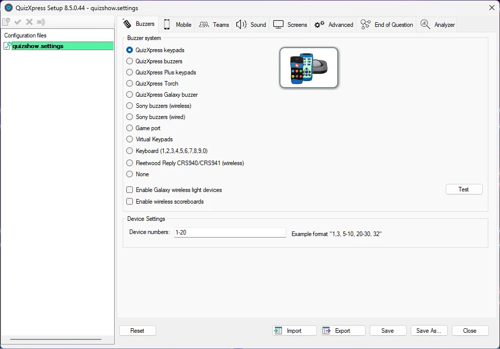

# Setting up the game show with QuizXpress Setup

The previous chapter described how to design a quiz in QuizXpress Studio. The next step is to ‘run’ the quiz in QuizXpress Live. Before you can do this, however, there are some aspects of the game show you may want to change — for example, the type of hardware you're using, the team names, the buzzer sounds, the welcome screen captions, the slideshow pictures, etc.

The Quiz Setup program can be found in the Windows Start menu or in the External Tools menu in Studio (Home ribbon).

Quiz Setup allows you to manage multiple settings files. In the list view on the left of the user interface, you can see the available configuration files. The one in **bold** is the active file, meaning these settings will be used when running a production quiz. You can change the active file by right-clicking it and selecting ‘Activate’ from the context menu. To load a file for editing, double-click it, or select ‘Load’ from the context menu.

{ width="605" loading=lazy }

By clicking ‘Reset’, the system reverts to the default configuration. Note that you’ll always have to select a buzzer system before you can use any functionality.

By clicking the Save button, the current settings file is saved to disk.

By clicking the **Save As…** button, the current settings file can be saved using a different name.

The Import and Export buttons let you export (save) the currently loaded settings to a file. This file can then be imported into QuizXpress Setup on another computer, enabling easy, fail-safe transfer of settings. Please note that any folders referenced in the settings file need to be present on the computer that imports the settings (otherwise, warnings will be shown when starting a quiz show with the imported settings).

There are several tab pages on which the various settings can be changed. The following sections describe each page and its settings.
