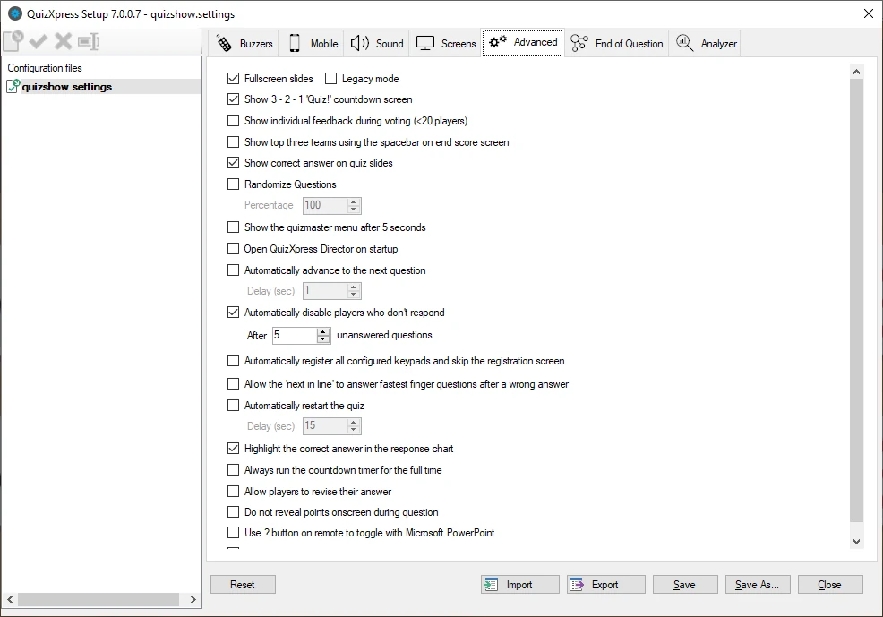

# Other settings – the Advanced tab page

The Advanced tab page contains several advanced settings:

{ width="598" loading=lazy }

**Full screen slides**

This option shows each slide in full-screen mode. By default, slides ‘float’ on the screen, with margins on all sides.

By clicking the full-screen option, slides are shown full screen. The background is extended to fit the whole desktop, and the slide item (question, answers) sizes are also slightly increased.

!!! note

    when you click the Full screen slides option, a second option, ‘Legacy mode’, appears. This supports the old Full screen setting, which worked slightly differently. Previously, the full screen slide option caused the clock bar to overlap the question text. To fix this, items on slides (the question text as well as the answers) had to be moved down to accommodate full-screen display. If you have quizzes with a layout designed for the old Full screen option, check the ‘Legacy mode’ box.

**Show 3-2-1 Quiz countdown screen**

Indicates whether a countdown animation is shown before the quiz starts.

**Show individual feedback during voting (\<20 players)**

When this option is checked, each individual vote will be shown for questions where voting is set to ‘True’. If this option is not checked, only a counter will be shown with the total number of votes received. For an example see the pictures as shown at the end of 5.4.5. This only applies when there are less than 20 players.

**Show top three teams using space on end score screen:**

When set, the final score screen does not show the top 3 players automatically but waits for the spacebar to be pressed. Pressing the spacebar multiple times then shows 3rd, 2nd, and 1st place in turn. After this, a full ranking is shown.

**Use remote control**

Indicates if a remote quizmaster control is used (for the QuizXpress buzzer system this option is always enabled as this system includes a special remote control).

**Show correct answer**

If checked (default), the correct answer (indicated by a green checkmark) is shown when a multiple-choice question is evaluated. If unchecked, the correct answer is not shown, letting you tell the audience yourself what the correct answer is. Alternatively, you could use a shape to override this default behavior and indicate the correct answer yourself — for example, by showing a big red arrow pointing to the right answer.

**Randomize Questions**

When checked, questions from a quiz are shown in random order. When rounds are present, the questions within each round are shuffled. By providing a percentage, you can tell QuizXpress to show only part of the questions (in random order). How slides are shuffled is controlled by the ‘Shuffle mode’ option, which you can set per slide.

** Show Quizmaster Hints**

When running a quiz show in QuizXpress Live, multiple commands are available at different stages — for example, showing charts, advancing to the next slide, showing score overviews, or judging questions. All these commands have shortcut keys on the keyboard (or can be operated with a quizmaster remote).

To guide beginning users, Quizmaster hints can be shown during a quiz, displaying all available commands as they become applicable. Once the quizmaster is confident operating the system, they can switch this setting off (in Quiz Setup) so the audience no longer sees the hints. By default, quizmaster hints are **enabled**.

**Enable QuizXpress Director**

When this option is checked, Director opens immediately when QX Live starts. If this flag is not set, you can still open Director at any time with the ‘D’ key *(note: this option is only available in the Ultimate edition)*.

**Automatically advance to the next question**

With this option, you can make Live advance to the next question without intervention. So, if you have a batch of multiple-choice questions to run for your audience without being present, this is the option to use. You can also set the time between questions.

**Automatically disable players that don’t respond**

When this is enabled, the system automatically disables players who have not answered for a certain number of questions (meaning they have probably left the quiz).

**Automatically register all keypads**

Normally, the audience must sign in at the beginning of a session. This way, the system knows which keypads are participating and can end a question once all responses have been received. If this registration process is inconvenient, you can set this flag, and the system will skip the registration screen and sign in all configured keypads. For example, if you’ve set the device configuration to ‘1-100’, keypads 1-100 will all be registered.

**Allow the next in line to answer**

When enabled, the system sequentially allows all players who responded to an open question (within 2 seconds of the first response) to provide an answer, until a correct answer has been given. If not enabled, only the first player gets to answer, after which the system opens the floor again to all players (except those who already gave a wrong answer).

**Automatically restart the quiz**

This option lets the quiz automatically restart a certain number of seconds after reaching the final score screen, letting you create a standalone quiz that doesn’t need a quizmaster in attendance.

**Highlight the correct answer in the response chart**

If you don’t want the correct answer highlighted in the response chart, switch off this setting. This can be useful, for example, when you first want to check with the audience how many responses there were for each answer, without highlighting the correct one.

**Always run the countdown timer for the full time**

If you want the clock to run for the full specified time, regardless of whether everyone has already answered, tick this option (when the option is off, the clock stops as soon as everyone has answered). If you prefer a consistent countdown time, check this option.

**Allow players to revise their answer**

When you tick this option, players can revise their answer if the countdown clock is running.

**Do not reveal points onscreen during question**

By default, the system shows the points gained or lost for fastest-finger questions. To build more suspense, you can set this flag so a player’s points aren’t known until the leaderboard is shown.

**Use ‘?’ button on remote to toggle with Microsoft PowerPoint**

For users who wish to mix QuizXpress with PowerPoint presentations, this feature lets you flip between the PowerPoint screen and QuizXpress using the ‘?’ button on the presenter remote control.

**Remove top panel when answering to avoid overlapping**

In certain situations (open question, voting with individual feedback), the slide moves up when a player buzzes, causing it to overlap with the top panel. This setting makes the top panel disappear temporarily to avoid the overlap.
