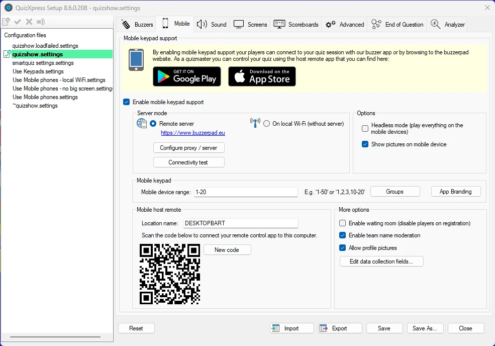
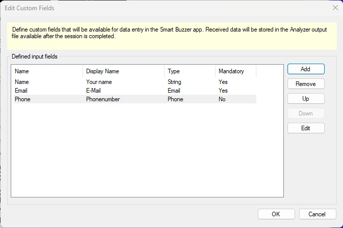
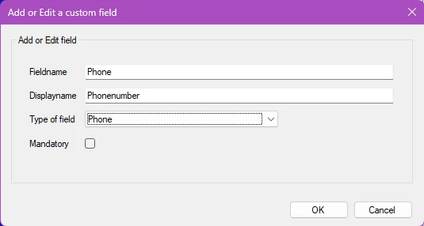
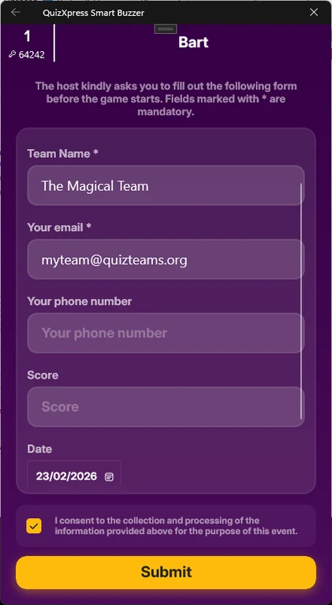
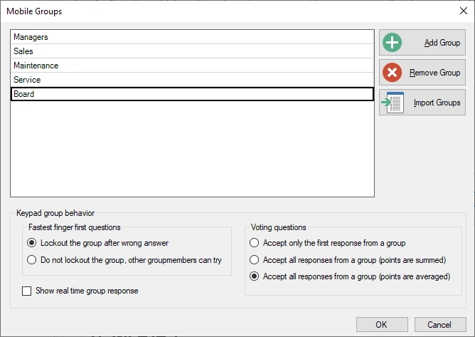
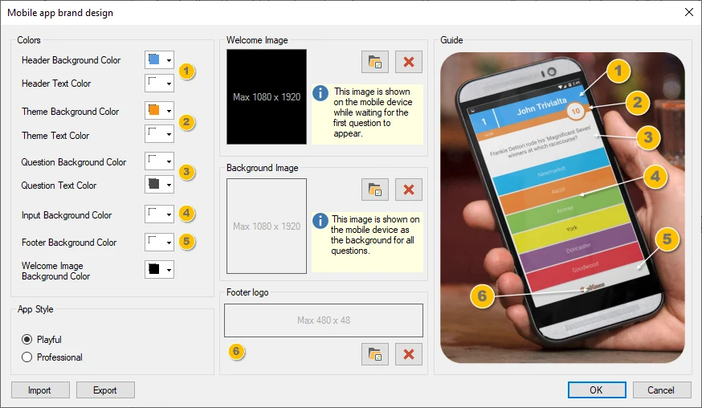

# Setting up mobile keypad support

QuizXpress supports using mobile phones and tablets as input devices. Players can connect using a standard web browser, or they can use our Smart Buzzer app for Android and iOS. You must own a license that supports mobile keypads before you can activate this feature.

To enable mobile keypad support, first tick the ‘Enable mobile keypad support’ checkbox. You’ll then see three sections to configure:

## Server mode

There are two ways you can run the system with mobile keypads:

1)  Using one of our cloud servers (internet required for you and your players who can participate from all over the world)

2)  Using a local Wi-Fi router connected to your laptop (no internet required but all players must be in one physical location to connect to your router)

{ width="455" loading=lazy }

There are several options:

- **Play in ‘Headless’ mode** – Use this when no external\projector screen is available and you want players to play on their mobile only. Please note that in this case using mini games as well as video questions is not supported. When playing in headless mode only the Director screen will be shown on the computer with an integrated quiz player (please refer to [QuizXpress Director](../live/quizxpress-director/index.md) for more information about Director).

- **Show pictures on mobile device** – Indicates whether pictures are also sent to the Smart Buzzer app / buzzerpad browser app (note: during the quiz you can turn this on or off in the Mobile Settings in Director).

- **Enable waiting room** – when this is on, all mobile players are immediately set to ‘disabled’ after registering and cannot participate in the quiz, although their device will show the questions. The host must first enable each player in Director. Use this, for example, when players need to pay an admission fee before they can participate.

- **Enable team name moderation – when enabled, the buzzerpad server scans player names for bad words from a predefined list (currently only in Dutch, English, and French) and replaces them with ‘#####’**

- **Allow profile pictures – allows players to upload their profile pictures to the quiz so they appear on leaderboards and other visual elements.Data collection with custom fields**

The system supports collecting data from individual users on a screen that appears after they connect to the quiz. The fields to collect can be configured here in Quiz Setup, and the captured data will be available after the quiz in the Analyzer output file.

{ width="449" loading=lazy }

To add a field, click Add and enter the details in the custom field popup:

{ width="296" loading=lazy }

When the user connects, a data entry screen is presented, like the following example:

{ width="211" loading=lazy }

When using *Remote server* mode, you can select the server that is used to host your quiz session by clicking the *Configure proxy / server* button. The default server is [www.buzzerpad.com](http://www.buzzerpad.com). This server is situated in the South-Central US. If you are based in Europe you may want to switch to [www.buzzerpad.eu](http://www.buzzerpad.eu) for lower latency.

## Mobile keypad section

Here you configure the range of keypads that can connect to your quiz. By default, when you enable mobile keypad support, the ‘Mobile device range’ field is filled with ids 1 through the maximum number of players allowed by your license.

If you have an existing kit of buzzers or keypads, you can extend it with players playing on mobile keypads. In this case, when you enable mobile keypad support, a ‘Mobile device range’ starting with the highest keypad or buzzer id defined on the Buzzers tab appears. The maximum number in this case is the number allowed by your license.

Example: on the Buzzers tab, you indicate that you’re playing with QuizXpress keypads 1-20. On the Mobile tab, you enable mobile keypad support. If you have an Ultimate 50 license (which allows up to 50 players), the ‘Mobile device range’ field will be filled with 21-50.

### Playing in groups

When you want your audience to compete in groups while using mobile devices, you have to predefine a list of groups. When a player connects to your quiz, they are prompted on their device to select the group to play for.

By clicking the ‘Groups’ button, a form appears where you can configure the groups and group behavior:

{ width="298" loading=lazy }

In the lower section, you define the behavior for fastest-finger and voting questions.

### Branding the mobile app

When playing with the QuizXpress Smart Buzzer app, you can set up your own branding with the Branding Designer, changing the colors, logo, and welcome image for the app:

{ width="549" loading=lazy }

Playing with predefined groups

**Mobile host remote section**

In this section, the QR code used to connect the remote-control app with your computer is presented.

The app to control the running quiz is available for Android and iOS. You can find them here:

| Mobile Director for Android | <https://play.google.com/store/apps/details?id=com.gameshowcrew.quizxpressdirector> |
|-----------------------------|-------------------------------------------------------------------------------------|
| Mobile Director for iOS     | <https://apps.apple.com/us/app/quizxpress-director/id1493187163>                    |

In the Mobile remote app, you can register multiple computers to control. These computers are displayed by their ‘Location name’, which can be set in the Mobile remote section. The default name is the name of the computer.

To connect the Mobile presenter remote to the computer, open the Virtual remote app and click the ‘plus’ button. A QR code scanner opens on your mobile device. Scan the QR code shown in the Mobile remote section, and the name entered in the ‘Location name’ field will be added to the list of computers in the Mobile remote app.

!!! warning

    please note that the app has a server setting that must correspond to the server you selected in Quiz Setup. Also, if you use Wi-Fi, you must switch the app’s setting to ‘Wi-Fi’.**

## Other options – Waiting room

If you’re running a quiz with QuizXpress Mobile and want more control over who enters the game, you can use the ‘Waiting Room’ setting. When this setting is active, players who enter the game are inactive by default.

To let players into the game, enable them explicitly on the Teams tab in QuizXpress Director. One example is a pub quiz where players must pay a small fee to participate: upon receiving payment from a player, the host can enable that player.
