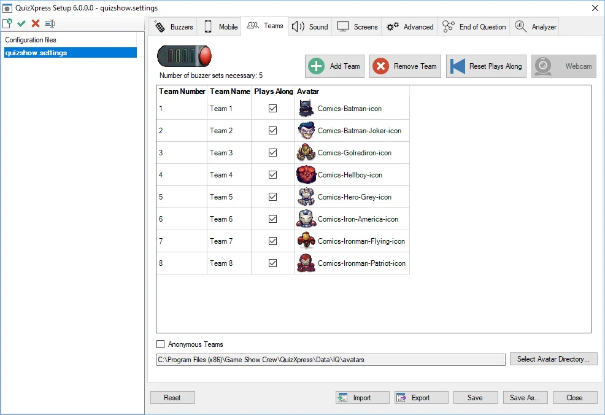
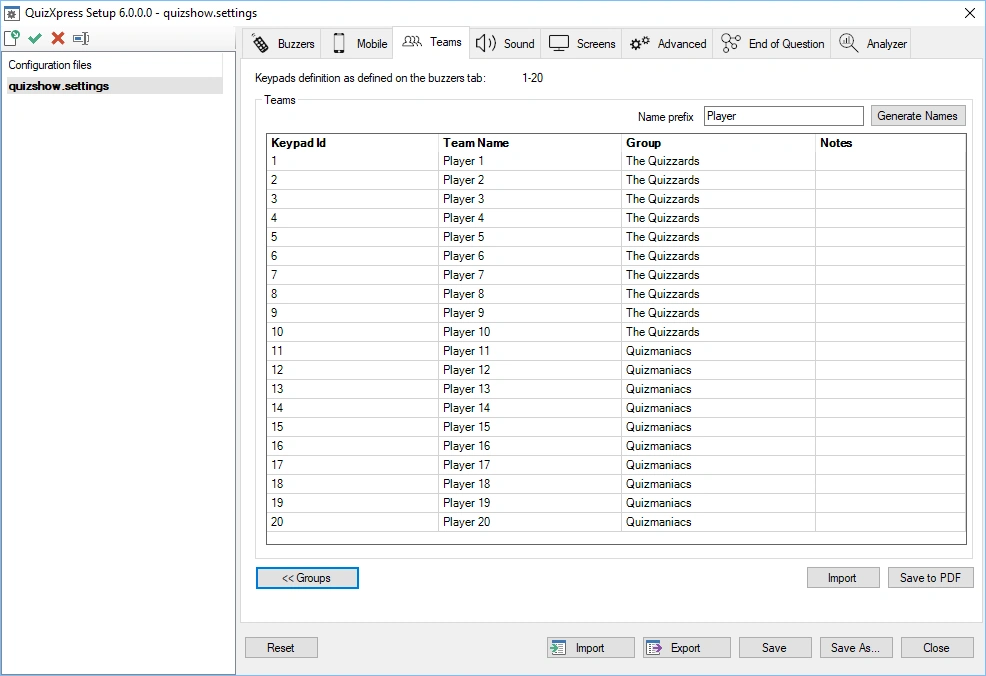
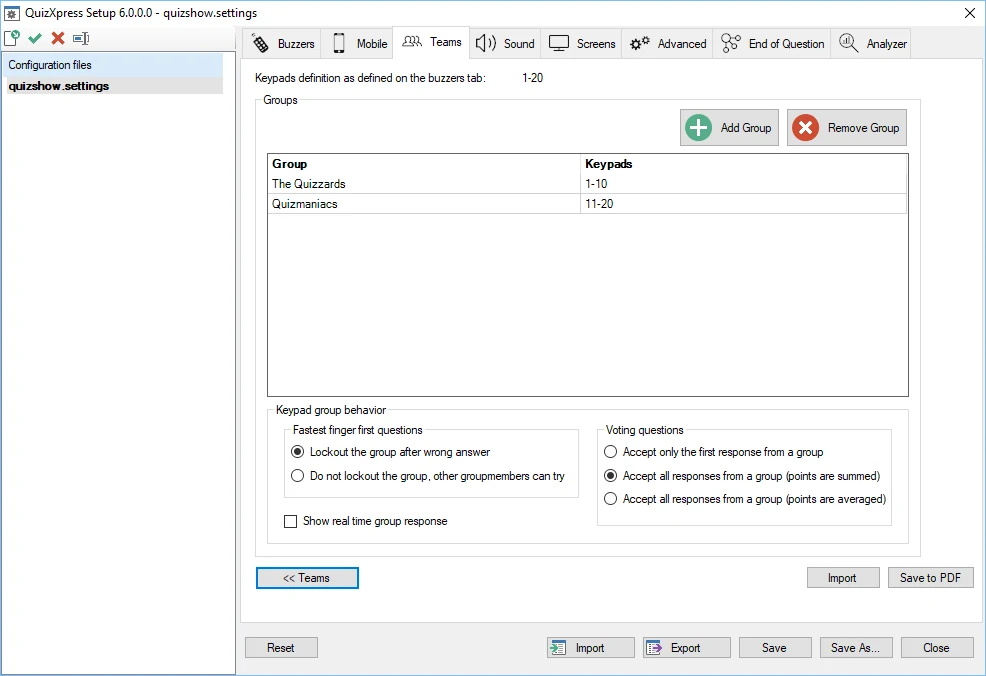
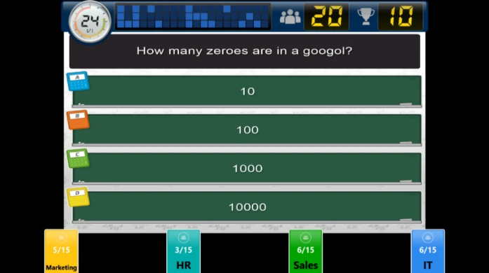
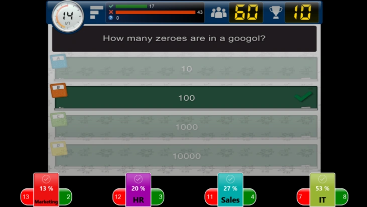
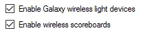
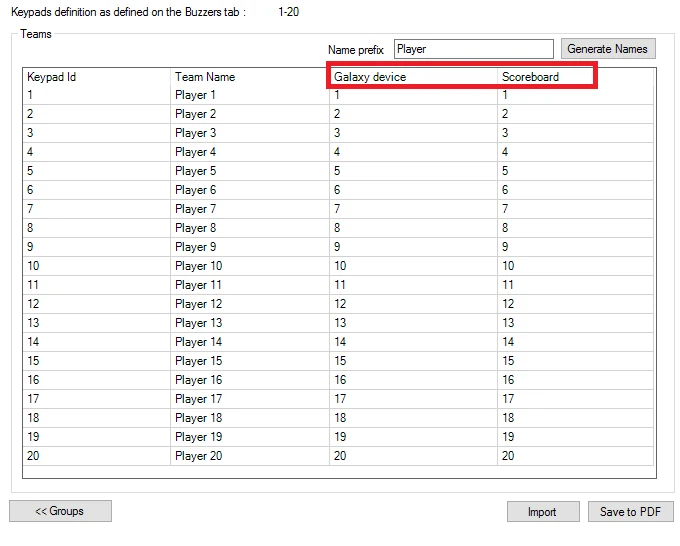

# Setting up teams – the Teams tab page

There are two different ‘flavors’ of the Teams tab page, one when Sony buzzers are selected on the ‘Buzzers’ tab and one when Fleetwood Reply or QuizXpress buzzers (numbered devices) are selected.

## Teams tab page – Sony Buzzers

The Teams tab page used when Sony Buzzers are selected can be found below. Functionality includes:

- Adding and removing teams

- Indication whether a team plays along in the quiz.

- Assign avatars to teams. At the bottom of the team settings page, you can indicate in which folder the avatars used are present.

At the top of the page, you can see how many buzzer sets are necessary given the number of teams in the list playing along.

Another feature is the ability to use anonymous teams. In this case, the list of teams/avatars is ignored, and the sign-in process resembles that of Fleetwood Reply buzzers. This is typically used when large numbers of Sony Buzzers are used, since the normal sign-in procedure for Sony Buzzers — which associates each buzzer with a team one at a time — would take too long.

{ width="605" loading=lazy }

## Teams tab page – QuizXpress keypads

On the Teams tab, you can define the team/player names and define groups. This tab isn’t available when Mobile only is used; when Mobile is used in combination with keypads or buzzers, the page is still shown.

For all buzzer types except Sony buzzers, the number of teams is derived from the ‘Keypads’ string entered on the ‘Buzzers’ tab. For example, when the string 1-50 is used, the ‘Teams’ tab shows a list of keypads 1 to 50 and the default team names *Team 1 … Team 50*. Team names can be changed in the second column of the list.

As explained above, if you want to change the number of teams, modify the ‘Keypads’ string on the ‘Buzzers’ tab.

!!! note

    it’s possible to use avatars in combination with Reply/QuizXpress buzzers. To do so, create images (.jpg or .gif) in the default avatar folder (c:\program files\game show crew\QuizXpress\Data\IQ\Avatars) with the names of the teams. For example, for Team A, create an image named ‘Team A.jpg’.

As can be seen in the picture below, various other commands are available:

- Generate Names: this enables you to quickly generate team names using a certain pattern, followed by an index. For example, you could quickly generate names like team 1…team 50, player 1…player 50, participant 1…participant 50

- Import: import the list of team names from Excel or a text file. For Excel, put the names in the first column of the first sheet; for a text file, put each name on a new line.

- Save to PDF: to get an overview of the teams assigned to each keypad, export the list to PDF by pressing the ‘Save to PDF’ button

- Groups: it is possible to divide teams into groups. You can read more about this in the following section.

> { width="605" loading=lazy }

### Grouping keypads

It is possible to divide teams into groups in Quiz Setup (alternatively, it is also possible to divide teams into groups while running a Quiz. Please refer to the [Demographic](../live/starting-a-quiz/the-quiz-screen-voting-everybody-answers.md#demographic) on demographic quiz slides for more information about this.

When you click the ‘Groups’ button, a list is shown where you can enter group names and their accompanying set of keypads. See the picture below:

{ width="605" loading=lazy }

By pressing the ‘Add’ button, a window appears where you can enter both the group name and the accompanying keypads (by entering a keypad string). You can also remove groups.

When entering the keypad range for a group (for example, ‘1, 2, 3, 10-20’), a check is done to confirm the range falls within the keypad range defined on the ‘Buzzers’ tab. If it doesn’t, an error message is shown.

The other settings you can change here are how groups should behave for fastest-finger and voting questions.

The options for fastest-finger questions are:

| **Lockout**    | With this option enabled, only the first player in a group to respond can answer the question. If the answer provided is wrong, the whole group is locked out. |
|----------------|----------------------------------------------------------------------------------------------------------------------------------------------------------------|
| **No lockout** | If the first person in the groups answers wrong, another person in the group can still try.                                                                    |

The options for voting questions are:

| **Accept only the first response** | Only the first answer received from the group will count and add points to the group score |
|------------------------------------|--------------------------------------------------------------------------------------------|
| **Sum points**                     | All responses are accepted, and the points are summed                                      |
| **Average points**                 | All responses are accepted, and the points are averaged                                    |

#### Show real time group responses during the quiz

When you enable the ‘Show real time group responses’ setting, the responses of each group are displayed on screen in real time during the quiz show.

{ width="442" loading=lazy }

While the clock counts down, for each group you’ll see the number of players in the group, as well as the number who have answered so far. For example, in the image above, the group HR has 15 players, of whom 3 have answered so far.

At the end of the countdown, the number of correct answers, the number of incorrect answers, and the percentage of correct answers are displayed per group.

{ width="463" loading=lazy }

### Assigning Galaxy devices and scoreboards to participants

When your QuizXpress license includes support for Galaxy devices or scoreboards, you’ll see the following options on the Buzzers tab of QuizXpress Setup:

{ width="234" loading=lazy }

When you enable Galaxy or scoreboard support, extra columns appear in the list on the Teams tab.

{ width="504" loading=lazy }

Each Galaxy device or scoreboard has an ID. In this list, you can indicate which Galaxy device ID and/or scoreboard ID is used for each player.
