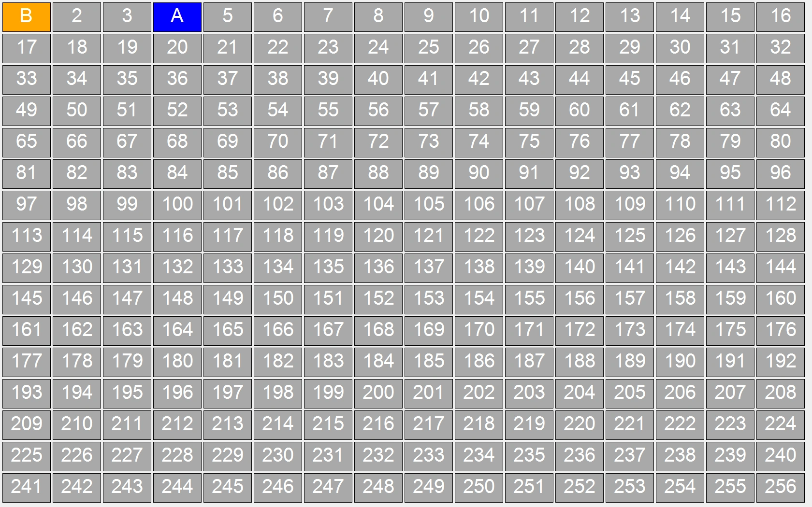
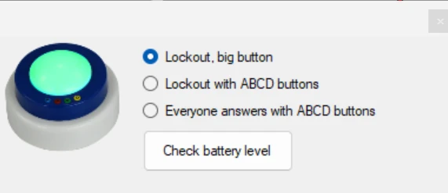

# Testing your buzzer setup

You can use the Buzzer Test application, found in the Windows Start menu under QuizXpress, to test whether the buzzers are connected and configured correctly. This application displays a grid of indicators; when a buzzer event is received, it shows information about the button pressed. This application is also useful for testing the range of the buzzers in a large room.

{ width="461" loading=lazy }

To exit the Buzzer Test application, press the *Escape* key or use the standard Windows *Alt+F4* key combination. Buzzer Test is also available under the *Tools* menu in QuizXpress Studio. During Buzzer Test startup, the background is dark gray while connecting to the buzzer hardware; when the connection succeeds, the background turns white, and if there’s a problem with the hardware, the background turns red.

You can also use Buzzer Test to check the battery level of the buzzers.

{ width="315" loading=lazy }

In the options form, press the **Check battery level** button, then switch on each buzzer by pressing the big dome button. The battery level will be shown on the buzzer grid.
