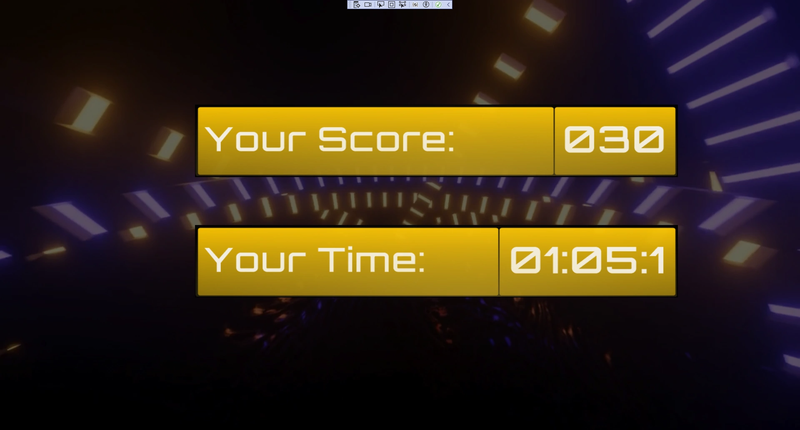
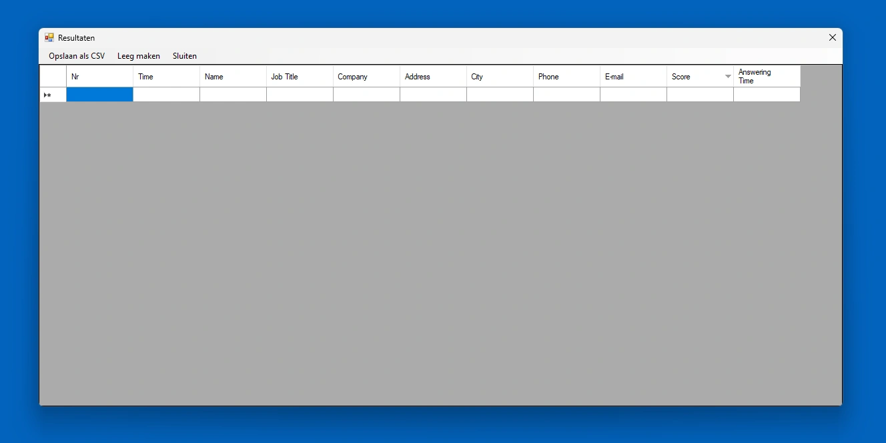
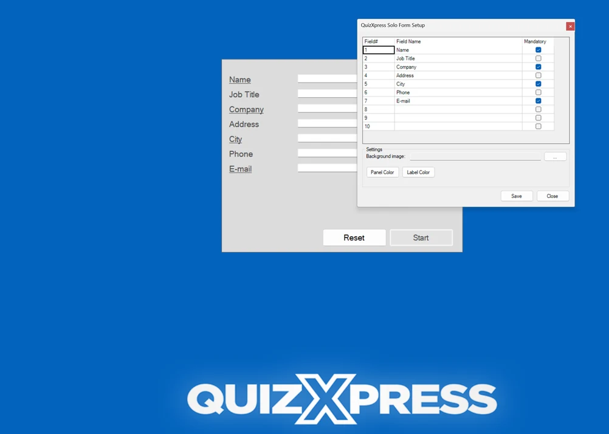

# Running your quiz at a tradeshow booth with QuizXpress Solo

QuizXpress Solo is a variant of QuizXpress Live that allows a single person to play a quiz. Before starting the quiz, however, they need to enter some personal data, after which the quiz starts. By using a single buzzer, this person can answer the questions presented. The final score, as well as the time used to answer all the questions (only the correct ones), is recorded and can be shown, sorted by score, on request.

Imagine being at a trade show where you would like to attract people to your booth by letting them play a quiz. Of course, you would like to collect some information from these people, so they need to fill in some details before the quiz starts. After a person has finished the quiz, the start (data entry) screen of QuizXpress Live is shown again, ready for the next player. As all scores are saved to an Excel file, at the end of the day you can pick out the winner who (for example) wins a prize. QuizXpress Solo can be started from the Start menu through Start > All Programs > QuizXpress > QuizXpress Solo.

The start screen of QuizXpress Solo looks as follows:

The ‘Results’ button, used to show the stored results, is shown on the upper-right side of the screen. It is not shown automatically, however — it is a ‘hidden button’, which is only shown after pressing the Control (Ctrl) key, to prevent unauthorized persons from viewing the scores.

When you press Control, you also see a ‘Setup’ button. By pressing this, you can customize the data entry fields that are shown, customize the color of the central panel and labels, and select an image to use as the background.

Pressing the Ctrl button also shows the Exit button to close the application.

After filling in all necessary information (underlined entry fields are mandatory), the ‘Start’ button becomes green, and the user should press it to begin the quiz. The welcome screen of the quiz is shown. Pressing the buzzer advances to the first question. Questions are answered using the A, B, C, or D button on the buzzer. When a question has been answered, a player can continue by pressing any key on the buzzer. In short, the entire quiz can be operated using a single buzzer. After a person has finished the quiz, the score screen is shown, which looks as follows (depending on the skin chosen — in the example below, the Techno skin was active):

{ loading=lazy }

The score screen shows both the player’s score and the time needed to answer the questions. Only the time spent answering questions correctly is counted. After pressing one of the buzzer buttons, the initial screen of QuizXpress Live is shown again.

Pressing ‘Results’ shows the score screen with all participants that played so far:

{ loading=lazy }

### Customizing the QuizXpress Solo data entry screen

Both the background and the fields that can (or need to be) entered can be customized.

#### Customizing the background picture

The background image of the data entry screen of QuizXpress Solo can be customized by (re)placing a .jpg file named “QuizXpressSolo.jpg”, or a .png file named “QuizXpressSolo.png”, into the installation directory of QuizXpress.

#### Customizing the data entry fields

The data entry fields of QuizXpress Solo can also be customized. To customize the fields, press the ‘Setup’ button shown at the top of the screen (like the ‘Results’ button, this becomes visible when pressing \<Ctrl>). After pressing ‘Setup’, the following screen is shown:

In the window shown (see next page), all data entry fields can be configured (there is a maximum of 10 fields). If a field must be filled in by a participant before the quiz can start, place a checkmark in the ‘Mandatory’ column for that field. In this case, the field will be underlined on the start screen of QuizXpress Solo, indicating to the participant that it needs to be filled in before they can start the quiz. When all mandatory fields are filled in, the ‘Start’ button becomes green, and the user should press it to begin the quiz.

!!! note

    if the number of fields is changed, previously stored score results will be cleared after confirmation. In this case, a message will be shown reminding you to first save the previous results if needed (this can be done by pressing the ‘Results’ button to show the current results, then choosing ‘Save as CSV’).

{ loading=lazy }
