# Pictures

## Inserting a picture

There are several slide formats that contain placeholders for a picture:

| 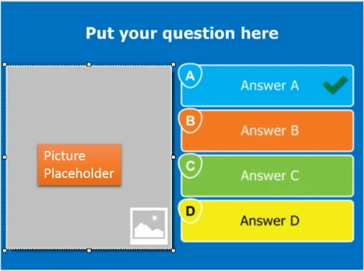{ width="288" loading=lazy } | 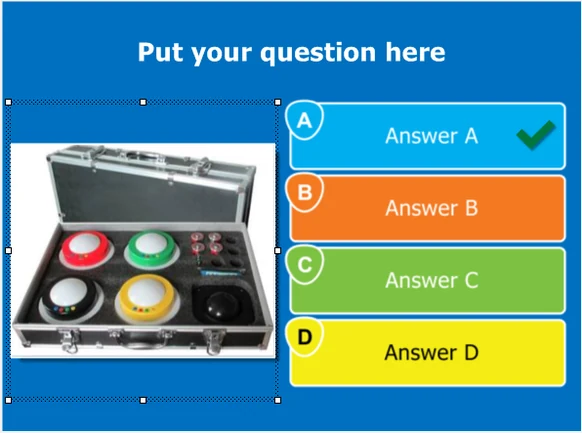{ width="291" loading=lazy } |
|---------------------------------------------------------------------------|---------------------------------------------------------------------------------|

To fill the placeholder with a ‘real’ picture, click the placeholder to select it. The ‘PICTURE’ contextual ribbon tab will then appear:

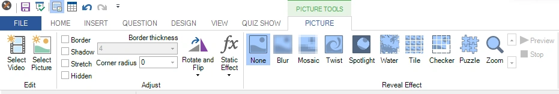{ width="605" loading=lazy }

Here you can click ‘Select Picture’ to open a file browser and select any of the supported image file formats from disk. After that, you can set the picture’s properties and apply effects or static transformations. You can also drag and drop pictures (and videos) directly from Windows Explorer onto a picture placeholder (or onto the slide background to set the background image).

Pictures can also have a textual representation in the form of a label. You can set the label by right clicking the picture and selecting “Set Label” from the menu. One example of where this label is being used is when a picture question is presented on the Smart Buzzer app. If you choose not to have pictures shown on the phone (for Wi-Fi mode, see 4.2.1 and for server mode see 5.7.8.3), the label will be shown on the phone instead.

Alternatively, you can right-click the placeholder to show the options:

Here you can choose to insert a picture, a video, or a chart. When you have a layout with multiple pictures, the pictures can also act as answers to the question. In that case, you can set a picture as the correct answer, indicate the order of the picture answers for an ordered-answer question, or set the correctness percentage for a question with multiple picture answers.

You can also generate pictures with AI. For more information, please refer to 3.8.4.

For more information about other pictures settings please refer to [Picture properties](../user-interface-overview/advanced-properties-grid.md#picture-properties).

## Cropping

When you right-click an image, you’ll see a ‘Crop…’ command in the context menu. This opens the **Crop Image** editor, which lets you select the section of the image to be presented in your quiz:

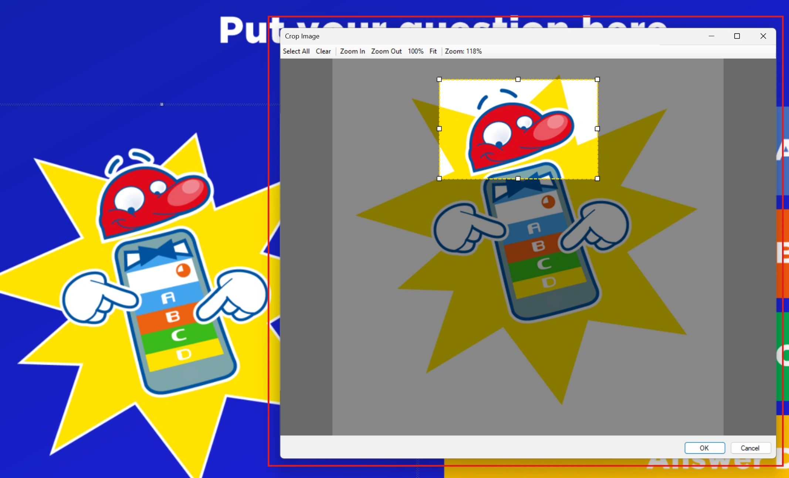{ width="602" loading=lazy }

The result is:

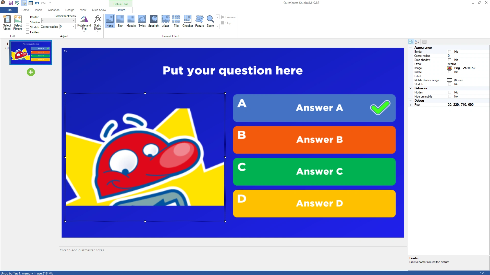{ width="602" loading=lazy }

Note that the *original* image is not retained after cropping, but if you don’t like the result, you can always undo the crop (within the same session).

## Text to image

This is especially useful when creating pairing questions or designing Bingo cards: you can generate images from text directly in Studio. Right-click the picture and select ‘Text to Image’ from the context menu:

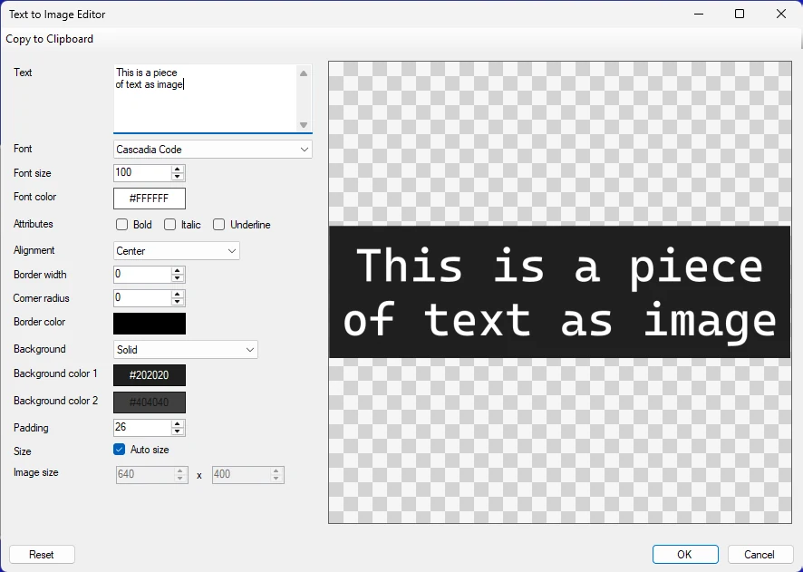{ width="591" loading=lazy }

You can format the text with various options, and when done, click OK to replace the picture placeholder on your slide with the generated image:

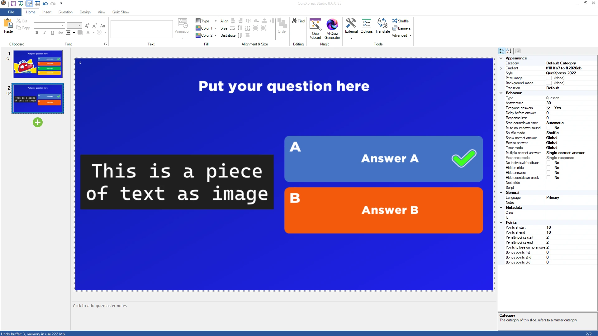{ width="602" loading=lazy }

## Applying effects

One of the properties of a picture within a question is ‘Effect’. When a value is chosen for this property in the property grid, the chosen effect is applied to the picture for the duration of the question. When the question starts, the effect is applied at full strength, so it can be very difficult to see what the picture shows. As the question’s time runs down toward 0, the picture slowly returns to its original state. Effects can be previewed by selecting the picture and clicking ‘Preview’.

See the following picture sequence for an example:

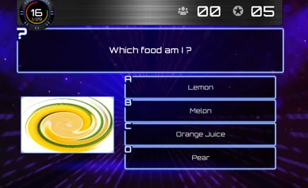{ width="194" loading=lazy } 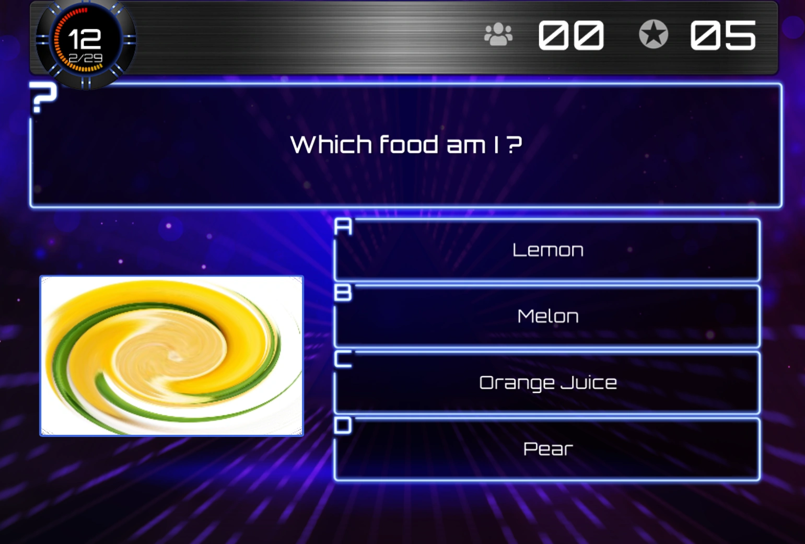{ width="176" loading=lazy } 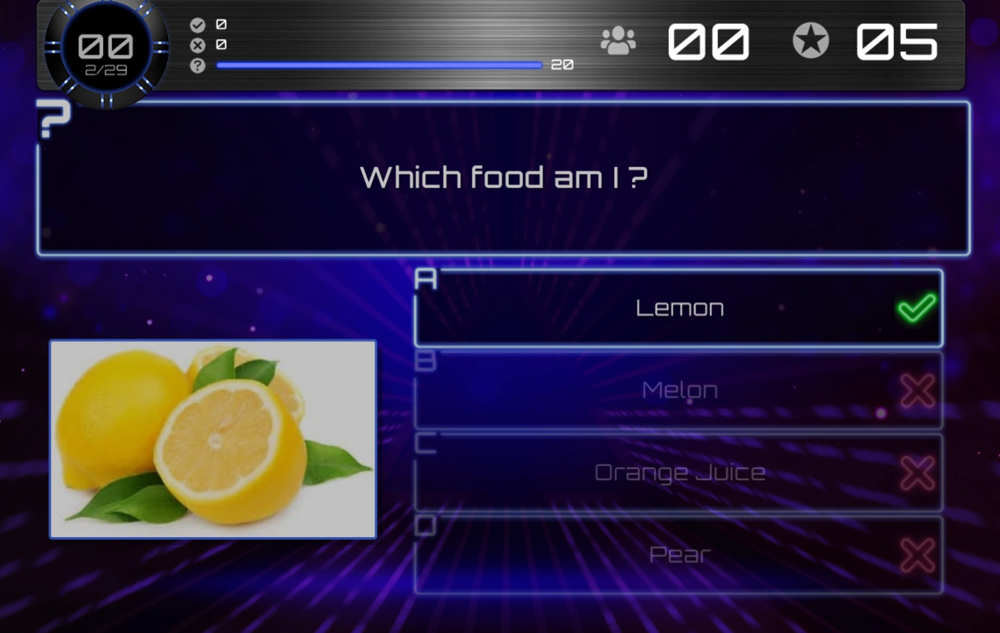{ width="184" loading=lazy }

Different stages of a ‘Twist’ effect.

Below are the effects that are available.

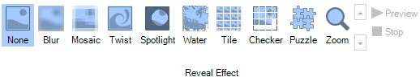{ width="402" loading=lazy }
