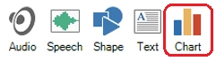
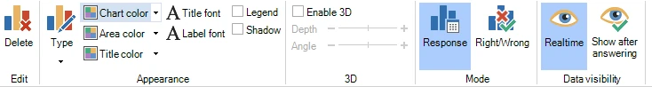
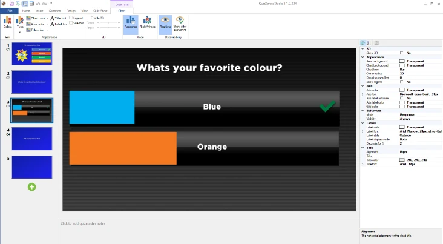

# Real-time chart

You can insert a real-time response chart into a slide. While the clock counts down, the chart shows a live representation of all the answers given by the audience.

{ width="163" loading=lazy }There are two ways to add a chart to a slide:

1)  Choose a slide with a picture/video placeholder. Right-click the placeholder and choose Select Chart

2)  Select the INSERT ribbon tab and click the ‘Chart’ button { width="228" loading=lazy }

After the chart has been inserted, the CHART contextual ribbon tab becomes visible to configure the various options.

{ width="605" loading=lazy }

The tab has the following options:

- Delete: delete the chart from the Slide

- Type: choose one of the following chart types: Bar, Column, Pie, Donut

- Set colors: Chart color (outside section of the chart), Area color (inside section of the chart), Title color (color of the title text above the chart)

- Font buttons: set the title and label font.

- Legend: show a legend next to the chart

- Shadow: add a drop shadow to the chart

- Enable 3D: make the chart 3D. Optionally, you can set the depth and angle of the 3D chart

- Mode: choose whether to show the response distribution in the chart, or the correct/incorrect/not-answered distribution

- Data visibility: indicate whether you want to see the results real-time or if the results should be shown after all players have answered.

In the properties pane, you can configure a couple of other aspects of the chart, such as the title text and alignment, the label color (a label holds the number of responses for a segment), and the axis color.

{ width="465" loading=lazy }

You can set the background color of the chart element to transparent to make more interesting layouts with charts. This allows you, for example, to build audience response slides where the chart overlays the answers.

{ width="466" loading=lazy }
