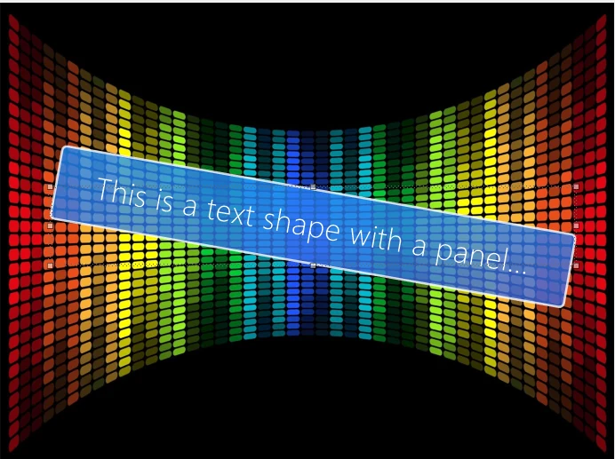
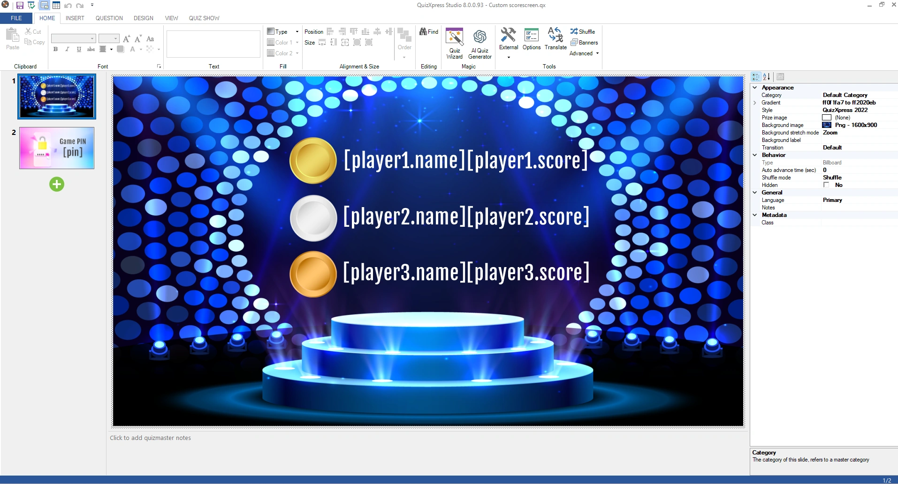
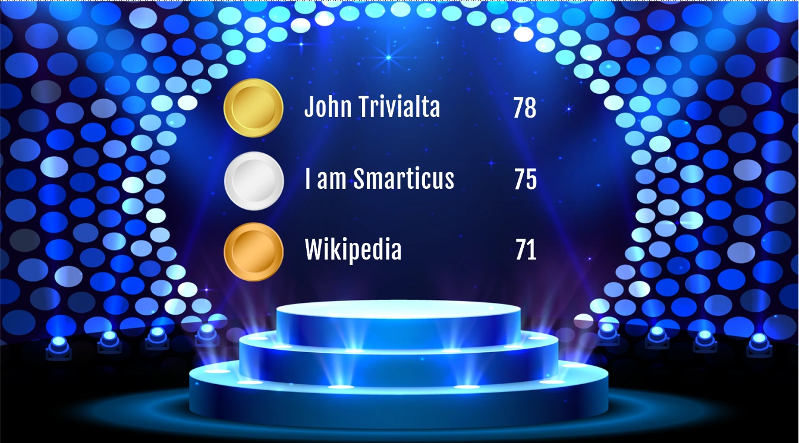
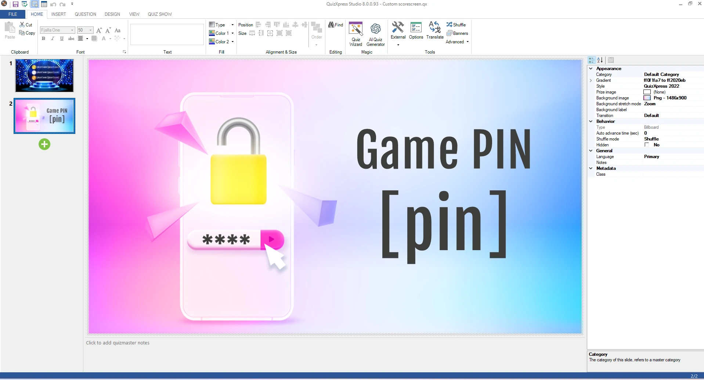
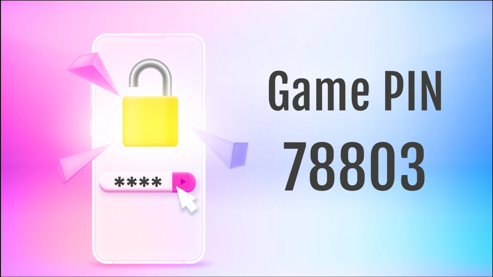
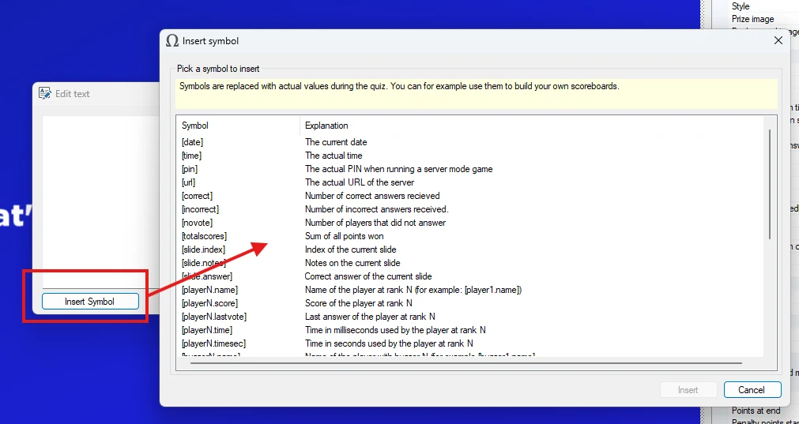
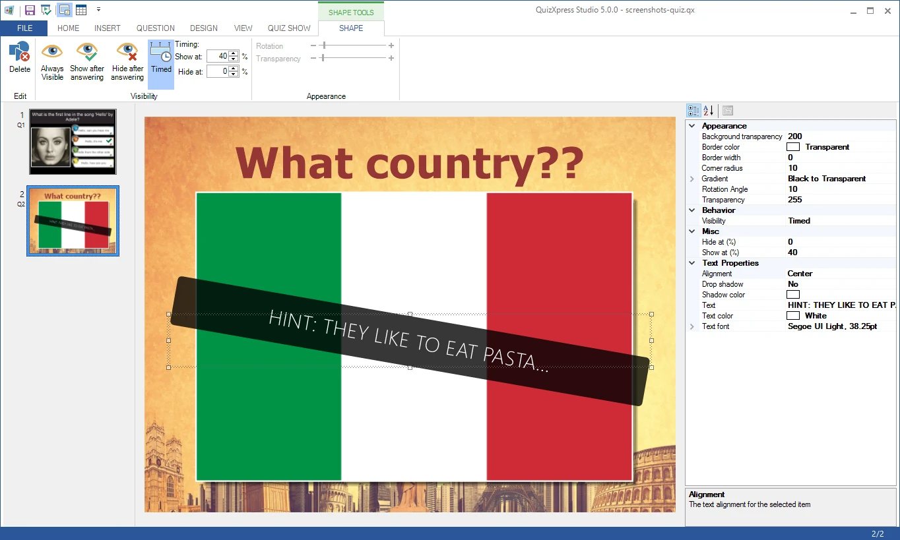

# Shapes

You can add arbitrary shapes or images to your slide. Shapes can be used for various purposes, for example:

- You could insert a large arrow to point out something in a picture you’re questioning your audience about. By setting the Visibility option to ‘Visible after answers’, the shape only becomes visible once the countdown of the question has ended.

- You could hide part of a picture on a slide by overlapping it with a shape. By setting the Visibility option to ‘Hide after answers’, the shape is hidden once the countdown completes, revealing what’s behind it.

To insert a shape, use the *Insert->Shape* command on the task pane (this command becomes visible after you select the slide background). You are then prompted to select a shape file. By default, the file browser filters for *\*.emf* or *\*.wmf* files. These file types use a ‘vector’ format (as opposed to bitmap formats) that looks good even after the shape is scaled. Shapes can also use any supported image format (png, jpg, bmp, etc.) as a source; you can select these other formats in the file browser. Note that image files do not scale well, and the result may look pixelated when enlarged.

The shape element has the following properties:

| Property       | Description                                                                                                                                                                                     |
|----------------|-------------------------------------------------------------------------------------------------------------------------------------------------------------------------------------------------|
| Picture        | The source picture for the shape. You can use the … button to select another source                                                                                                             |
| Rotation Angle | The angle by which the shape is optionally rotated                                                                                                                                              |
| Transparency   | Transparency of the shape                                                                                                                                                                       |
| Visibility     | Visibility condition. Can be set to ‘Always visible’, ‘Visible after answers’ (hide the shape until the question is over), or ‘Hide after answers’ (show the shape until the question is over). |

To delete a shape, select it and press the Delete key. QuizXpress ships with some default example shapes. You can also create your own shapes, for example with Microsoft PowerPoint, by saving a PowerPoint shape as a picture (right-click the shape, select ‘Save as picture’, and choose *wmf* or *emf* as the file format).

## Text shapes

You can add text items to your quiz slides, and their visibility can be controlled just like picture shapes. One example use of a text item is to show the correct answer on an open question (after the question has been answered and judged), or to give hints during the question. Using the properties grid, you can set some of the more advanced properties, such as the color of the text background panel and the corner radius, to create nice-looking visuals (note that these properties are not available in the ribbon). Text shapes have the following additional properties:

| Property                | Description                                                                           |
|-------------------------|---------------------------------------------------------------------------------------|
| Background transparency | Transparency of the background panel. By default the background is fully transparent. |
| Border color            | Color of the border around the panel                                                  |
| Border width            | Width of the line around the panel                                                    |
| Corner radius           | Radius of the background panel corners                                                |
| Gradient                | Gradient fill of the background                                                       |
| Alignment               | Text alignment (left, center, right)                                                  |
| Drop shadow             | Drop shadow for the text                                                              |
| Shadow color            | Drop shadow color                                                                     |
| Text                    | The text itself                                                                       |
| Text color              | Color of the text                                                                     |
| Font                    | Font used to draw the text                                                            |

With these properties, you can create text panels such as:

{ width="376" loading=lazy }

### Text Symbols

Using text shapes, you can make custom screens that contain data only known while the show is running. To do this, text fields (shapes) in QuizXpress can contain predefined ‘symbols’. When running the game show with an audience, these symbols are replaced with their corresponding values.

Things like player names, scores, responses, response times, the PIN code, slide index, slide notes, the number of correct and incorrect responses, and many more can be used.

Below are some examples of screens with a custom design. The left side shows how the slide looks in QuizXpress Studio. The right side shows how the slide could look during a game.

| { width="314" loading=lazy } | { width="305" loading=lazy } |
|---------------------------------------------------------------------------------|---------------------------------------------------------------------------------|
| { width="319" loading=lazy }  | { width="303" loading=lazy } |
|                                                                                 |                                                                                 |

When editing text elements in the text editor form (double-click a text or text shape to open it), there is an ‘Insert Symbol’ button to insert a text symbol. You can also type the symbols in manually. The Insert Symbol dialog lists all symbols along with an explanation for each.

{ width="544" loading=lazy }

Some examples of symbols you can use:

| **\[date\]**        | Current date                                        | **\[slide.answer\]**     | Correct answer of current question |
|---------------------|-----------------------------------------------------|--------------------------|------------------------------------|
| **\[time\]**        | Current time                                        | **\[playerX.name\]**     | Name of player with rank X         |
| **\[pin\]**         | Current mobile PIN                                  | **\[playerX.score\]**    | Score of player with rank X        |
| **\[url\]**         | URL of game server                                  | **\[playerX.lastvote\]** | Last vote                          |
| **\[correct\]**     | No. of players that answered correct after question | **\[playerX.time\]**     | Time for answering in milliseconds |
| **\[incorrect\]**   | No. of players that answered wrong after question   | **\[playerX.timesec\]**  | Time for answering in seconds      |
| **\[novote\]**      | No. of players that did not answer after question   | **\[buzzerX.name\]**     | Name of player with buzzer X       |
| **\[slide.index\]** | Slide number of current question                    | **\[buzzerX.score\]**    | Score of player with buzzer X      |
| **\[slide.notes\]** | Notes of the current question                       |                          |                                    |

You can use the symbols in any text item. For example, you could insert a text shape and type something like: “Please open your Smart Buzzer app and connect with game code: \[pin\]”

Text symbols are a great way to make your quiz slides more dynamic, and, for example, to design your own custom scoreboards.

## Timed shapes

You can also show and hide shape and text items over time by setting the timed shape properties on the SHAPE TOOLS contextual ribbon tab. This allows you, for example, to create a ‘hint’ that appears after a certain time as the countdown proceeds, as shown in the following example:

{ width="605" loading=lazy }

In this example, the text item with panel appears after 40% of the countdown time is over.

When you leave the ‘Hide at:’ percentage at 0%, the hint is shown until the end of the countdown.

Alternatively, you can, for example, remove elements over time that occlude parts of a photo.
