# Sound

Sound fragments can be used for questions such as “Who wrote this song?”, “What bird is singing here?”, or “What is this noise?”. To make things interesting, you can vary the speed of the sound over time by setting the ‘Speed from’ (playback speed percentage when the sound starts playing) and ‘Speed to’ (playback speed at the end of the sound fragment) properties. Likewise, you can vary the pitch of the sound.

## Inserting a sound file

To add a sound fragment to a quiz slide, select the INSERT ribbon tab and click the ‘Audio’ button, then select an mp3 or wav file and select whether to link or embed the file:

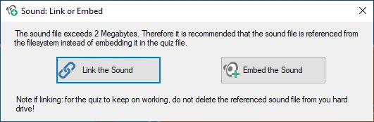{ width="321" loading=lazy }

Linking results in smaller, more manageable quiz files, but you’ll have to make sure all external files remain accessible — either at their original path or in the folder where the quiz file is stored (alternatively, you can keep the files external and pack your quiz before distributing it).

Once the file is inserted, the AUDIO contextual ribbon tab becomes visible to configure the various options.

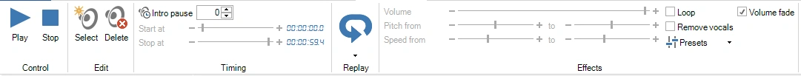{ width="720" loading=lazy }

## Trimming a sound

Usually you only want to play part of a song or recording: the chorus, the intro, or just the few seconds that give the answer away. The trim editor shows the sound as a waveform, so you can see where the music starts, where it gets loud and where it fades out, and choose the part to play by listening to it.

The trim editor doesn't change the sound file itself. It only sets the sound's start and end time, so you can always go back to the whole track.

### Opening the trim editor

Select the sound icon on the slide, then use one of these:

- Click the ‘Trim’ button in the ‘Timing’ group on the AUDIO ribbon tab, next to the start and stop times. The small arrow in the bottom-right corner of the ‘Timing’ group opens the same editor.

    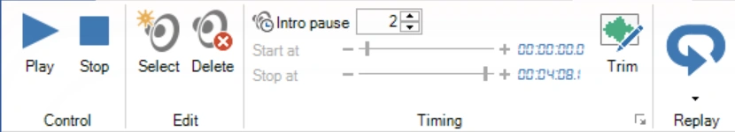{ width="420" loading=lazy }

- Right-click the sound icon on the slide and choose ‘Trim sound...’.

    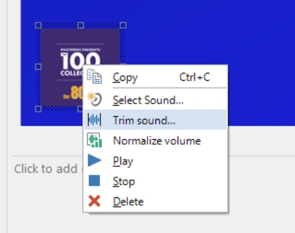{ width="240" loading=lazy }

!!! note
    You can't trim Spotify tracks and MIDI files, or a linked sound file that can't be found. The ‘Trim’ button is greyed out for these.

### Choosing the part to play

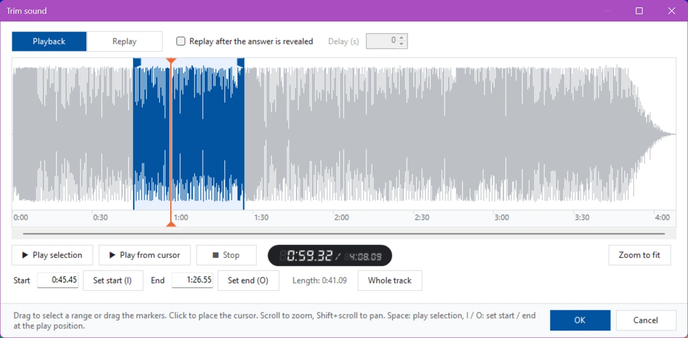{ loading=lazy }

The part that will play is highlighted in blue. To change it:

- **Drag across the waveform** to select a new part, or drag the markers at the start and end of the selection.
- **Type the times** in the ‘Start’ and ‘End’ boxes. You can enter seconds (`75`), minutes and seconds (`1:15`) or hours, minutes and seconds (`0:01:15`), with decimals if you like (`1:15.5`). ‘Length’ shows how long the selected part plays.
- **Set the start or end while listening**: click ‘Set start (I)’ or ‘Set end (O)’, or press I or O on the keyboard, at the exact moment you hear the right spot. When no sound is playing, these buttons use the cursor position instead.
- **‘Whole track’** selects the complete sound again.

Click anywhere in the waveform to place the cursor (the orange line).

To listen:

- ‘Play selection’ (or the Space bar) plays the selected part. Press Space again to stop.
- ‘Play from cursor’ plays from the cursor to the end of the sound.
- While the sound is playing, click the waveform to jump to that spot.

The display next to the buttons shows the current position and the total length of the sound.

For precise work, zoom in with the mouse wheel and use Shift + mouse wheel or the scroll bar under the waveform to move left and right. ‘Zoom to fit’ shows the whole sound again.

Click ‘OK’ to apply the new start and end time, or ‘Cancel’ to leave the sound as it was. You can undo a trim in one step with Undo. If you [normalized the sound's volume](#normalizing-the-volume), QuizXpress measures the new part again so it stays just as loud.

### Setting the replay part

In the same editor you can choose the part that plays again after the answer is revealed (see [Replay](#replay) below). Often that's a different part of the song than the one played during the question, for example the chorus.

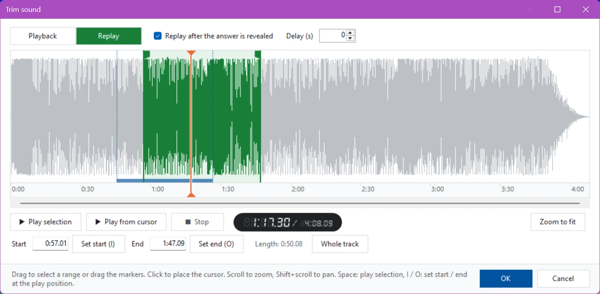{ loading=lazy }

1. Tick ‘Replay after the answer is revealed’. The editor switches to ‘Replay’ and the selection turns green.
2. Select the replay part in the same way as described above.
3. Optionally, enter a ‘Delay (s)’: the number of seconds to wait after the answer is revealed before the replay starts.

Use the ‘Playback’ and ‘Replay’ buttons at the top left to switch between the two parts. The part you are not editing is shown as a bar along the bottom of the waveform (blue for playback, green for replay), so you can see how the two relate.

!!! note
    Replay isn't available when the sound's ‘Keep playing’ option is on, because the sound then never stops.

## Replay

Often you’ll want to replay (part of) the music after the question has finished, synchronized with revealing the correct answer on the slide. This can be done by enabling the audio replay functionality:

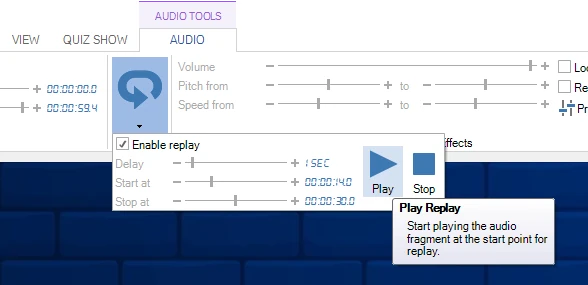{ width="576" loading=lazy }

You can set an initial delay, the song’s start time, and the end time. The easiest way to choose the replay part is on the waveform in the trim editor; see [Setting the replay part](#setting-the-replay-part).

## Normalizing the volume

Songs and sound clips from different sources are rarely equally loud: an old recording or a classical piece can be much quieter than a modern pop song, so players strain to hear one question and are blasted by the next. Volume normalization fixes this. QuizXpress measures how loud each sound really is and adjusts it so all sounds play equally loud, in Quiz Studio and during the show.

Normalization doesn't change the sound files. It sets the sound's ‘Loudness gain’ (see [below](#the-loudness-gain-property)), so you can always change or undo it. Only the part of the sound that plays is measured: the part between its start and end time.

You can normalize all sounds in the quiz at once, or a single sound.

### All sounds in the quiz

Click ‘Normalize volume’ in the ‘Tools’ group on the HOME ribbon tab.

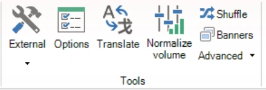{ width="220" loading=lazy }

The ‘Normalize sound volume’ window opens and immediately starts measuring all sounds in the quiz. Long songs take a few seconds each.

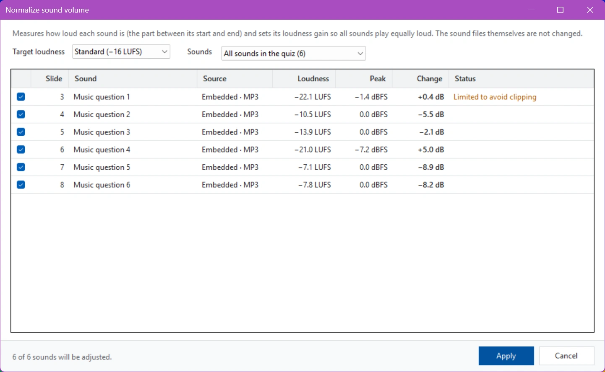{ loading=lazy }

For every sound you see:

- **Slide** and **Sound**: where the sound is and what it is (the file name, or the question text for an embedded sound).
- **Source**: whether the sound is embedded in the quiz or linked, and its file type.
- **Loudness**: how loud the sound is, in LUFS (Loudness Units relative to Full Scale, the measure streaming services and broadcasters use). Closer to 0 is louder: −8 LUFS is a loud pop song, −22 LUFS a quiet recording.
- **Peak**: the loudest moment in the sound, in dBFS. 0 dBFS is the loudest a sound file can store.
- **Change**: how much QuizXpress will turn the sound up (+) or down (−), in dB.
- **Status**: anything worth knowing about the sound (see the table below).

Choose the ‘Target loudness’:

| Target | Use it when |
|---|---|
| Standard (−16 LUFS) | The default. About as loud as music on streaming services. |
| Quieter (−18 LUFS) | You want a bit more headroom, for example when sounds play over background music. |
| Broadcast (−23 LUFS) | You want the level used by European TV and radio (EBU R128). Noticeably quieter; turn up the sound system to match. |

Changing the target updates the ‘Change’ column right away; the sounds aren't measured again. Quiz Studio remembers the target you chose and also uses it to normalize single sounds.

If you selected some slides before opening the window, the ‘Sounds’ list lets you choose between ‘All sounds in the quiz’ and ‘Sounds on the selected slides’.

All sounds that will change are ticked. Untick a sound to leave it as it is. The line at the bottom shows how many sounds will be adjusted. Click ‘Apply’ to set the new loudness gains. You can undo the whole normalization in one step with Undo.

| Status | Meaning |
|---|---|
| Limited to avoid clipping | The sound is quiet but already has loud peaks. QuizXpress turns it up only as far as it can without distorting (peaks stay below −1 dBFS), so it may stay a little quieter than the others. |
| Already at target | The sound is already at the target loudness and isn't changed. |
| Silent | There is no sound in the part that plays (check its start and end time). |
| Skipped: MIDI has no audio to measure | MIDI files can't be measured and keep their volume. |
| Skipped: Spotify track | Spotify tracks can't be measured and keep their volume. |
| Sound file is missing | A linked sound file can't be found. [Fix the link](../other-functionality/fixing-broken-links.md) and try again. |

### A single sound

To normalize just one sound, for example after replacing it, select the sound icon on the slide and click ‘Normalize’ in the ‘Effects’ group on the AUDIO ribbon tab, or right-click the sound icon and choose ‘Normalize volume’. The tooltip of the button shows the target loudness that will be used: the one last chosen in the ‘Normalize sound volume’ window.

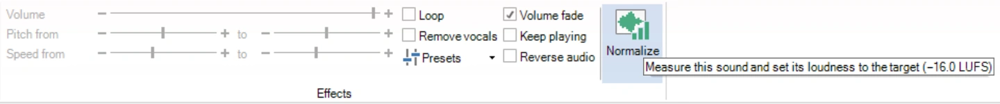{ width="720" loading=lazy }

QuizXpress measures the sound and sets its loudness gain straight away, without opening a window. A bar below the ribbon shows the result, with an ‘Undo’ link to reverse it:

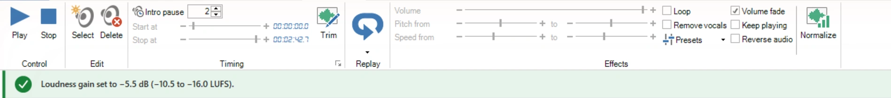{ width="720" loading=lazy }

### The loudness gain property

The result of normalization is stored in the sound's ‘Loudness gain’ property, in the ‘Audio’ section of the property panel. 0 dB leaves the sound unchanged; the range is −30 to +20 dB. You can also fine-tune it by hand.

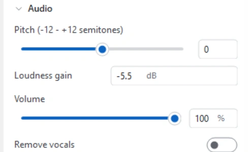{ width="250" loading=lazy }

The loudness gain comes on top of the sound's ‘Volume’. Unlike the volume, which can only make a sound quieter, the loudness gain can also make a quiet sound louder.

!!! tip
    Normalize after trimming a sound, because the part that plays determines how loud it is. If a sound was already normalized and you change its start or end time in the [trim editor](#trimming-a-sound), QuizXpress measures the new part and adjusts the loudness gain automatically.

## Spotify ™ playlist import

You can import your Spotify playlists (optionally with album art and a 30 second preview of the songs) and effortlessly create a Trivia Music quiz or a Disco Bingo game. QuizXpress does not interact with Spotify directly but supports a CSV file format produced by the [Exportify](https://watsonbox.github.io/exportify/) website. To use this function, export your playlist to CSV using the site and import the file in QuizXpress. A form will appear for you to make some choices:

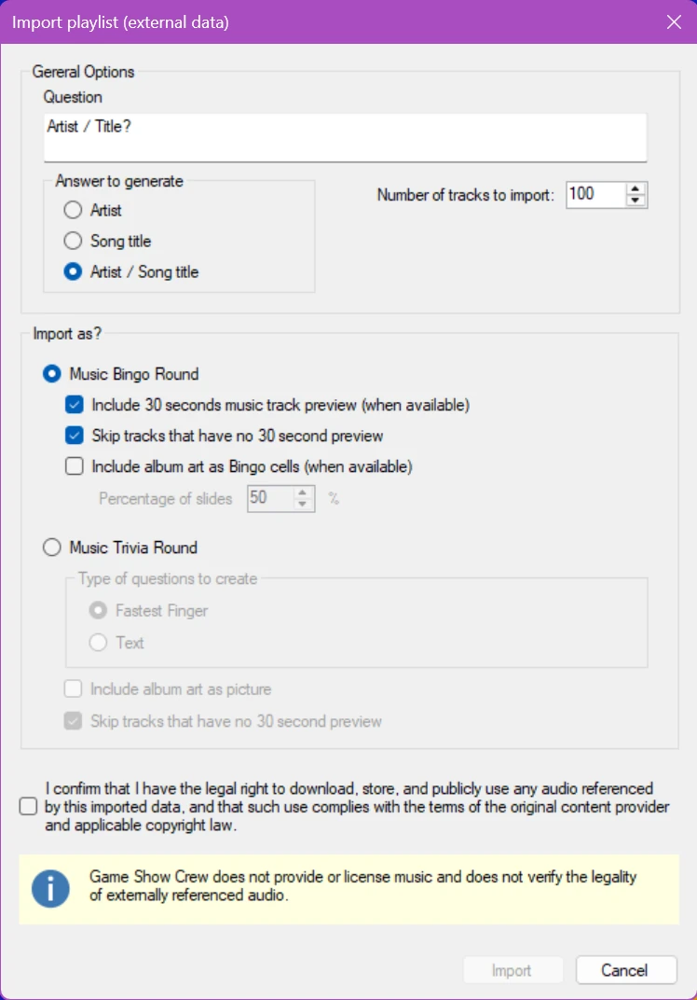{ width="224" loading=lazy }

If we create a Bingo game with these options, we get a mix of cells with album art and Artist/Title text, like:

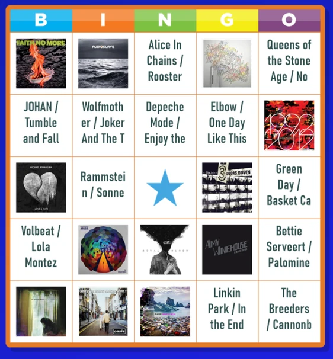{ loading=lazy }

The created slides and game settings can be tweaked after the import.

## Applying sound effects

There are various effects possible when playing sounds:

- **Increase sound speed** – this is accomplished by giving the sound’s ‘speed percentage’ and ‘target speed percentage’ properties the same value in the Property Editor. This value must be greater than 100 to speed up the sound. To show the properties of a sound, left-click the sound icon in the design area.

- **Slow down sound speed** – this is accomplished by giving both properties mentioned above a value smaller than 100. Again, give both properties the same value; you’ll see why below.

- **Slow speed to normal speed** – to accomplish this, enter a value smaller than 100 for the sound’s ‘speed percentage’ property. This ensures the sound starts playing slowed down. Leave the ‘target speed percentage’ property unchanged; its default value is 100, meaning normal speed. As a result, QuizXpress will play the sound slowly at first, but as time progresses, it will reach the target speed of 100 (normal speed).

- **Fast speed to normal speed** – to accomplish this, select a value greater than 100 for the ‘speed percentage’ property. Leave the ‘target speed percentage’ property unchanged.

- **Reverse** – plays the sound fragment in reverse, challenging the players to recognize the song (tick the Reverse audio checkbox in the sound ribbon)

You can listen to these sound effects while creating the question that contains the sound. To listen to the sound and its effects, click the ‘Play’ button in the ribbon, or select ‘Play’ from the sound’s context menu.

If you don’t want the sound to start immediately when the question starts, use the sound’s ‘Intro Pause’ property to delay playback (this gives participants the opportunity to read the question first, or gives the quizmaster the opportunity to read the question aloud first).

!!! note

    other sounds, such as the buzzer sounds, background music, and countdown music, can be configured in Quiz Setup.*
