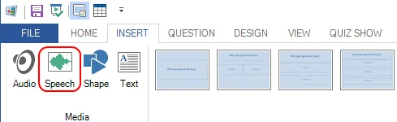
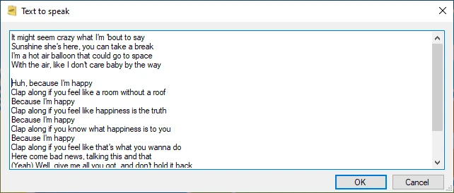
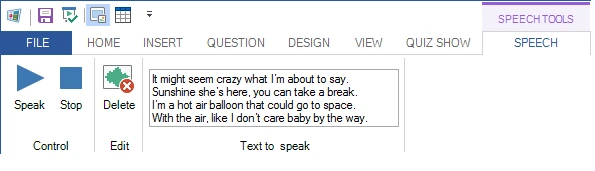

# Speech

You can add computer speech to your quiz slides. QuizXpress uses the Windows speech synthesizer to read aloud pieces of text that you specify. For example, you can create a question where song lyrics are read aloud, and the audience must guess the artist or the song.

To insert a speech item, select the INSERT ribbon tab and click the ‘Speech’ button:

{ width="428" loading=lazy }

Next, you will be able to enter the text to speak:

{ width="425" loading=lazy }

After the speech item has been created, you can change it using the controls in the contextual ribbon tab.

{ width="595" loading=lazy }
