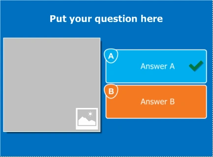
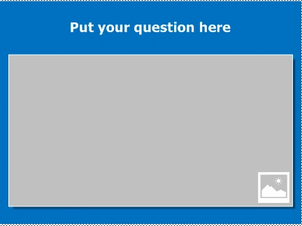
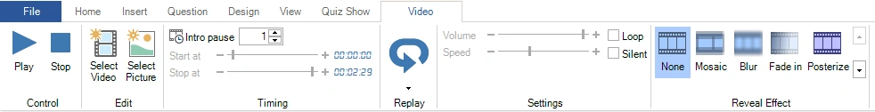
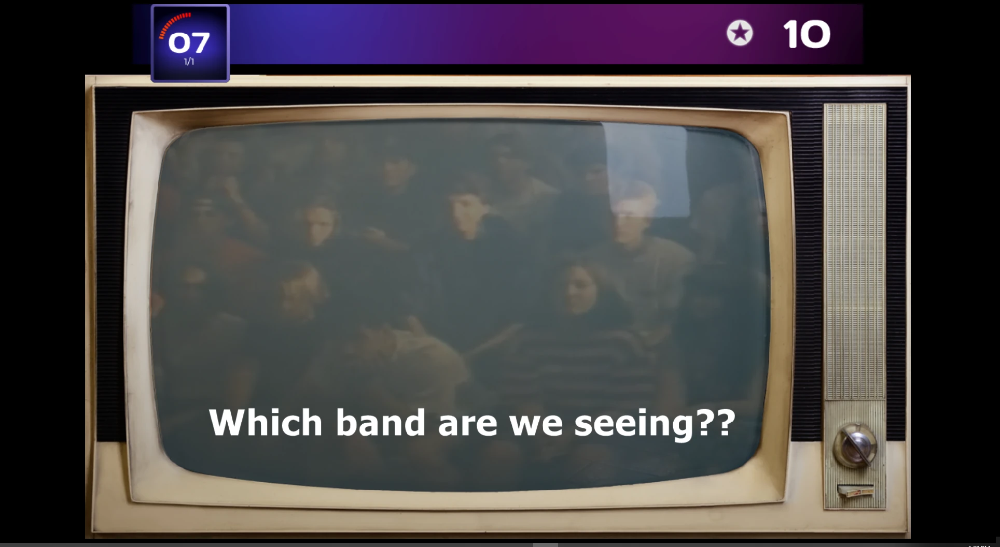
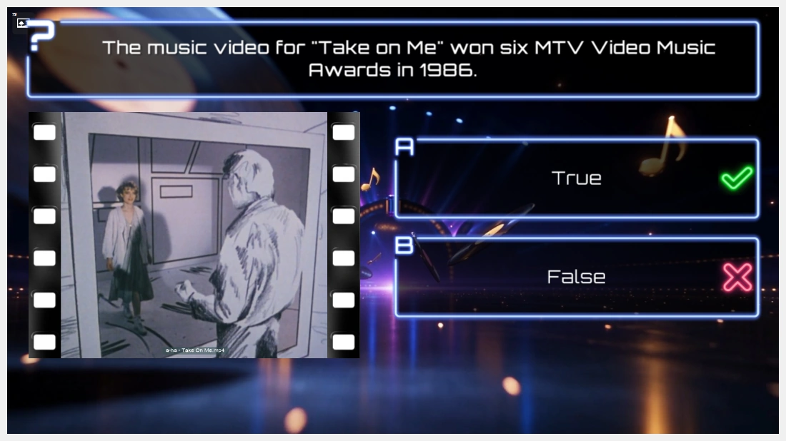

# Video

QuizXpress also supports the use of video fragments. Video fragments can be used in questions, but also, for example, to communicate a marketing message to your audience. There is a special ‘full screen video’ slide format that plays the selected video in full screen during the game show.

QuizXpress supports various file formats but to successfully playback video files the correct video CODEC (a Windows component used to stream a particular video format) needs to be installed on your system. The QuizXpress installer adds the LAV Codec pack to your system. The latest version of that CODEC pack can be found here: <https://github.com/Nevcairiel/LAVFilters/releases>

## Inserting a video

To add a video to a question, first create a new question with a template that has one picture/video placeholder.

| { width="163" loading=lazy } | { width="161" loading=lazy } | { loading=lazy } | This last template shows the video in full screen mode. You can also use this to show promotional material about your company in between questions! |
|-------------------------------------------------------------------------------|---------------------------------------------------------------------------------|-------------------------------|-----------------------------------------------------------------------------------------------------------------------------------------------------|

Then right-click the picture box placeholder and click ‘Select Video’ from the context menu. This opens a file dialog where you can select a video fragment *(\*.avi, \*.wmv, \*.mov, \*.mp4, \*.mpg, \*.mpeg, \*.flv, \*.3gp, \*.webm*).

Just like audio, a video can be linked or embedded. Embedding a video fragment into a quiz means the fragment is incorporated into the quiz file. Linking a video fragment means a reference is made from the quiz file to a video on the file system. In general, *linking* videos is recommended while you’re still editing the quiz. When you’re done editing, you can use the ‘Pack’ function to combine all externally linked files into one large quiz file (max 2GB). With this combined file, it’s easy to move your quiz to another computer without having to worry about the external assets.

!!! note

    when linking videos, be sure not to remove the videos from your file system. When copying the quiz to a different computer, the videos must be copied into the same folder as the quiz file so that QuizXpress can locate them.*

Embedded video content cannot be larger than 30MB. In general, try to keep your videos as small as possible: if your question is only thirty seconds long, there’s little use in inserting a four-minute video. In that case, use a video editing tool to trim the video.

## Editing video properties

When selecting a video, the contextual ribbon tab for video becomes visible:

{ loading=lazy }

From here you can preview the video, set the start and end markers, set the volume, and change the playback speed (note that changing the playback speed may not work for all video types and depends on the CODECs being used). You can also configure an effect that changes over time. For example, you can use the Mosaic effect to show the video fully pixelated at the start and gradually reveal the details while asking your audience a question about the video, with decreasing points. You can also play the video in silent mode and loop the fragment until the question ends. With ‘Select Picture’, you can change the slide element back to a static picture.

With Replay, you can enable replaying part of the video after the question has finished (when the correct answer is revealed).

## Video in the background

A video can also play behind the whole slide, as its background. Such a background video is not placed in a placeholder: right-click the background of the slide and choose ‘Background video…’, or set the ‘Background video’ property of the slide. A background video loops and plays without sound by default. See [Background video](../backgrounds.md#background-video) for all its settings.

In the screenshot below, a background video is combined with an overlay shape to create an old-school TV effect (a shape with a transparent screen is placed on top of the background video).

{ loading=lazy }

!!! note
    Earlier versions had a ‘Background’ tick box for a video in a placeholder. That box is gone: a background video now has its own place behind the slide. Background videos in quizzes made with an earlier version are converted automatically when you open the quiz.

## Combining a background video with a video in a placeholder

Because the background video does not use a placeholder, a slide can have both: a background video playing behind the slide and a video (or picture) in its placeholder, which plays on top of it. For example, use a looping studio animation as background video and the question’s film fragment in the placeholder.

{ loading=lazy }

The two videos each keep their own settings. The video in the placeholder starts after its intro pause and always pauses and resumes along with the quiz. The background video starts as soon as the slide appears and, unless you switch on ‘Sync with quiz’, keeps playing. Leave the background video silent (the default) so its sound does not mix with the sound of the video in the placeholder.
