# Word Game

A Word Game element is a graphical element for creating questions around words and sentences. When inserting a Word Game, the following window appears:

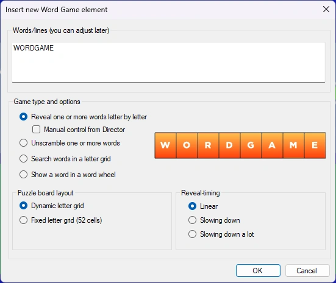{ width="320" loading=lazy }.

Here you enter the text to be displayed, and select the type of game and any related options.

There are four different games:

| *Word Reveal* (shown here in fixed 52-letter grid format). The letters appear over time, starting with an empty grid           | 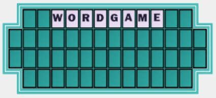{ width="279" loading=lazy } |
|--------------------------------------------------------------------------------------------------------------------------------|---------------------------------------------------------------------------------|
| *Word Scramble* (anagram). The word/sentence will unscramble over time                                                         | { width="388" loading=lazy } |
| *Letter Grid. The words are hidden in a random letter grid. When the question is over, the words are highlighted.*             | 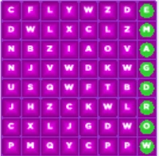{ width="122" loading=lazy }  |
| *Word Wheel. The word is presented as a (optionally spinning) wheel. One letter is randomly removed and placed in the center.* | 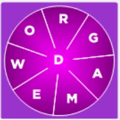{ width="126" loading=lazy } |

Both Word Reveal and Word Scramble can be visually presented as a regular multiline grid (dynamic letter grid) or on a fixed 52-cell letter board (as seen on the Wheel of Fortune© TV game show). Note that for these two elements, it’s up to you to split the sentence across multiple lines by pressing Enter to move to the next line.

When using Word Reveal, you can choose to manually control the reveal from QuizXpress Director. When running a quiz show, this shows the ‘Reveal Word Game’ tab in QuizXpress Director once the slide is shown. Here, you can manually reveal a letter that a player mentions by pressing the corresponding button, or alternatively reveal a vowel, consonant, word, or the whole phrase (all).

If the letter is part of the phrase, it is revealed in the quiz player. After pressing a letter, Director also shows whether it is in the phrase (green letter) or not (red letter).

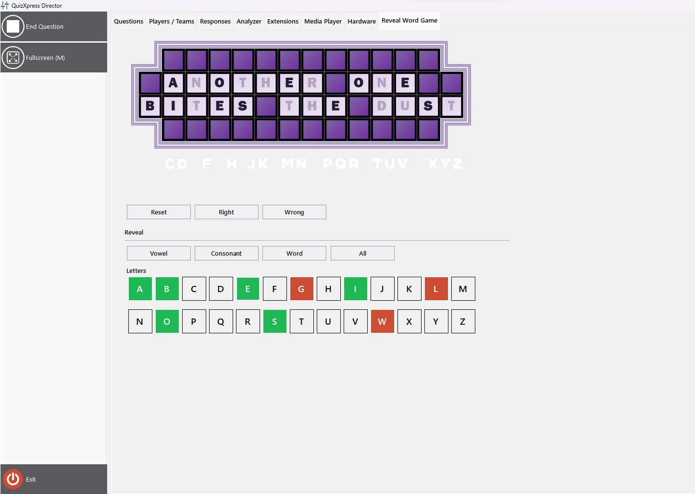{ loading=lazy }

If a player tries to guess the word, you can judge it by pressing the right or wrong button, after which a big green tick or red cross appears on the quiz player screen for the audience.

The quiz player shows the letter grid with the revealed letters. It can also show an overview of letters that have not yet been chosen (by enabling the ‘Show alphabet strip’ option in the advanced properties in QuizXpress Studio).

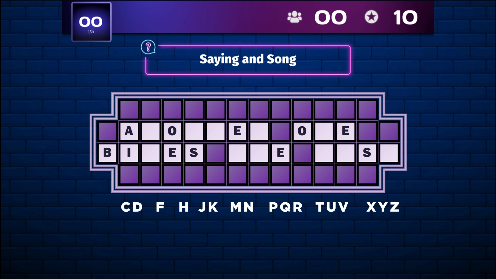{ loading=lazy }

Manual mode also supports buying vowels and winning or losing points for guessing consonants. The scoring settings for vowels and consonants can be configured in QuizXpress Studio after selecting the Word game element on the slide.

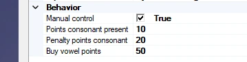{ width="359" loading=lazy }

The player who will be playing the game can be selected during the quiz in QuizXpress Director on the Reveal Word game tab.

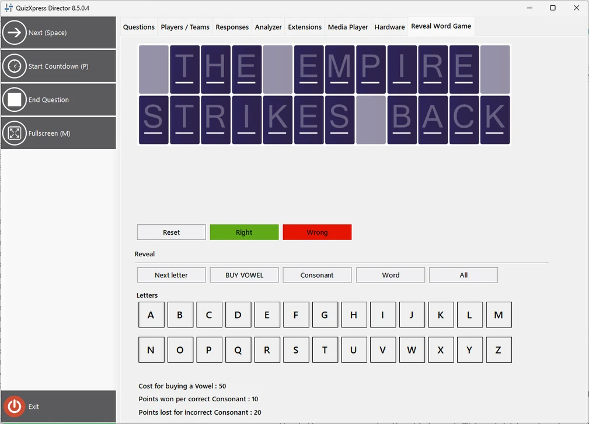{ width="505" loading=lazy }

Points won or lost will be shown in the quiz player.

| { loading=lazy } | 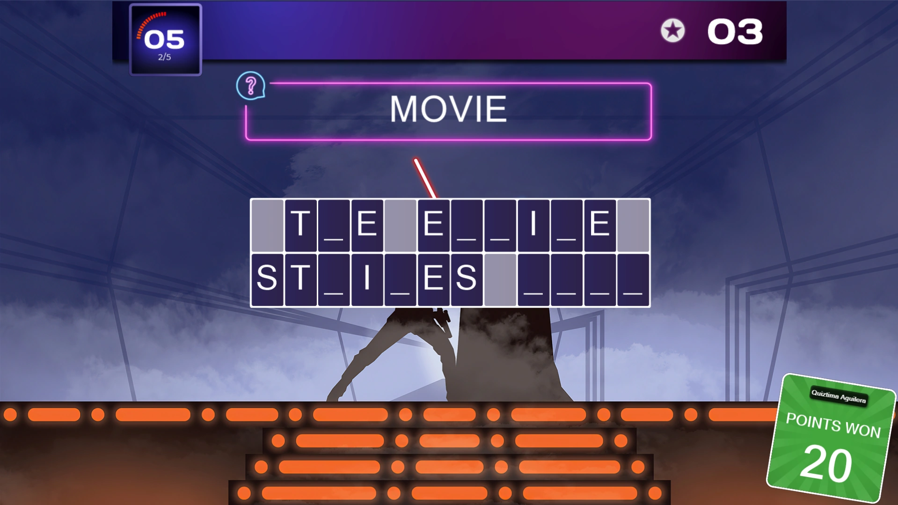{ loading=lazy } | 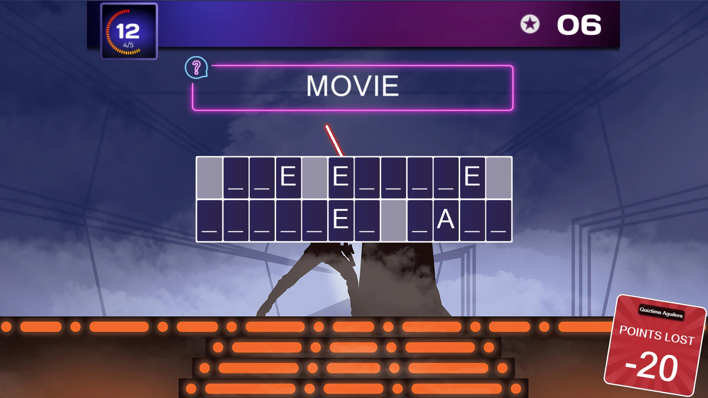{ loading=lazy } |
|---------------------------------------------------------------------------------|---------------------------------------------------------------------------------|---------------------------------------------------------------------------------|
| **Buy Vowel**                                                                   | **Correct consonant**                                                           | **Incorrect consonant**                                                         |

For the automatic Word Reveal and Word Scramble, you can configure the reveal/unscramble timing. By default, each step takes the same amount of time, meaning that for the reveal game, letters appear at a fixed interval. This might be fine for a single word, but for a longer sentence you may want to use a different scheme — for example, showing more letters at the beginning and then slowing down. You can choose your preferred option in the ‘Reveal timing’ section.

Once a Word Game element is inserted onto your slide, you can configure it further: click the Word Game element, then change its settings in the Word Game ribbon at the top of Studio, or in the advanced properties grid shown on the right of QuizXpress Studio.

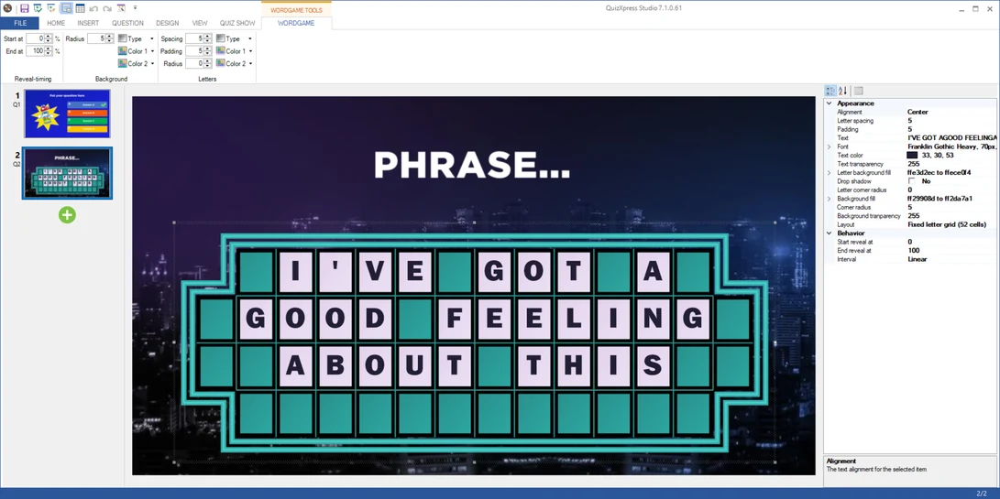{ loading=lazy }

You can use this element for different types of questions. For example, a fastest-finger question where the player who buzzes in guesses the correct phrase based on the letters revealed so far, or names a letter to reveal and then tries to guess the phrase. Or you could use a full-text-answer question with QuizXpress mobile, where all players can type in the correct answer. Combining this with diminishing points gives faster players more points. Alternatively, give each player a turn and let them win points using manual reveal mode in combination with points. The color, font, letter size, padding, etc. can all be edited in the ribbon or the advanced properties grid.

The Word Game element follows the slide’s ‘Show correct answer’ property. When set to ‘Do not show’, the Word Game will not reveal the correct answer when the question ends. When set to ‘Global’ (the default), the Word Game follows the ‘Show correct answer on quiz slides’ setting from Quiz Setup.
