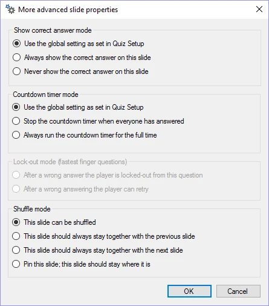

# Advanced slide properties

On this dialog, you can configure a few more advanced properties for the current question:

{ width="177" loading=lazy }

**Show correct answer mode**

Setting that indicates if the correct answer should be shown after the question is over. By default, the setting as defined in QuizXpress Setup is used.

**Countdown timer mode**

Setting to indicate how the countdown timer should behave for this question. By default, the setting as defined in QuizXpress Setup is used.

**Lock-out mode for fastest finger question**

Normally, a player who gives a wrong answer is excluded from the question. With this setting, you can change this behavior so that players can retry with a different answer. Only available if the slide is a fastest-finger slide.

**Shuffle mode**

QuizXpress allows shuffling of the questions in a quiz when it is played in QuizXpress Live! As you might want to keep some slides in place (for example, Billboards announcing rounds) or keep them coupled with a previous or next slide (for example, when information on a slide applies to the next or previous slide, or for wagers), this setting offers support for just that. It indicates what should happen to the slide when QuizXpress Live selects a shuffled subset from the questions in the quiz file (configured in Quiz Setup, where you can choose to randomize a percentage of questions). This setting is useful when you want to run the same quiz multiple times, for example at a trade show. Note: these options can also be accessed from the property grid (at the slide level).
