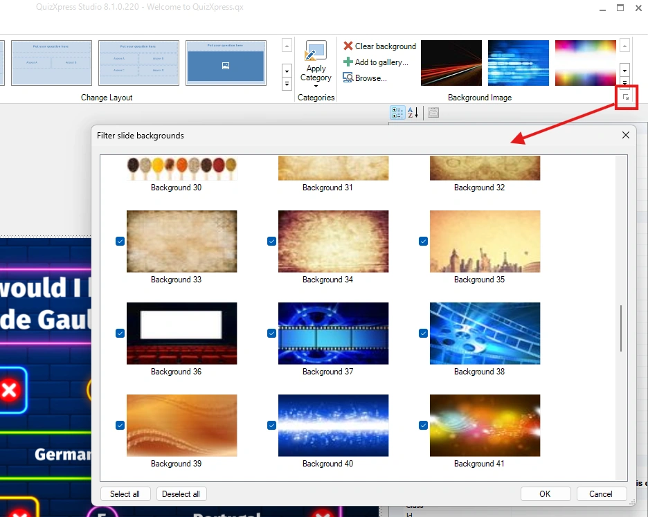

# Backgrounds

Each style in QuizXpress has a background. You can change the background of a slide (also after selecting a style) by right-clicking a slide and choosing ‘Select background picture…’.

Alternatively, you can choose a background image from the background gallery in the Background Image section of the Design ribbon. You can also add your own backgrounds to the gallery.

Just like with styles, you can better organize your workspace by filtering out backgrounds you don’t use. You can access the filter from the ‘dialog launcher’ button in the Background Image section of the Design ribbon.

{ width="466" loading=lazy }
