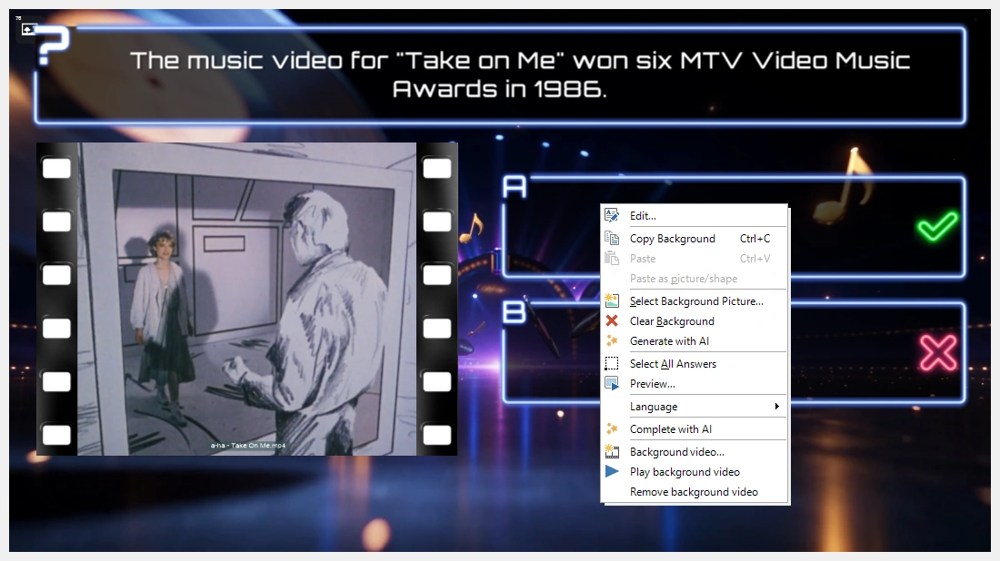
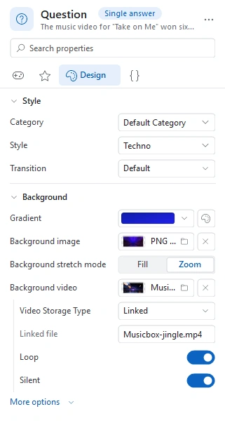

# Backgrounds

Each style in QuizXpress has a background. You can change the background of a slide (also after selecting a style) by right-clicking a slide and choosing ‘Select background picture…’.

Alternatively, you can choose a background image from the background gallery in the Background Image section of the Design ribbon. You can also add your own backgrounds to the gallery.

Just like with styles, you can better organize your workspace by filtering out backgrounds you don’t use. You can access the filter from the ‘dialog launcher’ button in the Background Image section of the Design ribbon.

{ width="466" loading=lazy }

## Background video

Instead of a still picture, a slide can also have a video playing behind it: moving clouds, a countdown, a looping animation in your own colors. The question, the answers and everything else on the slide stay on top of the video.

To add one, right-click the background of the slide and choose ‘Background video…’, then select a video file. You can also set it in the properties pane: select the slide, and click the ‘Background video’ property in the Background section of the Design page. When you select several slides and set the property, they all get the same background video; the video is stored only once in the quiz file.

{ loading=lazy }

In the editor the slide shows the first frame of the video, with a small video icon in the top left corner so you can see which slides have a background video. To see it move, right-click the background and choose ‘Play background video’ (and ‘Stop background video’ to stop it). The preview (F5) plays it as well.

A background video does not take a picture/video placeholder, so you can still put a picture or a [video in a placeholder](adding-multimedia-content/video.md#combining-a-background-video-with-a-video-in-a-placeholder) on the same slide; it plays on top of the background video.

Once a slide has a background video, the following settings appear below the ‘Background video’ property:

{ width="322" loading=lazy }

| Property           | Description                                                                                                                                                                                                 |
|--------------------|-------------------------------------------------------------------------------------------------------------------------------------------------------------------------------------------------------------|
| Video storage type | Embedded (the video is stored in the quiz file) or linked (the quiz refers to the video file on disk). See [Video](adding-multimedia-content/video.md#inserting-a-video) for when to use which.              |
| Linked file        | The name of the video file, for a linked video                                                                                                                                                              |
| Loop               | Start the video again when it ends. On by default.                                                                                                                                                          |
| Silent             | Play the video without sound. On by default, so the background video does not get in the way of your question sounds.                                                                                      |
| Sync with quiz     | Pause the video when a team buzzes in, the countdown is paused or the question ends, and resume it when the question continues. Off by default: the video simply keeps playing. (Under ‘More options’.) |

To remove the background video, right-click the background of the slide and choose ‘Remove background video’.

!!! tip
    Give a [category](using-categories.md) a background video, and every slide you format with that category gets it too.

During the quiz, the background video starts as soon as the slide appears. Keep background videos short and light: a loop of a few seconds in HD is usually all you need.
