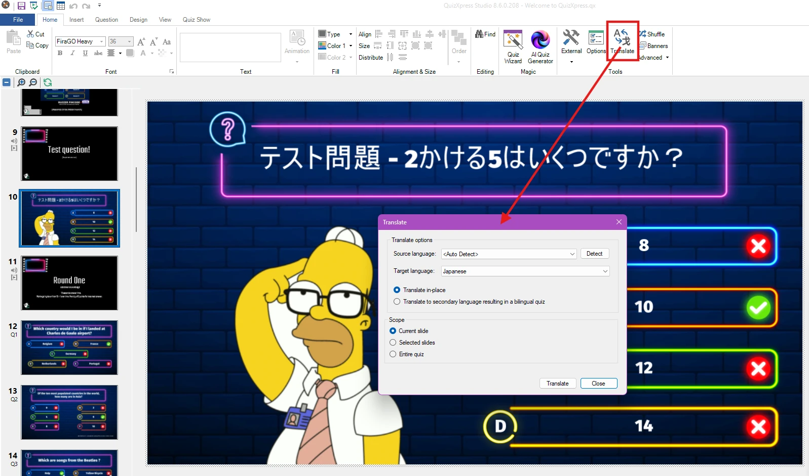
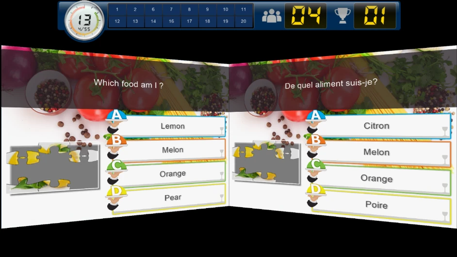
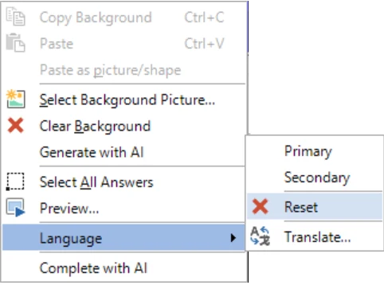

# Dual language quizzes

You can create quizzes for a bilingual audience. To support this, QuizXpress Studio lets you enter questions and answers in both a Primary and a Secondary language.

To enter the content for two languages, select a slide and make sure the Properties window is shown. Now set the *Language* property to Primary or Secondary.

{ width="317" loading=lazy }

{ width="65" loading=lazy }

After setting the language to Secondary, a tab is shown next to the slide, allowing you to switch between Primary and Secondary language by clicking the respective tabs.

Once you enter text in the secondary language, it is stored in the quiz. Switching back and forth between Primary and Secondary shows you both languages.

You can automatically translate a quiz into another language. To do so, click the Translate button on the HOME ribbon tab:

{ loading=lazy }

In QuizXpress Live!, the slides of both languages are presented on screen at the same time — the Primary language on the left and the Secondary language on the right.

{ width="603" loading=lazy }

!!! note

    if you have created a bilingual quiz, you can still run it as a single-language quiz. To do this, pass the -language=0\|1\|2 command line argument to Quiz Show.exe (the quiz player): 0 runs bilingual, 1 runs in the primary language, and 2 runs in the secondary language. The easiest way to do this is by creating a Windows shortcut and setting the correct **-language** argument there.*

If you want to remove the secondary language from a slide, right-click the slide and choose Language > Reset.

{ width="366" loading=lazy }
