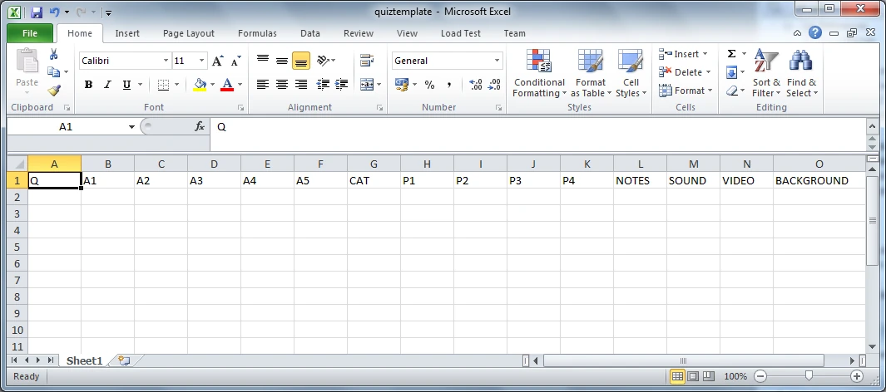
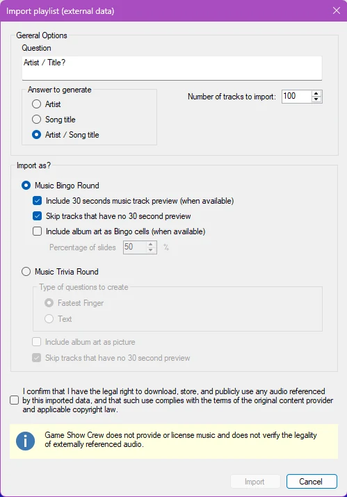
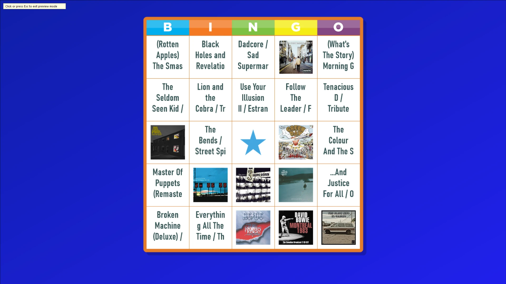
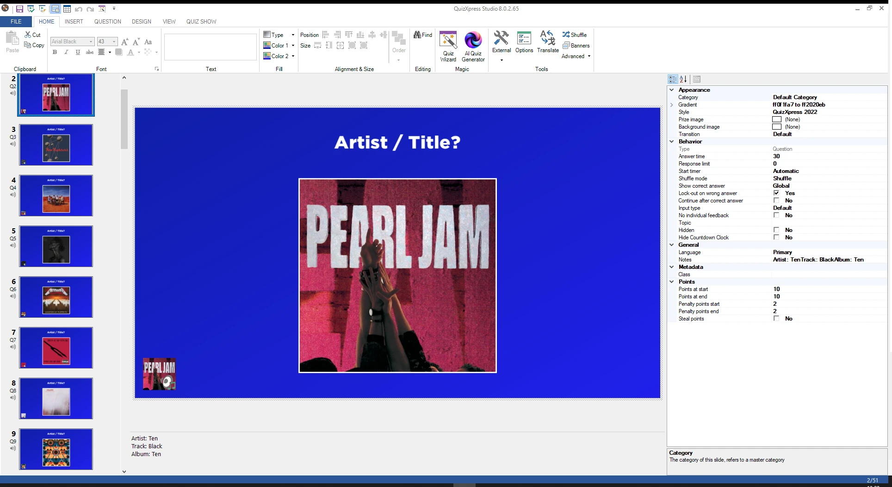
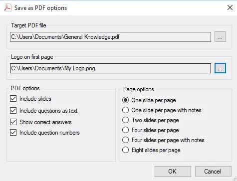

# Import and export of questions

In QuizXpress Studio, you can import from and export to different sources. To do this, click the FILE ribbon tab, then click Import or Export to see the options.

## Import of Excel format

QuizXpress Studio allows questions to be imported from Microsoft Excel. You may find it more convenient to enter your questions in Excel (although QuizXpress Studio also has a tabular view for entering questions quickly), or you may have a database of questions that can be exported to Excel.

QuizXpress Studio supports the Office 2007 native .xlsx file format and the CSV (comma-separated text file) format. The .xlsx format is preferred, as it has fewer issues with localization, special characters, etc.

To define your questions in Excel, open the preinstalled template *quiztemplate.xlsx* (you can find this file in the QuizXpress installation folder). You can also open the template from the backstage menu, on the ‘Import’ section. You will see the layout as shown below:

{ width="605" loading=lazy }

The first row is mandatory and must follow the heading names as below:

<table>
<colgroup>
<col style="width: 17%" />
<col style="width: 82%" />
</colgroup>
<thead>
<tr class="header">
<th>Column</th>
<th>Description</th>
</tr>
</thead>
<tbody>
<tr class="odd">
<td>Q</td>
<td>Column to contain the question text. If you want to import a primary and secondary language, separate the text for both languages with || .</td>
</tr>
<tr class="even">
<td>A1-A6</td>
<td>
Columns to contain the answers for multiple-choice questions. The correct answer must be in the A1 column; the system will shuffle the answers for you. You can leave all A* columns empty for an open question, or fill in only A1 and A2 for a two-answer multiple-choice question, etc.

You can also explicitly mark the correct answer for multiple-choice questions by placing it between brackets (‘[‘ and ‘]’). In this case, the system will not shuffle the answers. If you want to import a primary and secondary language, separate the text for both languages with ||.
</td>
</tr>
<tr class="odd">
<td>CAT</td>
<td>An optional category name. Imported questions will automatically be formatted according to this category. If you want to use your own category, you must create it in the quiz before importing.</td>
</tr>
<tr class="even">
<td>P1-P6</td>
<td>Optional filename of a picture file. This can be an absolute (full) path to the file, or a single filename if the picture file is in the same directory as the imported XLSX file. Supported file formats are <em>jpg, png, bmp, wmf, emf</em>, and <em>gif.</em> You can also explicitly mark the correct answer picture for multiple-choice questions by placing the picture filename between brackets (‘[‘ and ‘]’).</td>
</tr>
<tr class="odd">
<td>NOTES</td>
<td>The optional quizmaster notes to add to the question</td>
</tr>
<tr class="even">
<td>SOUND</td>
<td>An optional path to a sound file to add to the question</td>
</tr>
<tr class="odd">
<td>VIDEO</td>
<td>An optional path to a video file (WMV, AVI, etc.) to add to the question (cannot be used in combination with P1-P4). Leave all other fields empty to get a full-screen video slide.</td>
</tr>
<tr class="even">
<td>BACKGROUND</td>
<td>An optional path to a background image for the slide (png, jpg, bmp, etc.)</td>
</tr>
</tbody>
</table>

In addition to this fixed set of columns, there are a number of user-definable columns that can be picked from the dropdown list in the Excel template:

| Column               | Description                                                                                                                                 |
|----------------------|---------------------------------------------------------------------------------------------------------------------------------------------|
| A7                   | Define answer 7. To be used for Trivia Feud import                                                                                          |
| A8                   | Define answer 8. To be used for Trivia Feud import                                                                                          |
| POINTS-START         | Points to win at start of countdown                                                                                                         |
| POINTS-END           | Points to win at end of countdown                                                                                                           |
| PENALTY-POINTS-START | Penalty points at start of countdown                                                                                                        |
| PENALTY-POINTS-END   | Penalty points at end of countdown                                                                                                          |
| NO-ANSWER-POINTS     | Penalty points when no answer provided                                                                                                      |
| BONUS-POINTS-1       | Bonus points for fastest player with correct answer                                                                                         |
| BONUS-POINTS-2       | Bonus points for second fastest player with correct answer                                                                                  |
| BONUS-POINTS-3       | Bonus points for third fastest player with correct answer                                                                                   |
| ANSWER-TIME          | Answer time in seconds                                                                                                                      |
| STYLE                | Name of the slide style (see the tooltips in the Studio style picker for correct names; for example: Millionaire, Neon Tubes, etc.)         |
| TRANSITION           | The slide transition name. Valid values: Default, None, MoveRight, MoveLeft, MoveToFront, PageTurnLeft, ScaleToZero, LiftAndMoveRight, Fade |
| SHUFFLEMODE          |                                                                                                                                             |
| EVALUATION-MODE      |                                                                                                                                             |
| NEAREST-WINS-WINNERS |                                                                                                                                             |
| TEXT-EVALUATION      |                                                                                                                                             |
| TOLERANCE            |                                                                                                                                             |
| END-OF-ROUND-ACTION  |                                                                                                                                             |

Save the file in Excel, then select ‘FILE->Import->Import from Excel’ in QuizXpress Studio. This brings up a file browser where you can select the Excel file to import.

Based on the columns you fill in, QuizXpress automatically selects a matching slide layout. For example, to get a multiple-choice question with 3 answers and a video, fill in the columns Q, A1, A2, A3, and VIDEO. To get an open question with a sound fragment, a picture, and a background image, fill in the columns Q, P1, SOUND, and BACKGROUND.

By default, all slides are created as quiz questions. However, you can specify the type of slide to create by prefixing the text in the Q column with one of the following identifiers:

| Prefix | Description                                                                                                                                                                                                                                                                                                                                                                                                                                                                  |
|--------|------------------------------------------------------------------------------------------------------------------------------------------------------------------------------------------------------------------------------------------------------------------------------------------------------------------------------------------------------------------------------------------------------------------------------------------------------------------------------|
| {Q}    | Create a normal question. You can use the following extra qualifiers to specify how the question is created: **EA** – Everyone Answers, **FF** – Fastest Finger, **NUM** – create a number question, **LET** – create a letter question, **TXT** – create a full-text question, **CA** – Countdown Automatically, **CM** – Countdown Manual. For example, **{Q, EA, CM}** creates a question where everyone can answer (voting), with a manual start of the countdown timer. |
| {T}    | Create a test question                                                                                                                                                                                                                                                                                                                                                                                                                                                       |
| {W}    | Create a wager slide (you must also specify two or more percentages in the answers, such as ‘20%’)                                                                                                                                                                                                                                                                                                                                                                           |
| {B}    | Create a (static) billboard slide                                                                                                                                                                                                                                                                                                                                                                                                                                            |
| {A}    | Create an audience response slide                                                                                                                                                                                                                                                                                                                                                                                                                                            |
| {D}    | Create a demographic slide                                                                                                                                                                                                                                                                                                                                                                                                                                                   |
| {L}    | Create a last-man-standing slide                                                                                                                                                                                                                                                                                                                                                                                                                                             |
| {E}    | Create an End-of-Round slide                                                                                                                                                                                                                                                                                                                                                                                                                                                 |
| {M}    | Create a Majority Rules slide                                                                                                                                                                                                                                                                                                                                                                                                                                                |
| {J}    | Create a Trivia Board slide                                                                                                                                                                                                                                                                                                                                                                                                                                                  |
| {TL}   | Create a Trivia Ladder slide                                                                                                                                                                                                                                                                                                                                                                                                                                                 |
| {TF}   | Create a Trivia Feud slide (use A1..A8 for survey entries)                                                                                                                                                                                                                                                                                                                                                                                                                   |
| {SR}   | Create a Speed Round slide (must end with an End-of-Round slide)                                                                                                                                                                                                                                                                                                                                                                                                             |

So, for example, the text “{A}Do you like this quiz night?” imports an Audience Response slide with the text “Do you like this quiz night?”

Sound and video inserted into your slide using the SOUND and VIDEO columns are normally embedded, meaning the entire contents of the sound/video file are stored inside the quiz file. This may result in large quiz files. To prevent this, you can prefix the values in these columns with ‘{L}’ to indicate you want to link the media files. For example: “{L} C:\Users\Public\Videos\Sample Videos\Wildlife.wmv”. Note that linked files must remain present on your system when running the quiz.

You can create rounds in your quiz by adding multiple worksheets to the Excel workbook. For each worksheet, a quiz slide of type ‘billboard’ is inserted into the quiz, containing the worksheet’s name to announce the next round. For example, suppose you have two worksheets, ‘Round 1’ and ‘Round 2’, each containing ten questions. When importing the Excel file into QuizXpress Studio, you get a quiz containing: a billboard with the text ‘Round 1’, followed by ten questions, followed by a billboard with the text ‘Round 2’, again followed by ten questions.

## Import from PowerPoint

QuizXpress Studio also allows questions to be imported from PowerPoint. In this case, the PowerPoint slides are imported as pictures and placed on Billboard slides. If you want to turn slides into questions, some post-processing is needed: first set the slide type to ‘Question’, then, if multiple-choice answers are involved, change the slide layout to include the same number of answers, set the slide style to ‘Just Text’, and remove the question-and-answer texts in QuizXpress Studio.

## Import from Spotify™

With this function you can turn your favorite playlists into a QuizXpress music quiz or a music bingo with almost no effort. Spotify exposes ~30 seconds of the music track (predefined) and a picture of the album art. There are two easy steps involved: first you export your playlist to a comma separated file (csv) with Exportify, a public website to be found at: <https://exportify.app/> . Then you import this csv file in QuizXpress Studio using the Excel import function. The system will recognize the format and present you the following options form:

{ width="270" loading=lazy }

Here, you specify what to create, along with several options. In this example, we are creating a music bingo with 75 slides: half of the bingo cells will be made up of album art, and the rest will be text with Artist/Song. After importing, the 30-second music clips will be on the slides, and an example bingo card will look like this:

{ width="605" loading=lazy }

Likewise, you can create a music trivia quiz with questions.

{ width="605" loading=lazy }

!!! note

    make sure no copyright is violated when using this function.*

## Import from QuizXpress

If you want to append questions from an existing QuizXpress quiz to a quiz you are creating, click the *Import from QuizXpress* button and select a QuizXpress file. Alternatively, you could open two instances of QuizXpress Studio and copy and paste slides between them.

## Export to PDF

QuizXpress Studio allows you to export your questions in PDF format. This PDF file can be printed or sent to your customers to give them a preview of the quiz. Your quizmaster may also be interested in receiving a printout before the game show. The PDF export is available from ‘FILE->Export->Export to PDF’. *(Note: this option is not available in the Home edition).* The PDF export offers the following options:

{ width="370" loading=lazy }

| Field                     | Description                                                          |
|---------------------------|----------------------------------------------------------------------|
| Target PDF File           | The PDF output file. Use the \[…\] button to browse to a folder/file |
| Logo on first page        | The logo that will be displayed on the first page of the PDF         |
| Include slides            | Toggle to include images of the slides                               |
| Include questions as text | Include a textual overview of the questions and answers              |
| Show correct answers      | Include the correct answers in the output.                           |
| Include question numbers  | Include the question numbers in the PDF export                       |
| Page options              | Allows you to combine multiple slides on one page                    |

!!! note

    to be able to read PDF documents on your computer you need the Adobe PDF reader available for download at <http://get.adobe.com/reader/>*

## Export to HTML

You can export a quiz to HTML to run it on a website. Please note that this functionality is very basic: among other things, audio, video, and picture effects are not supported, and although a score is shown, there is no final score announcement.
