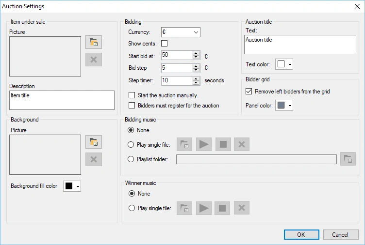
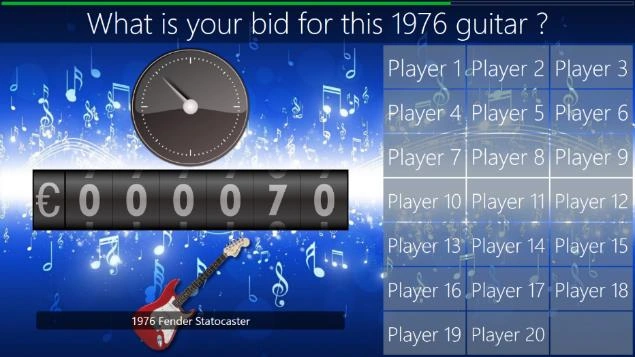

# Auction

With this plugin, you can auction items during a quiz while the audience bids with their handhelds — ideal for fundraisers!

During the auction, as the bid amount increases, players opt out when they are no longer interested.

The available configuration options are:

- Item under sale: picture of the item that is auctioned

- Description: description of the item that is auctioned. The description is displayed at the top of the auction screen.

- Background: background image of the auction screen.

- Background fill color: alternatively, a solid background color can be set for the auction screen.

- Currency: currency displayed before the current auction money amount

- Show cents: include cents in the auction amount

- Start bid at: set the starting price of the item being auctioned

- Bid step: set the increment by which the auction price rises

- Step timer: set the interval after which the auction amount is raised

- Start the auction manually: starts the auction only when you press Next (otherwise, it starts immediately)

- Bidders must register for the auction: by default, everyone participates, and bidders opt out when they are no longer interested in the item being auctioned. Check this setting if you want each bidder to explicitly indicate whether they want to participate before the auction starts.

- Bidding music: music played during the auction (no music, select one music file or select a folder containing music files)

- Winner music: set the music played when the auctioned item is sold

- Auction title text: the auction title is displayed over the picture of the auctioned item (or as text alone if no picture is set).

- Auction title text color: the color of the auction title text.

- Remove left bidders from the grid: with this setting checked, players who opted out of the auction are removed from the bidder’s panel.

- Bidder grid panel color: set the color of the bidder grid panels.

{ width="410" loading=lazy }

Below you can see a picture of an auction in action:

{ width="405" loading=lazy }
