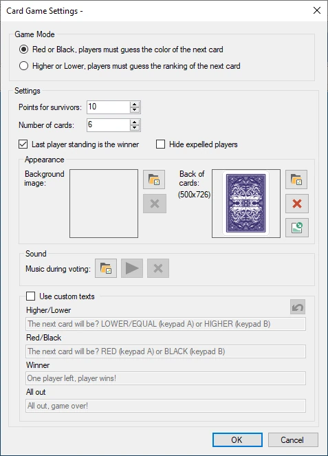
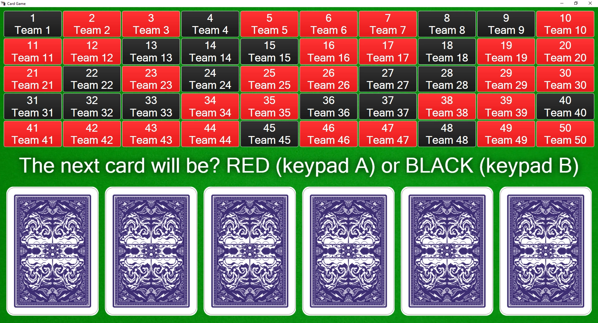

# Card game

In the card game the audience needs to survive several cards by correctly predicting the next card (red/black or higher/lower) to gain points.

Available configuration options:

{ width="255" loading=lazy }

- Game Mode: choose between red/black or higher/lower guessing

- Points for survivors: how many points do the players win when they survived up to the end

- Number of cards: how many cards are on the table

- Last player standing is the winner: with this option, the player who survived last wins, even when not all cards have been turned

- Hide expelled players: hide the players from the player grid that are no longer in the game.

- Background image: choose a background image shown during the game

- Music during voting: choose the music that is played while all players make their bets

- Back of cards: the image to be used at the back of the card (use 357 x 500 pixels). Use this to brand the game for your own purpose.

- Use custom texts: override the default texts presented to the players with your own texts.

Please find below a picture of the card game in action.

{ width="605" loading=lazy }

Each player is represented by a square. When a choice is made, the square turns either red or black.

In order to go through the various steps of the cards game (show message to the players to make a choice, reveal the next card) just press the ‘Next’ button in the left-hand side panel.

{ width="160" loading=lazy }

The squares of players who are out of the game are grayed out, indicating they no longer participate in this session of the card game.
