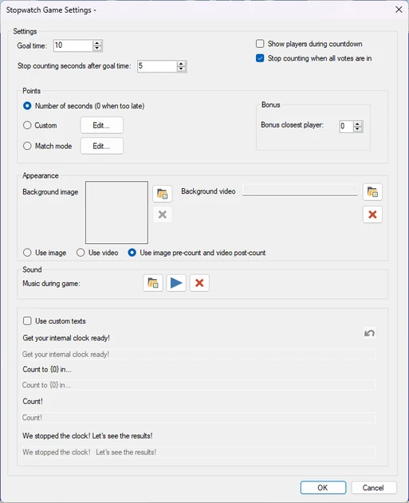
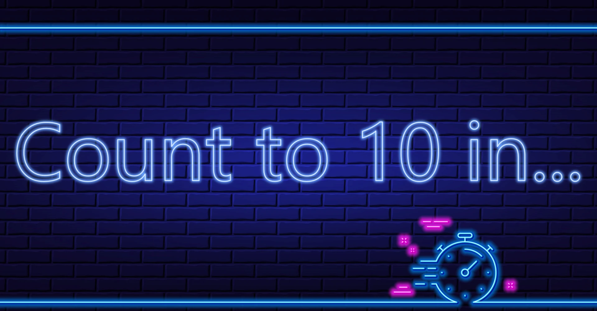
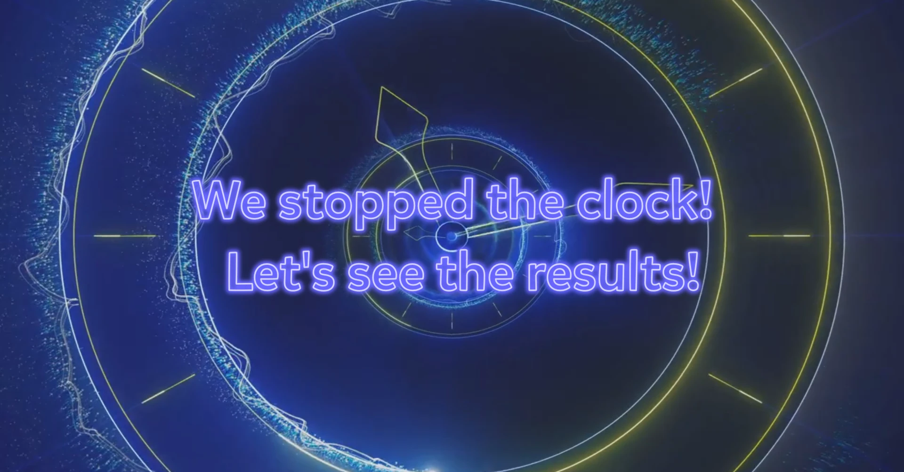
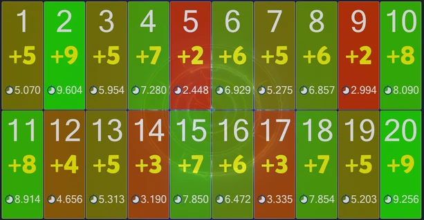

# Chrono Challenge

The Chrono Challenge is a game of precision. The idea is to count the time and press the buzzer as close as possible to a certain number of seconds.

Available configuration options:

{ width="257" loading=lazy }

- Goal time is the amount of time in seconds which the players count towards.

- Stop counting seconds after goal time. The voting time will go on this amount of seconds after the goal time has been reached. For example, if the goal time is 10 seconds and the ‘stop counting seconds after goal time’ is five, the total voting time is 15 seconds.

- There are three ways to judge points:

  - Number of seconds. Points are won based on the number of seconds after which a player pressed. The closer the player is, the more points are won.

  - Custom. The host can configure which points are won for which amounts of time.

  - Match Mode. Players are ranked on how close they are to the goal time. The higher a player’s rank, the more points the player gets.

- Bonus closest player: the player who is closest to the target time wins additional points

- Background image: sets the background image of the game.

- Background video: sets the background video of the game.

- The host can choose to either use only the image, only the video or both the image (pre-count) and the video (post-count)

- Voting music sets the music that plays during voting.

- Use custom texts. Change the default messages shown during the game.

  - Get your internal clock ready!: the text that is shown when the game starts.

  - Count to (0) in: the text that is shown when the players are about to start counting.

  - Count!: the text that is shown when the players start counting.

  - We stopped the clock! Let’s see the results!: the text that is shown when the clock has been stopped and the answer times of the players are about to be judged.

{ width="213" loading=lazy }At the start of the game, players are notified to get ready to count!

{ width="209" loading=lazy }{ width="215" loading=lazy }

After a small countdown shown onscreen (3-2-1), players have to keep counting and press the buzzer when the indicated time expires. After the amount of seconds determined by the settings has passed, the clock is stopped.

{ width="307" loading=lazy }

Players are judged based on how far their answers are off the goal time (depending on the game mode chosen).

{ width="307" loading=lazy }
