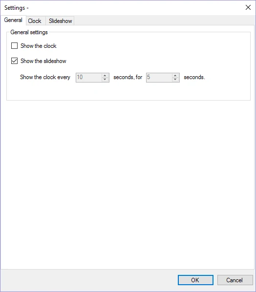
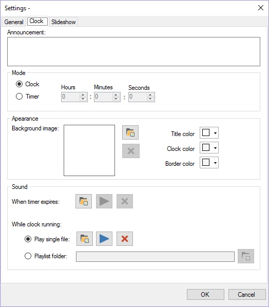
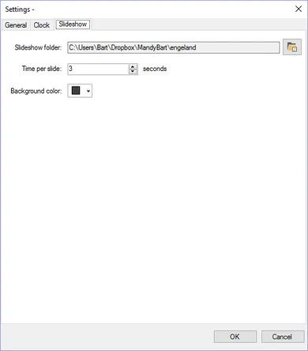
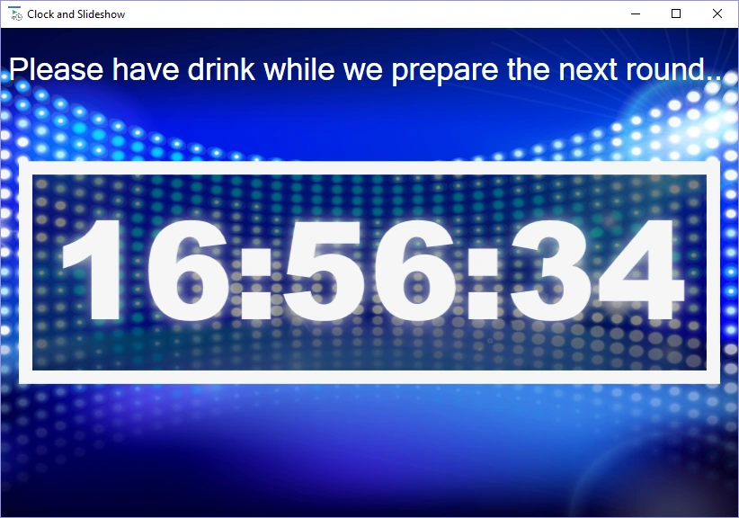

# Clock and slideshow module

This module can show a digital (countdown) clock, a picture slideshow with cool transition effects, or a mix of both.

Configuration options:

| { width="195" loading=lazy } | { width="199" loading=lazy } | { width="195" loading=lazy } |
|---------------------------------------------------------------------------------|------------------------------------------------------------------------------|---------------------------------------------------------------------------------|

On the first page, you can configure whether to show the clock, the slideshow, or both (in which case the clock is shown at a configurable interval for a set amount of time)

For the clock you can configure the following options:

- Announcement: text which is displayed on screen above the clock

- Mode – Clock: the time is shown on screen

- Mode – Timer: a timer counts down from the specified time to 00:00:00

- Background Image: image which is shown in the background

- Timer expires sound: played when the timer expires

- Clock ticking sound: played while the clock is ticking or,

- A playlist folder: the folder from which the module randomly plays MP3 files while the clock is ticking. (Note that when using the clock *embedded in* the quiz, this folder must also exist on the PC where you run your quiz.)

On the last page, you can configure the slideshow by selecting a folder from which pictures are drawn, along with timing information.

Below is a picture of the clock in action (default settings).

{ width="605" loading=lazy }
