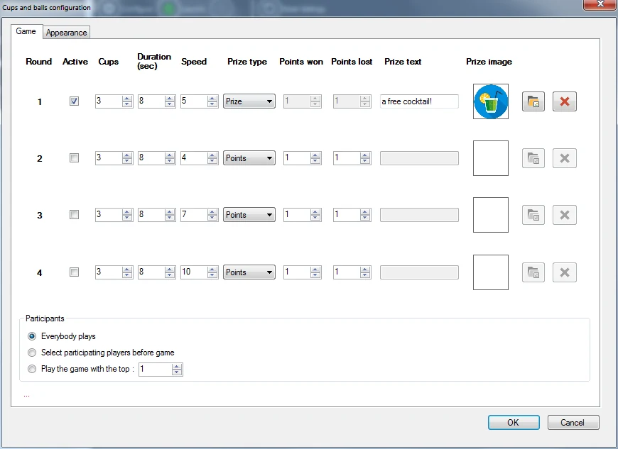
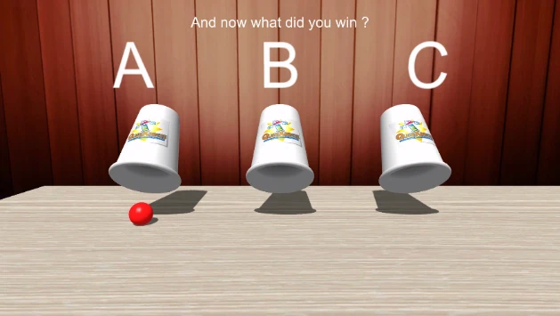

# Cups and Balls

In the cups and balls game the audience needs to guess under which cup a ball is located after shuffling the cups. Initially, the ball is shown. Then, the cups are shuffled, and each player needs to closely watch. Finally, each player needs to tell under which cup the ball is. Points or prizes can be won with this game.

Available configuration options:

{ width="436" loading=lazy }

- Round: you can define up to four games that will run one after another (for example with increasing speed/number of cups).

- Active: indicates whether a round is active (if not active, it will be skipped)

- Cups: the number of cups that will be played with

- Duration: the duration of the shuffling of the cups

- Speed: the speed of the shuffling

- Prize type: indicate whether a prize can be won or points can be won

- Points won: the amount of points a player wins if he or she is correct (if the ‘Prize type’ is ‘Points’)

- Points won: the amount of points a player loses if he or she is incorrect (if the ‘Prize type’ is ‘Points’)

- Prize text: text shown when a prize is won

- Prize image: image of the prize won. Images can be selected or deleted using the two buttons next to the image.

- Participants: all players can play along, only top ranked players can play along, or selected players can play along (selection is done before the game starts, on the director screen).

- Appearance tab: here you can select images to be shown on the cups (for example a company logo), a background image as well as the texture of the table that the cups are on. Also, you can select alternative background music which plays once the cups are shuffling

Please find below a picture of the cups and balls game in action.

{ width="402" loading=lazy }

In order to go through the various steps of the game (cups are loaded, ball is shown, cups are shuffled, players choose a cup, ball is revealed) just press the ‘Next’ button in the left hand side panel.

{ width="200" loading=lazy }
