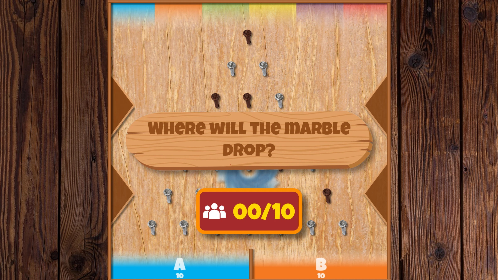
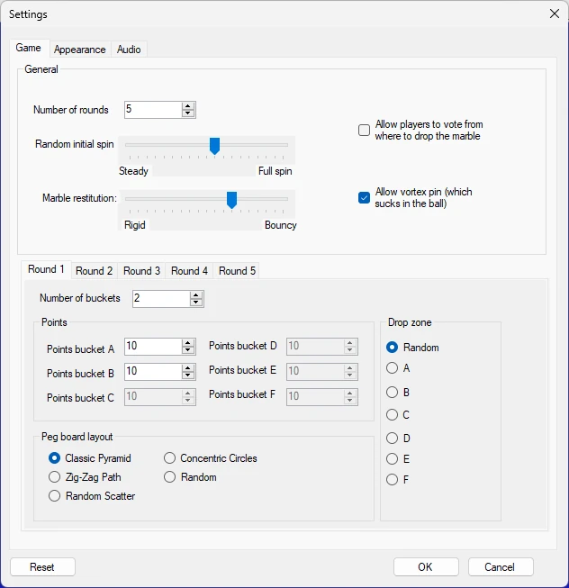

# Lucky Marbles

Players can score points in this exciting twist on the classic Plinko marble game. After choosing the bucket they think the marble will land in—and optionally voting or competing to select the release point—the marble drops and bounces its way down the board, guided by a realistic physics simulation. With multiple board layouts and an optional rotating *vortex* that can send the marble back to a random starting position, every round is full of suspense and surprises.

{ loading=lazy }

{ loading=lazy }

The game has the following configuration options:

{ width="331" loading=lazy }

- Number of rounds: how many rounds the game is played

- Allow players to vote on where to drop the marble: if activated, the game starts with the audience choosing where the marble is dropped. The audience can keep changing their choice until the host decides to drop the marble

- Random initial spin: how much the marble spins when it drops

- Marble restitution: how bouncy the marble is

- Allow vortex pin: shows a vortex in the center that sucks in the marble and sends it back to the top

- On the round tabs, you can configure the following settings per round:

  - Number of buckets: number of target buckets at the bottom of the screen

  - Points: points to win for each bucket

  - Peg board layout: choose from multiple available layouts

  - Drop zone: indicates from where the marble is dropped (only active when the setting *Allow players to vote on where to drop the marble* is not active).

The Text settings tab lets you change the text shown on screen as well as on the mobile phone. On the Audio tab, you can select which music is played during the game.
