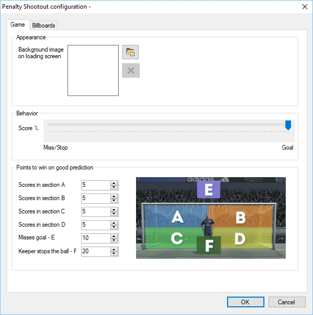
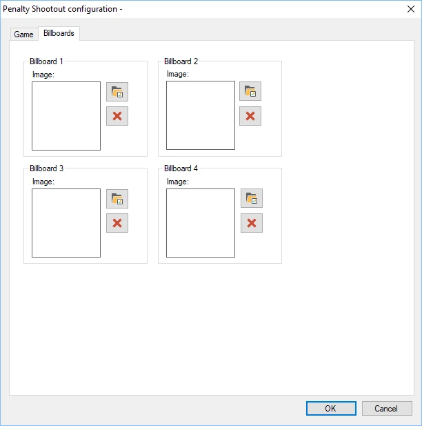
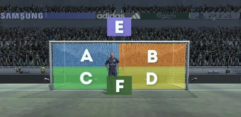
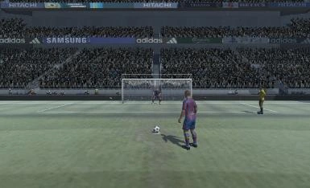

# Penalty Shootout

The purpose of the Penalty Shootout mini game is to predict if the football player is going to score (and in which section of the goal), if the penalty will be missed, or if the goalie will stop the penalty.

The available configuration options are:

- Background image on loading screen: sets the image that is shown while the game is loading

- Score%: set the chance of scoring or missing.

- Points to win on good prediction: assign points to the possible outcomes of the game:

  - Player scores in section A

  - Player scores in section B

  - Player scores in section C

  - Player scores in section D

  - Player misses (E)

  - Keeper stops the ball (F)

- Billboards tab: there are four billboard signs next to the racetrack. You can choose your own images to be displayed in these billboards

{ width="300" loading=lazy } { width="302" loading=lazy }

Below you can see two pictures of the penalty shootout game in action.

{ width="306" loading=lazy } { width="243" loading=lazy }
