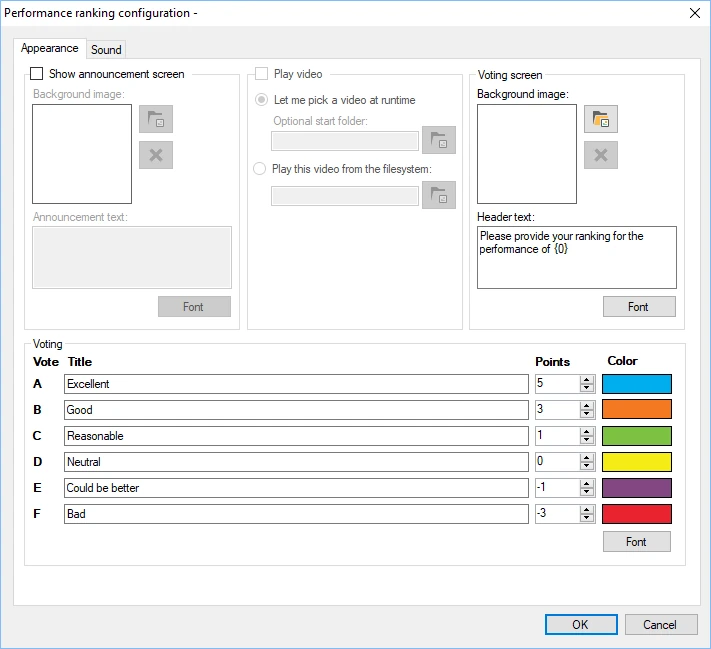
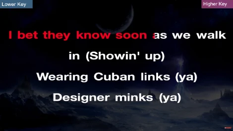
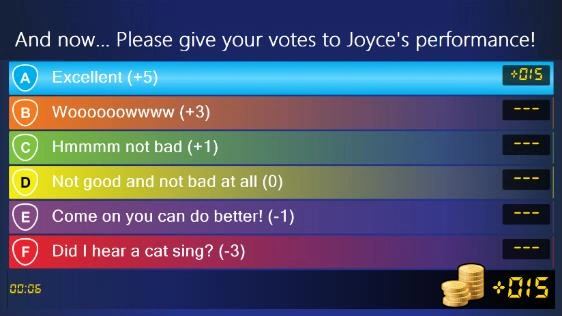
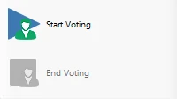

# Performance ranking

With the Performance ranking module, you can hold talent and karaoke competitions. The audience/players can rank the performance of one of the other players.

The available configuration options are:

> { width="401" loading=lazy }

- Show announcement screen: enable this option to show an announcement screen before the performance.

- Background image (announcement screen section): select a background for the announcement screen.

- Announcement text: the text to show in the announcement. To include the name of the player who is going to perform, add {0}, which will be replaced with the selected player’s name.

- Play video section: enable this option to show a video during the performance, then select a video file to play. Typically used to show a karaoke video.

<!-- -->

- Background image (voting screen section): choose the background picture shown on the voting screen

<!-- -->

- Header text: choose the text shown on the voting screen. To include the name of the player who has performed, add {0}, which will be replaced with the selected player’s name.

<!-- -->

- Title/Points/Color fields: enter labels shown on the voting screen to indicate performance quality. Each label has a number of points attached, as well as a color.

- Sound tab: configure the music played before voting starts, during voting, and after voting ends.

Below are pictures of the different screens of the Performance ranking module in action.

{ width="293" loading=lazy } { width="294" loading=lazy }

{ width="358" loading=lazy }

When the Performance ranking plugin starts, a window opens in which one of the players must be selected as the player who will be judged by the others.

When the ‘Start Voting’ button is pressed in the left-hand panel of QuizXpress Director, the performance starts, and players can begin giving their opinion. At the bottom left of the voting screen, the time elapsed since the performance began is shown, along with the number of players who have voted so far.

When the ‘End Voting’ button is pressed in the left-hand panel, players can no longer vote, and the final score is shown on the screen.

Alternatively, when the ‘Play video’ setting is enabled, the button initially reads ‘Start Video’. Pressing it plays a video, or lets you select one, depending on the settings. After this, the button changes to ‘Start Voting’.

After the voting process has ended, pressing the ‘Start Voting’ button repeats the whole process. Another player can now go on stage and give his or her best performance!

{ width="180" loading=lazy }
