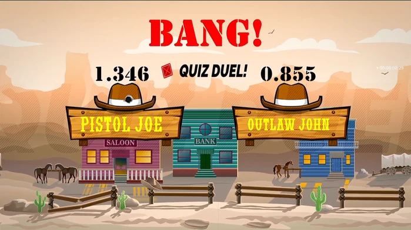
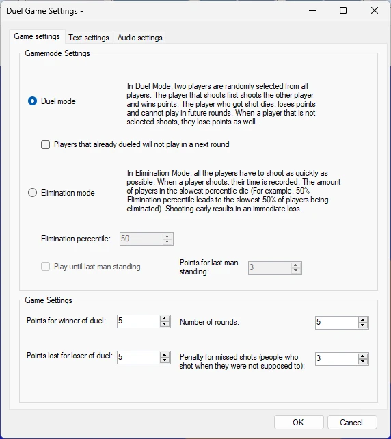

# Quiz Duel

Quiz Duel is a fun, easy-to-use, western-inspired ‘reflex’ minigame. With fun graphics and western-style sound effects, this game will definitely elevate your event!

{ width="350" loading=lazy }

The game has the following configuration options:

{ width="316" loading=lazy }

- There are two game modes:

  - **Random Duel mode**: in Duel Mode, two players are randomly selected from all players and shown onscreen on two sign posts. The player who shoots first shoots the other player and wins points. The player who gets shot dies, loses points, and cannot play in future rounds. If players from the audience who are not selected shoot anyway, they lose points as well.

    - The setting *Players that already dueled will not play in a next round* indicates whether players who have already been shown on the sign posts are excluded from the next round. This makes sure everyone gets a turn. When there is an uneven number of players, the last player plays against a ‘bot cowboy’.

  - **Elimination Duel mode**: in Elimination Mode, all players must shoot as quickly as possible when the **Shoot!** message appears onscreen. For each player who shoots, the time is recorded, and the slowest percentile of players is eliminated (for example, a 50% elimination percentile eliminates the slowest 50% of players). Shooting early results in an immediate loss.

    - The setting *Play until last man standing* runs the game until only one player remains.

    - The setting *Extra points for last man standing* indicates how many points the last player standing wins.

- Other game settings:

  - Points for winner of duel: points won when you win a duel

  - Penalty for loser of duel: points lost when you lose a duel

  - Number of rounds: how many rounds of the game do you want to play

  - Penalty for missed shots: penalty points for players who shoot without being selected on the sign posts in Random Duel mode, or for shooting early in either duel mode.

The Text settings tab and Audio settings tab let you customize the text and audio used in the minigame.
