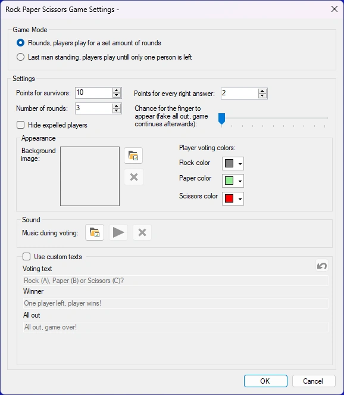
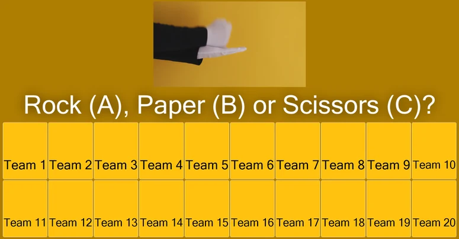
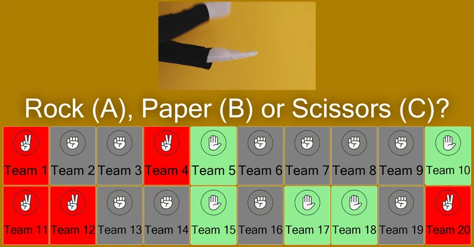
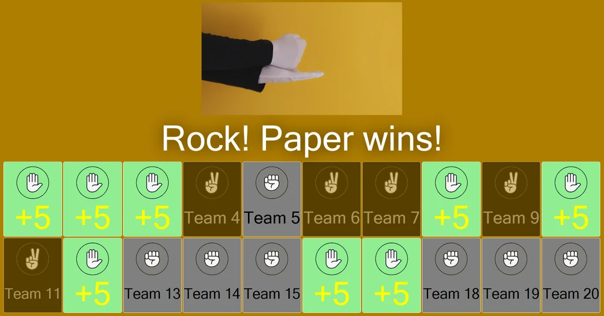

# Rock Paper Scissors

In the Rock Paper Scissors minigame, the audience plays Rock Paper Scissors against a virtual player (computer).

Available configuration options:

{ width="378" loading=lazy }

- **Game Mode**. There are 2 game modes: Rounds and Last Man Standing. In the Rounds mode, the game ends after a set number of rounds. In the Last Man Standing mode, the game ends when there is either no one or exactly one person left.

- **Points**. There are 2 ways to win points as a player. Points for survivors are won by players who have survived all rounds as defined in ‘number of rounds’ or are the last player standing. The points as defined in ‘Points for every right answer’ are given to players who survive a round.

- **Chance for ‘the finger’ to appear**. This is the percentage chance of the computer making the (middle) finger move. The finger is a fake ‘all out’. The fake-out makes the audience think everyone has lost, but the game continues anyway.

- **Background Image**: sets the background image of the game.

- **Hide expelled players**. This automatically hides the players who have lost.

- **Player voting colors**. These are the colors the player boxes get when they vote. The default colors are gray, green and red for rock, paper and scissors respectively.

- **Sound**. Set the music that plays during voting.

- **Use custom texts**. Change the default messages shown during the game.

  - Voting text: the text that is shown during voting.

  - Winner: the text that is shown when (a) player(s) has/have won.

All out: the text that is shown when everyone has lost. When the game starts, a screen is shown with a video on top showing the moving hands of a virtual player who all the other players play against.

{ loading=lazy }

Each player makes a choice for rock, paper, or scissors on their keypad/buzzer/phone.

{ loading=lazy }

After this the opponent’s choice is revealed.

{ loading=lazy }

{ loading=lazy }

When the choice of the opponent has been revealed, the game indicates who won, lost, or tied.

In the example above, the virtual player chose rock. The players who chose scissors lose, the players who chose rock tie, and the players who chose paper win the round. Players who tie are still in the game (but do not win the points for the round).
