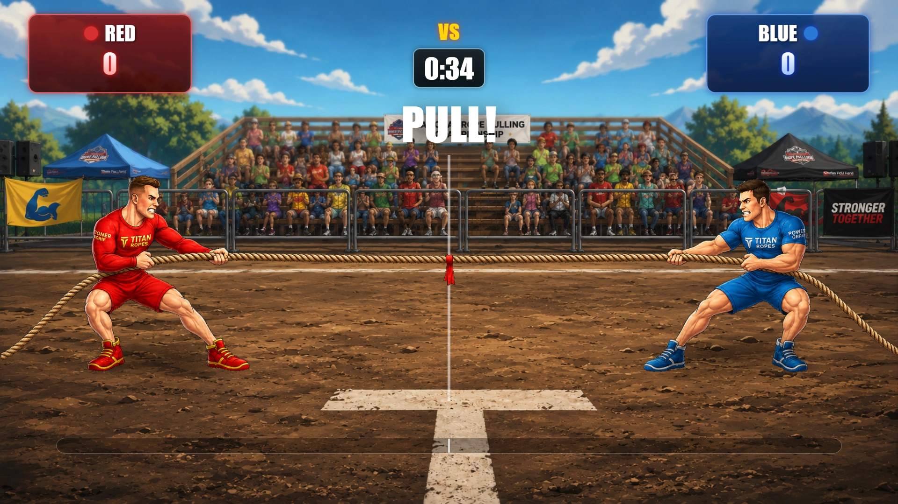
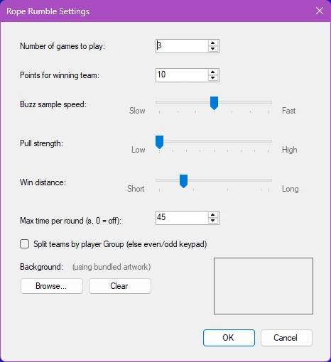

# Rope Rumble

Rope Rumble is a fast-paced team tug-of-war game. Players are divided into two teams—Red and Blue—and compete by pressing their buzzers to power their team’s rope puller. Every buzzer press adds force to the team’s side, creating an exciting battle as the rope and center flag move across the arena.

The game evaluates team activity in rapid intervals, so the lead can change from moment to moment. The team that generates the most buzzer presses pulls the rope toward its side. The first team to pull the flag past the winning line wins the round.

{ width="605" loading=lazy }

For added suspense, Rope Rumble can be played with a time limit. If time expires before either team reaches the winning line, victory goes to the team whose side the flag is on. Multiple rounds can be played, and players on the winning team receive the configured number of points.

With intuitive controls, animated visuals, live score tracking, and a dramatic tug-of-war format, Rope Rumble transforms buzzer activity into an energetic and highly engaging competition for audiences of any size.

**Rope Rumble settings:**

{ width="311" loading=lazy }

The Rope Rumble settings determine how long the game runs, how quickly buzzer presses move the rope, and how teams are formed. To open the settings, select Rope Rumble and choose Configure.

**Number of games to play**

Specifies how many rounds are played before Rope Rumble ends. After a round is completed, the director can start the next round until the configured number has been reached.

**Points for winning team**

Sets the number of points awarded to each player on the winning team at the end of a round.

**Buzz sample speed**

Controls how frequently the game evaluates buzzer presses and updates the rope position.

- Fast: Buzzer presses are evaluated more frequently, resulting in quicker and more responsive rope movement.

- Slow: Buzzer presses are evaluated less frequently, resulting in more gradual movement.

The default value is 250 milliseconds. The available range is 100 to 400 milliseconds.

**Pull strength**

Controls how far the rope moves when one team has more buzzer presses than the other during a sample interval.

- Low: Creates a slower, more gradual tug-of-war.

- High: Makes each team’s advantage move the rope farther, producing a faster and more decisive game.

**Win distance**

Determines how far the flag must move from the center before a team wins the round.

- A smaller distance makes it easier to win and shortens the round.

- A larger distance creates a longer battle and gives teams more opportunity to recover.

**Maximum time per round**

Sets the maximum duration of each round in seconds. If the timer reaches zero before either team reaches the winning distance, the team currently pulling the flag toward its side wins.

Set this value to 0 to disable the time limit.

**Split teams by player Group**

Determines how players are assigned to the Red and Blue teams.

- When enabled, players are divided according to their configured Group. This option is intended for events where players have already been organized into two groups.

- When disabled, players are divided using their keypad numbers, with odd and even keypad IDs assigned to opposite teams. This provides a balanced default split.

**Background**

Allows you to replace the bundled Rope Rumble artwork with a custom background image. Click Browse... to select a PNG, JPG, JPEG, or BMP file. The selected image is shown in the preview area and stored with the quiz configuration. Click Clear to remove the custom image and return to the default bundled artwork.
