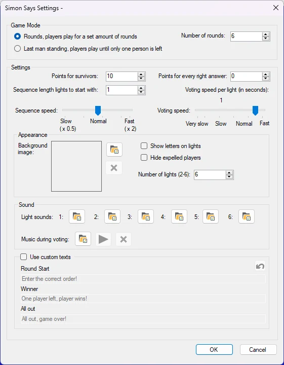
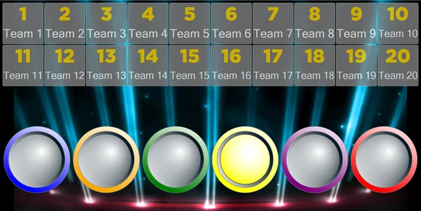
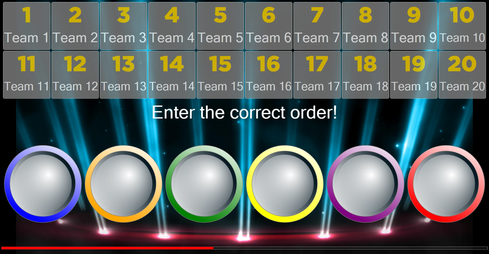
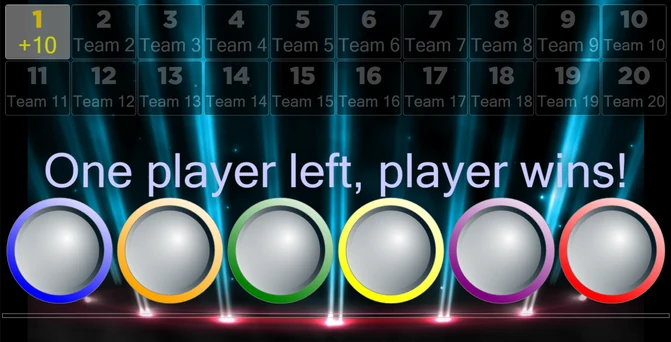

# Simon Says

In the Simon Says minigame, the audience plays a game that challenges players to mimic an increasingly longer sequence of lights. Available configuration options:

{ width="323" loading=lazy }

- **Game Mode**. There are 2 game modes: Rounds and Last Man Standing. In the Rounds mode, the game ends after a set number of rounds. In the Last Man Standing mode, the game ends when there is either no one or exactly one person left.

- **Points**. There are 2 ways to win points as a player. Points for survivors are won by players who have survived all rounds as defined in ‘number of rounds’ or are the last player standing. The points as defined in ‘Points for every right answer’ are given to players who survive a round.

- **Sequence length lights to start with.** Indicate how many lights light up at the start of the game.

- **Sequence Speed**. This indicates how fast the lights light up.

- **Voting Speed**. This indicates how much time players must enter their votes after a light sequence has been shown.

- **Background Image**. Set the background image of the game.

- **Show letters on lights**. Indicates whether to show letters (A-F) on the lights.

- **Hide expelled players**. This automatically hides the players who have lost.

- **Number of lights**. This sets the number of lights in the game. This number can range from 2 to 6.

- **Light Sounds**. The sounds that each light makes when it lights up can be configured. Each light sound (1-6) can be set individually.

- **Voting music**. Sets the music that plays during voting.

- **Use custom texts**. Change the default messages shown during the game.

  - Round start: the text that is shown when a round starts.

  - Winner: the text that is shown when (a) player(s) has/have won.

  - All out: the text that is shown when everyone has lost.

The purpose of the games is that when a light sequence is playing, players must memorize it.

{ width="301" loading=lazy }

When the sequence is done playing, players input the sequence into their keypad / buzzer / phone

{ width="292" loading=lazy }

After this, the system judges the answers and shows the winning and losing players. After this a random light is added to the sequence and the sequence plays again. This makes the game increasingly more difficult as time goes on.

In this game (Last Man Standing mode), only player 1’s answer was correct. Player 1 wins the game.

{ width="336" loading=lazy }
