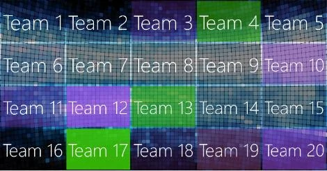

# The Randomizer module

The QuizXpress Randomizer can be used to randomly draw one or more players/teams from the audience — for example, to raffle a prize, hold a karaoke competition, play a game, or do anything else to round out your game show night.

Instead of selecting players, you can also have the Randomizer select one or more numbers from a range, from a comma-separated list, or from a text file — so basically, you can draw anything!

When drawing players, you can also have the players win a specified amount of points.

You can specify how many items to draw per run, as well as the number of runs the Randomizer will do. When running more than once, you can choose to exclude previously drawn items. You can also show a list of previously drawn items on screen.

When running, the Randomizer first shows an animation (two configurable styles are available) of all the team names, then draws and presents the results at the quizmaster’s command (space bar, or using the quizmaster remote control). The following configuration options are available:

For the animation, you can choose between a static, colorful grid or a floating team-names animation:

{ width="275" loading=lazy }{ width="300" loading=lazy }

You can draw from a subset of the entire audience (by means of a selection dialog) or include the whole audience (no manual selection needed)

In the ‘Appearance’ section, you can configure the background picture to show. The ‘Music’ section lets you specify different sounds for the animation and for when the selection has been made.
