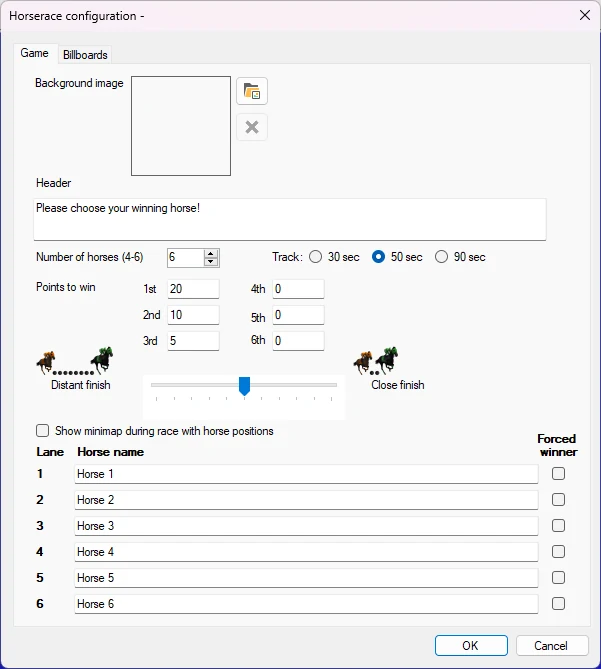
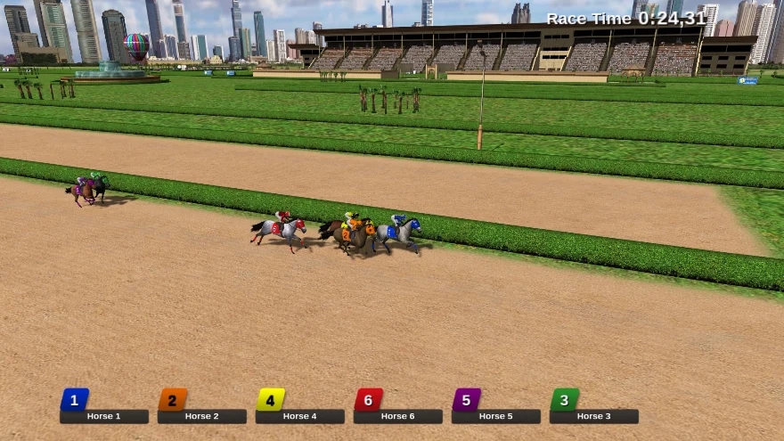

# Virtual horse race

In the horse racing game, each player bets on a horse using their handhelds, after which a race will run with a random outcome. Points will be added based on the outcome of the race.

The Virtual Horserace module has the following configuration options:

- Background image: select the background image shown on the screen where the players pick the winning horse

- Header: text that is shown on the screen where the players pick the winning horse. Number of horses: pick the number of horses that participate in the race

- Track: choose different track lengths which last approximately 30, 50 or 90 seconds

- Points to win: points that can be won for the different rankings

- Distant finish – close finish: choose here if horses should finish closely or distantly

- Show mini map during the race with horse positions: shows a little overview in the top right corner during a horse race outlining the positions of the horses

> { width="436" loading=lazy }

- Horse names: you can enter the names of the horses here

- Billboards tab: there are four billboard signs next to the racetrack. You can choose your own images to be displayed in these billboards

- Forced winner: you can indicate which horse will win

Please find below a picture of the horse race game in action.

{ width="601" loading=lazy }

In order to go through the various steps of the horse race (players choose a horse, go to the start, start the race), just press the ‘Next’ button in the left-hand side panel.
