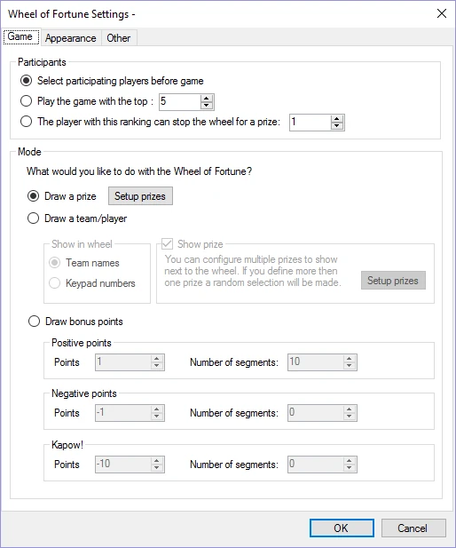
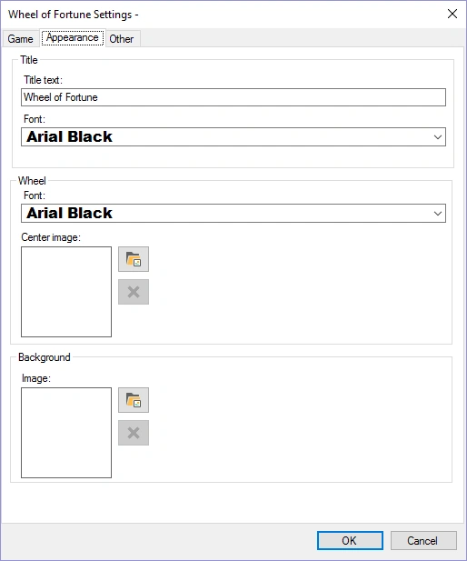
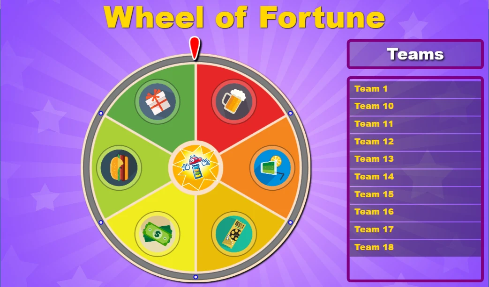
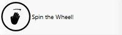
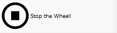

# Wheel of Fortune module

The wheel of fortune allows you to spin a wheel to draw a prize or points for a team, or just draw a specific team.

Please find below the configuration screens with their default settings:

| { width="254" loading=lazy } | { width="254" loading=lazy } |
|--------------------------------------------------------------------------------|---------------------------------------------------------------------------------|

- Participants: selected players play the wheel (selection is done before the wheel starts, on the director screen), the top ranked players play the wheel or a single player of a certain rank can stop the wheel with his or her keypad.

- Draw a prize: prizes (which can also be positive or negative points) are shown in the wheel. By pressing the ‘Setup prizes’ button the prizes can be configured.

- Draw a team/player: the selected participants are distributed across the wheel. The number of segments on the wheel can be chosen by selecting a value for ‘Number of segments’. If the checkmark is checked before ‘Show prize’, prizes which can be won (or lost) are shown next to the wheel. While the wheel spins, the prizes highlight one after another. When the wheel stops on a player/team, the highlighted prize is won (or lost, in the case of negative points). Prizes (or points) can be defined by pressing the ‘Setup prizes’ button. This mode does not work in combination with the ‘stop the wheel’ option in the ‘participants’ section, as prizes are required on the wheel for the ‘stop the wheel’ game.

- Draw bonus points: the positive, negative and Kapow! points are distributed across the wheel in the number of segments indicated. For positive and negative points, each segment increases or decreases in value, respectively (for example: positive points of 1 with 5 segments results in the values 1, 2, 3, 4, and 5; negative points of -2 with 4 segments results in the values -2, -4, -6, -8). Kapow! points are negative points that are fixed across the number of segments specified. The Kapow! segments are the ones players do not want to land on! The total number of segments for the ‘Draw bonus points’ section cannot exceed 30.

- Appearance tab: set the title text of the game and the fonts used. Choose a background image as well as the image shown at the center of the wheel.

- Other tab: Set the wheel spinning speed as well as the spin time.

Please find below a picture of the wheel of fortune game in action.

{ width="546" loading=lazy }

In order to spin the wheel, press the ‘Spin’ button in the left-hand side panel.

{ width="142" loading=lazy }

When the ‘Stop the wheel’ setting is on, the player that can stop the wheel with his or her keypad is indicated in the ‘Teams’ panel in the game. The wheel can also be stopped by pressing the ‘Stop the Wheel!’ button (but typically this is not necessary as the player should stop the wheel).

{ width="143" loading=lazy }
