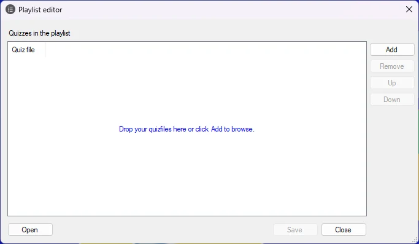

# Creating playlists

You can create and save playlists that contain multiple quizzes. Using playlists, you can create several smaller quizzes and combine them into one larger quiz.

To create a playlist, click the External button on the HOME ribbon, then choose ‘Make playlist’.

{ width="474" loading=lazy }

By clicking the ‘Add’ button, you can add multiple quizzes to the list. After adding the quizzes, you can change their order by selecting a quiz in the list and pressing the ‘Up’ and ‘Down’ buttons.

Pressing the ‘Save’ button saves the playlist to disk. Playlists have the file extension .qxp.

When starting QuizXpress Live, the quiz player, you can select either a quiz file (extension .qx) or a playlist (extension .qxp). When you select a playlist, all quizzes in it are played one after another as if they were one big quiz. Scores are retained between quizzes.

Alternatively, you can select a playlist in Windows Explorer, right-click it, and choose ‘Edit playlist’ to edit it with the playlist editor, or choose ‘Open with > QuizXpress Live’ to start the quiz player with the playlist.
