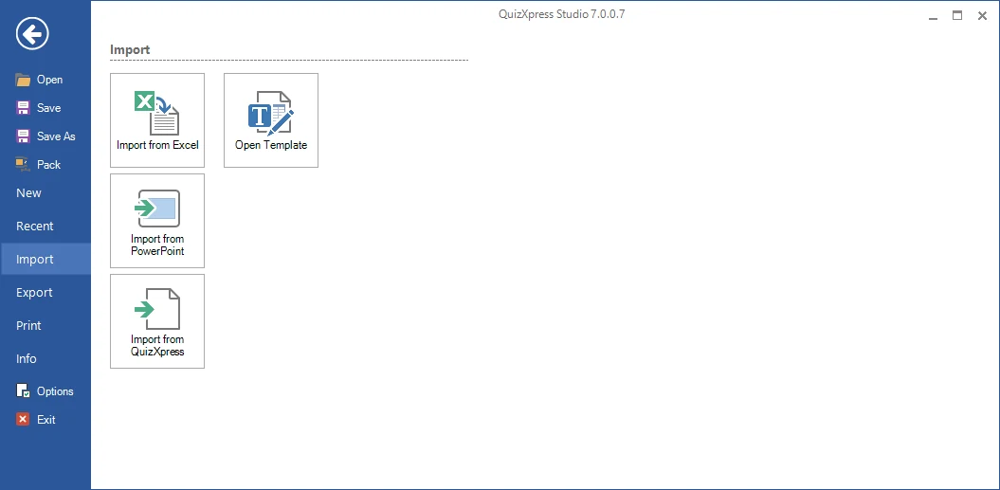
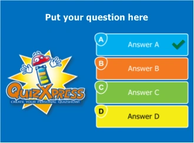
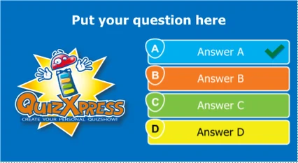
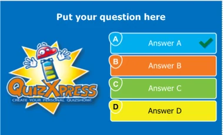

# FILE → Options dialog

The entry to this dialog can be found in the backstage FILE menu:

{ width="605" loading=lazy }

The ‘Target device’ tab of this dialog lets you set the target screen ratio and image quality of your quiz. The *ratio* option configures the width/height ratio of your slides to match the device you’ll present your quiz on:

| { width="156" loading=lazy } | { width="213" loading=lazy } | { width="190" loading=lazy } |
|---------------------------------------------------------------------------------|---------------------------------------------------------------------------------|--------------------------------------------------------------------------------|
| 4:3                                                                             | 16:9                                                                            | 16:10                                                                          |

<table>
<colgroup>
<col style="width: 42%" />
<col style="width: 57%" />
</colgroup>
<thead>
<tr class="header">
<th></th>
<th>
So, for example, if you intend to run your quiz on a widescreen TV, use the default 16:9 ratio. For an older beamer, use the 4:3 ratio. You can change the ratio after creating your quiz, and the system will resize all your slides automatically.

The Quality option controls the image resolution QuizXpress uses internally when rendering a slide in Quiz Show (the physical number of pixels used for the slide image). You can set this to ‘High quality’ or ‘Ultra high quality’ if you are presenting your quiz on a high-resolution device (like a full HD LCD screen) and have a powerful video card/PC with enough memory.
</th>
</tr>
</thead>
<tbody>
</tbody>
</table>

<table>
<colgroup>
<col style="width: 42%" />
<col style="width: 57%" />
</colgroup>
<thead>
<tr class="header">
<th></th>
<th>
On the ‘Protection’ tab, an expiration date for the quiz can be set. After this date, the quiz can no longer be played by QuizXpress Live.

You can also protect your quiz with the DRM (Digital Rights Management) key of your target customer. When you do so, the quiz content cannot be copied to or run on another machine. Your customer’s DRM key can be obtained from the ‘Info’ tab in the backstage menu on their PC (in the License Info section).
</th>
</tr>
</thead>
<tbody>
</tbody>
</table>

The ‘Quiz Author’ details section shows the history of the quiz file: who originally created it and who last modified it. These details are used, for example, when a quiz file has expired and your end user is presented with contact details for obtaining a recent update. Your own quiz author details can be entered in the ‘Options’ dialog (available on the HOME ribbon).

Finally, the ‘Advanced’ tab lets you set advanced properties for the quiz. ‘QX3 compatible video rendering’ means the system uses the video system that was present in QX3. You might want to use this because it can perform better on low-end systems like netbooks. The drawback is that it only supports the AVI format, and you cannot use video effects. This setting applies to the whole quiz, so be careful not to use any other video formats in your quiz (if you do, a warning is generated when starting QuizXpress Live). *You will rarely need to enable this function.*
