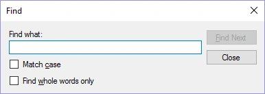

# Find text in questions and answers

You can find text in questions or answers by pressing Ctrl+F (or the Find button on the HOME tab).

{ width="301" loading=lazy }

By entering text and pressing ‘Find Next’, you can go through the found items.
