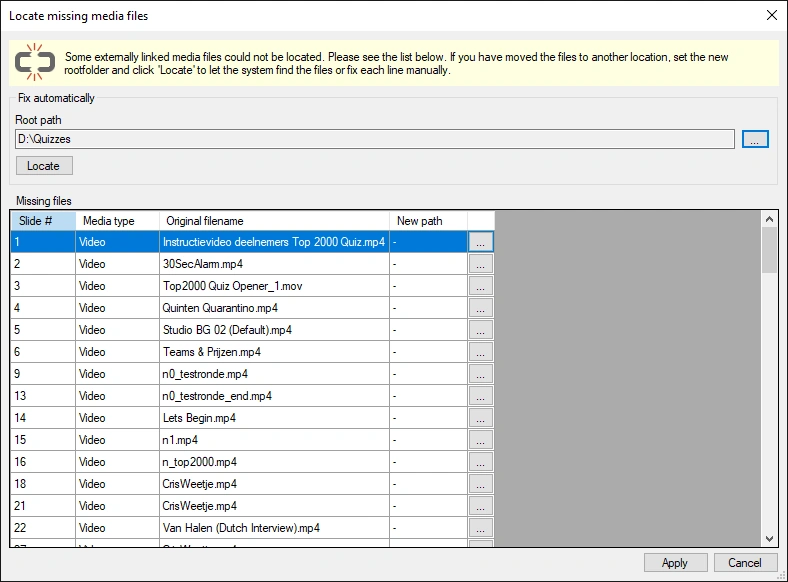

# Fixing broken links

When you link audio and video content, the quiz contains only a path to the external file. If you move the external file, QuizXpress will no longer be able to locate it, resulting in a broken link. After loading a quiz, Studio runs a background task to check whether all referenced media files are still present. When it detects at least one broken link, it presents a form listing all the missing links:

{ width="568" loading=lazy }

In this form, you can quickly resolve the problem (the linked files must, of course, still be available somewhere on the computer). If all files are still available under a root folder, you can let the system search for them using the Locate button. If the files are scattered around the disk, you’ll need to locate them manually, one entry at a time. Once all paths have been corrected, click Apply to make the changes to the slides.
