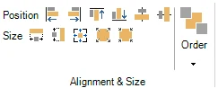
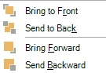

# HOME → Alignment & Size, Order

{ width="211" loading=lazy }

The alignment and size section has several tools that let you align, position, and size multiple elements on a slide. To do so, select multiple slide elements (for example, answers, pictures, or a combination of these) by clicking them one by one while pressing the Ctrl key. The first item selected has white resize handles around it, while the other selected items have black resize handles.

You can now choose one of the following options:

- Position: align left, right, top, bottom, middle vertical, middle horizontal

- Size: make same width, make same height, make same width and height, decrease size, increase size

{ width="108" loading=lazy }The order button allows you to order multiple overlapping items in z-order (depth). You can bring an item to the front, send it to the back, bring it one level forward or send it one level backward.
