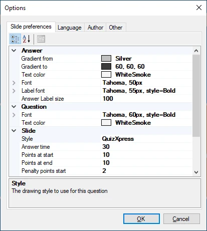
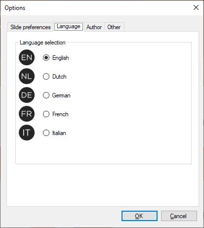
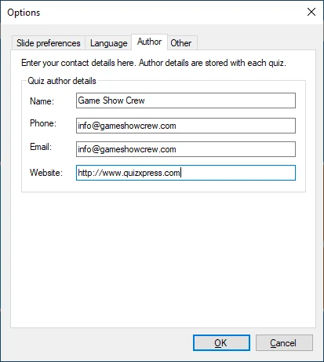
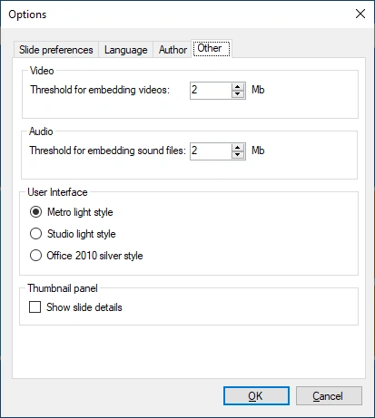

# HOME → Options

The QuizXpress Studio options dialog can be found under Tools->Options. The dialog has three pages:

| { width="262" loading=lazy }  | { width="263" loading=lazy }  |
|---------------------------------------------------------------------------------|---------------------------------------------------------------------------------|
| Slide preferences                                                               | Language selection                                                              |
| { width="265" loading=lazy } | { width="261" loading=lazy } |
| Quiz author details                                                             | Other settings                                                                  |

***Slide preferences* tab:**

This page lets you set various properties used as defaults for every new slide you create. For example, setting ‘Answer time’ to 40 seconds here ensures the answer time on every new slide is set to 40 seconds. Note: changes made here apply only to new slides, not to existing ones!

***Language* tab:**

This tab lets you set the user interface language for QuizXpress Studio and all other QuizXpress tools (stored in the QuizXpress settings file).

***Author* tab**:

Here you can set the details about yourself that will be embedded in the quiz as the original quiz author.

***Other* tab:**

Here you can set the thresholds for embedding/linking audio and video content, switch between three different user interface styles, and set an option for the thumbnail panel to show additional info, such as the question number as shown in QuizXpress Live.
