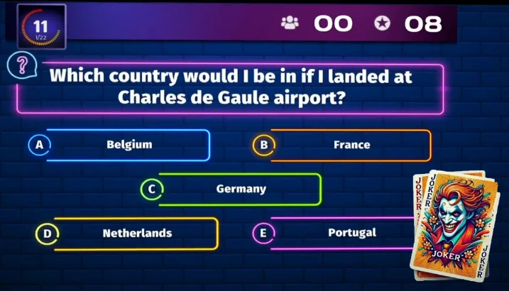
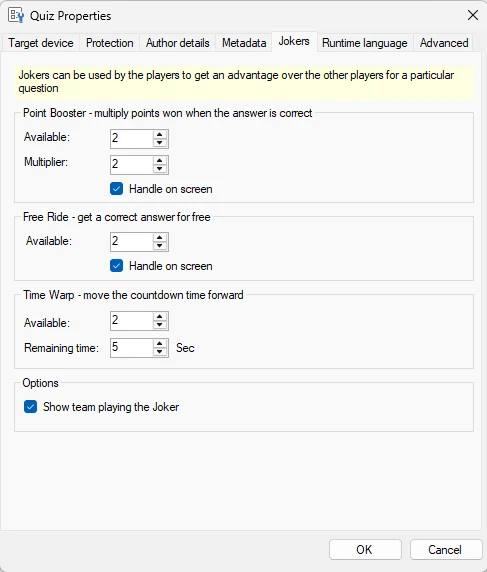
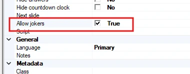
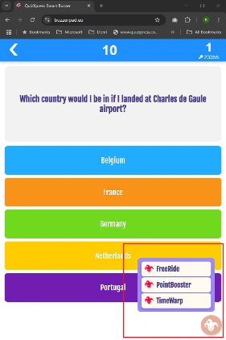

# Jokers

Players can use Jokers — tokens that can be used to influence the outcome of a quiz! Players can choose to play a Joker whenever they think it will give them an advantage. Jokers are available only when playing with mobile phones.

{ loading=lazy }

Currently, three types of Jokers are available:

- **Time Warp**, move the time forward so other players have less time answering

- **Free Ride**, automatically get the question right without answering

- **Point Boost**, players get the points won for a question multiplied when correct

Jokers are defined in Studio for the whole quiz by clicking File > Options:

{ width="234" loading=lazy }

Per type you can configure the following:

**Point booster**

- Available: how many times can the joker be used by a player

- Multiplier: how many times the points won are multiplied

- Handle on screen: the quiz player shows that a joker has been played

Free Ride

- Available: how many times can the joker be used by a player

- Handle on screen: the quiz player shows that a joker has been played

**Time Warp**

- Available: how many times can the joker be used by a player

- What is the remaining time when the joker has been used

!!! note

    Time Warp is always shown on screen, as it affects all players

Show team playing the joker: show the team name in the joker indicator shown onscreen in the quiz player when a player plays a joker.

Jokers are automatically enabled on all slides of type Question. If there are questions where you don't want Jokers to be used, you can explicitly disable them in the slide properties:

{ width="333" loading=lazy }

{ width="180" loading=lazy }

When jokers are available, players see a menu on their smart buzzer (app or web) by which they can play the joker of their choice:

!!! note

    only one player can play a Time Warp per question, and Free Ride and Point Booster are mutually exclusive (you can use one or the other). More types of Jokers will become available in future versions.
