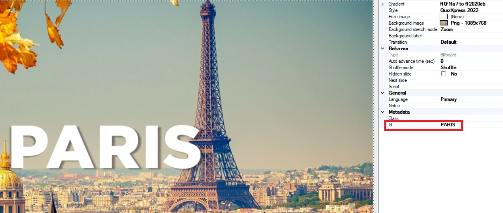
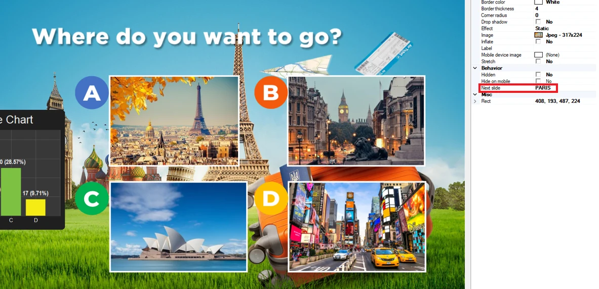
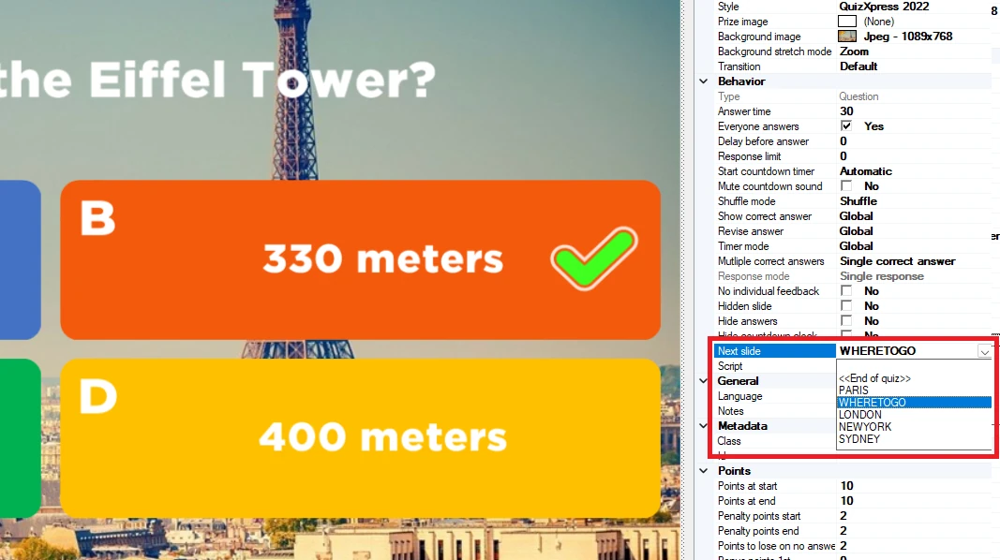
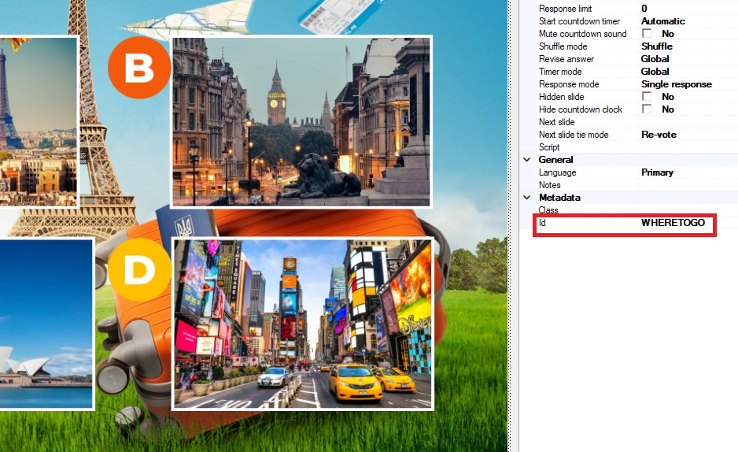

# Slide routing

Normally, a quiz runs linearly from slide 1 to the end. With slide routing, you can define different ‘routes’ in your quizzes. Routes can be static (for example, slide 10 always followed by slide 20) or dynamic, based on the outcome of a voting slide. With the dynamic option, you can have your players decide where to go next based on their votes — for example, having them select a video clip or music to play, or which question round to go to.

A built-in viewer helps to visualize the slide flow.

You define a route by giving the slide you want to jump to an Id in the slide’s properties. This can be an arbitrary but unique name that makes sense to you as the quiz author:

{ width="545" loading=lazy }

Then, refer to this Id in the ‘Next slide’ property of the answer/picture on an Audience Response/Majority Rules slide:

{ width="592" loading=lazy }

The example above shows an Audience Response slide with 4 pictures. When option A (Paris) has the most votes, the system jumps to the slide with Id ‘Paris’.

Of course, it can happen that there is a tie in the voting, when two or more answers have the same number of votes. The behavior for that situation can be defined in the slide’s properties (when routing is active on that slide) with the ‘Next slide tie mode’ property. There are three options:

- Re-vote, the slide is reloaded and the voting is redone until one answer has a majority

- Randomize, the system randomly picks the route of any of the top voted answers

- Prompt, a prompt is presented to the host (on main screen) to make a selection

Every slide itself also has a ‘Next slide’ property that defines the next slide the system will present. When left empty, the default flow is followed (going to the next slide in line).

To jump to a slide other than the default ‘next in line’ slide, fill in the ‘Next slide’ property of the slide itself. One example is when you’re at the end of a round and want to jump back to a round selection slide. Applying this to the previous example, the last slide of the Paris round can refer back to the voting slide.

{ width="298" loading=lazy } { width="271" loading=lazy }
