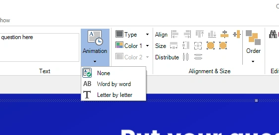
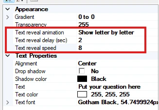

# Text reveal animations

For all question and answer items you can define how they appear on the screen:

- Show direct/None (default)

- Word by Word

- Letter by Letter

{ width="563" loading=lazy }

In the advanced properties of the question or answer texts, you can tweak the animation with the start delay and speed properties:

{ width="327" loading=lazy }

You can use this feature if you want to read the question aloud without revealing it immediately, or to put players on the wrong track by showing the answers directly while the question appears over time (players might choose the wrong answer by making assumptions about the question).

If you want to preview the text reveal, press F5 to show a preview of the slide in fullscreen.
