# QuizXpress and AI

QuizXpress offers access to your very own AI-powered virtual quiz writer. You can generate questions, autocomplete multiple-choice questions with viable options, create Trivia Feud surveys, or generate images!

## AI Quiz generator

The AI Quiz Generator helps you generate various types of questions. You can start it by clicking the button on the HOME tab.

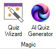{ width="112" loading=lazy }

After clicking the button, the Trivia generator window is shown.

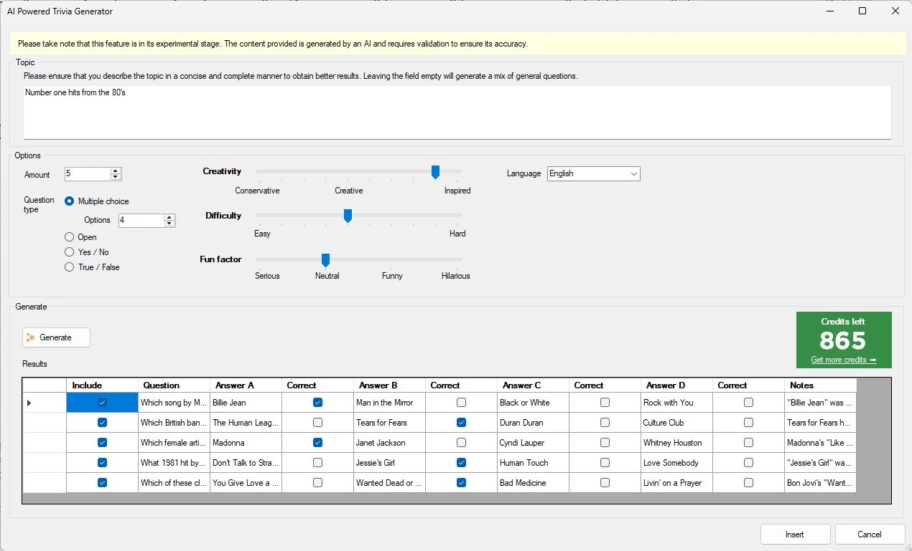{ width="567" loading=lazy }

In the Topic field, enter your desired subject. Be as specific as possible. For example:

“Music questions” will produce very general music questions, and asking the same question again may generate the same questions. Instead, try asking “Music questions about top 10 hits from the nineties”.

You can indicate what kinds of questions you would like to generate:

- a multiple-choice question – you can indicate the number of responses

- an open question

- a Yes/No question

- a True/False question

You can also play with the Creativity/Difficulty and Fun Factor sliders, which, depending on the subject, have more or less influence.

Now press the ‘Generate’ button and watch as the questions are generated for you, complete with detailed notes that can be used by the quizmaster while hosting the quiz.

The generated questions are presented in a list format alongside the corresponding answers. In the case of multiple-choice questions, the AI system will also generate viable alternatives to the correct answer. This feature streamlines the process of quiz creation and ensures that your content is engaging and comprehensive.

## AI-Completion for multiple choice questions

This feature helps you create multiple-choice options while you keep control over the question. To use it, type the question as you normally would, right-click the slide, and select ‘Complete with AI’ from the context menu. The multiple-choice options will be filled in and the correct answer set, along with notes explaining the correct answer.

See an example of this below:

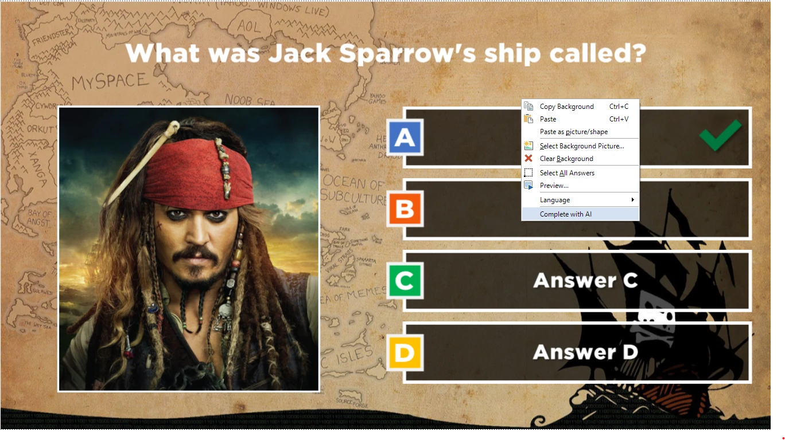{ width="356" loading=lazy }

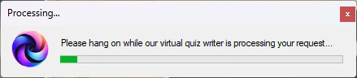{ width="331" loading=lazy }

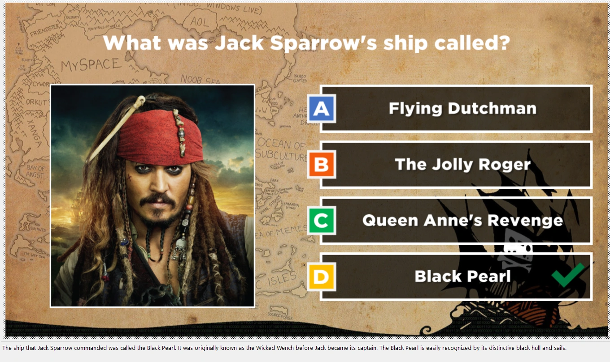{ width="533" loading=lazy }

## Trivia Feud survey generation

You can also use AI to generate Trivia Feud surveys. Just enter the survey question and press the ‘Complete with AI’ button.

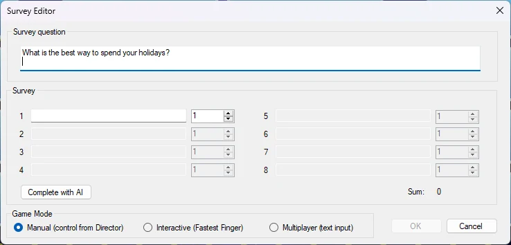{ width="455" loading=lazy }

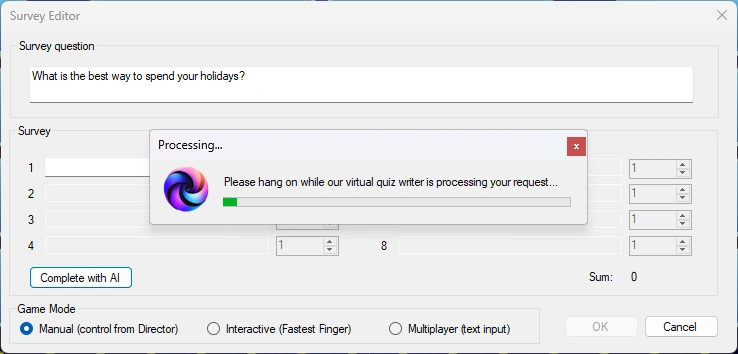{ width="452" loading=lazy }

The survey answers will now be generated for you, including viable percentages.

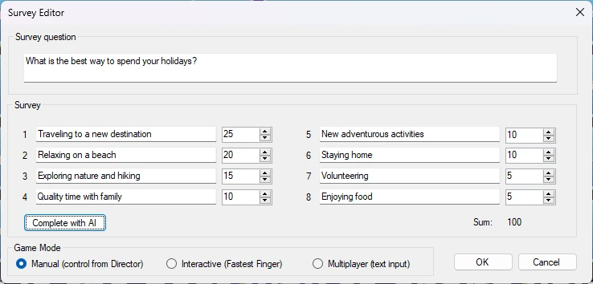{ width="464" loading=lazy }

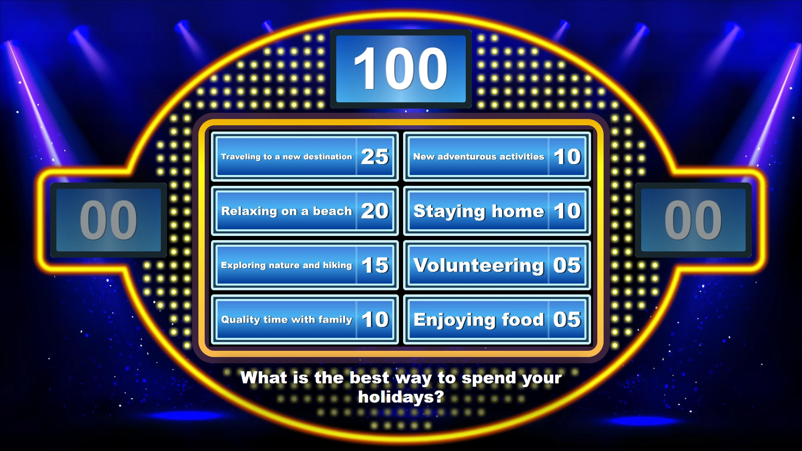{ width="467" loading=lazy }

## AI-image generator

You can also use the ‘QuizXpress AI co-pilot’ to generate slide images or a slide background.

For example, generate an image in an image placeholder: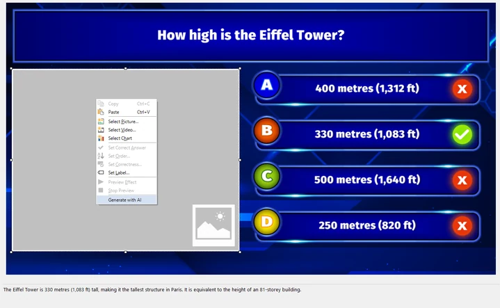{ width="360" loading=lazy }

Providing a detailed description and rich context yields better pictures. You can also specify the desired style, such as ‘3D rendering’, ‘abstract art’, ‘comic’, etc.

In the example below, four pictures of the Eiffel Tower in the snow are generated.

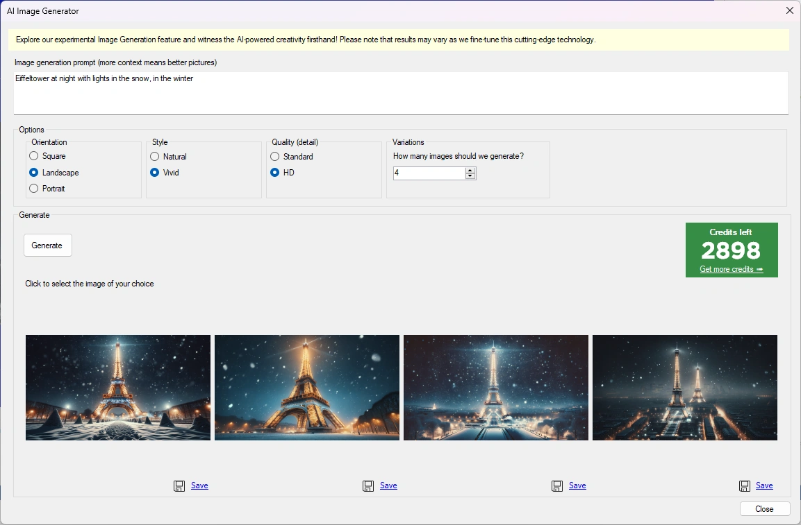{ width="439" loading=lazy }

Choose one of the four generated pictures, and it will be inserted into the picture placeholder.

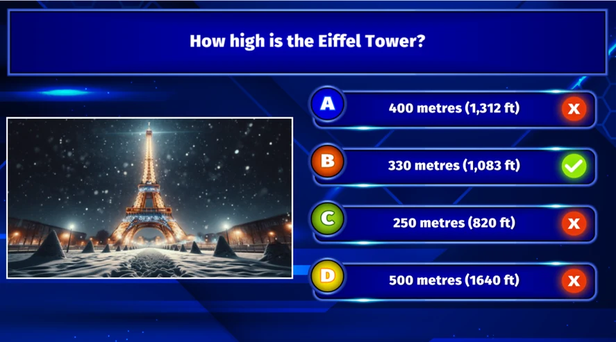{ width="444" loading=lazy }

You can do the same for slide backgrounds. Right-click the background and choose ‘Generate with AI’. The example below generates a background for a music round with the description ‘female quizmaster announcing a music round, pointing towards the audience, with headphones, in front of a stage’.

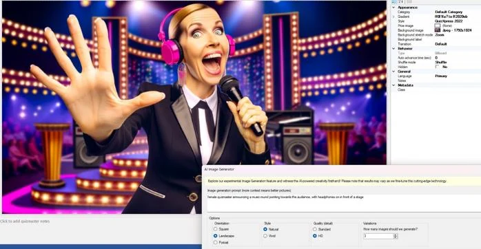{ width="440" loading=lazy }

## Validate with Google

You can right-click any question or answer and instantly perform an online Google search on the text in the selected item. A browser pops up with the search results, helping you double-check the AI-generated content.

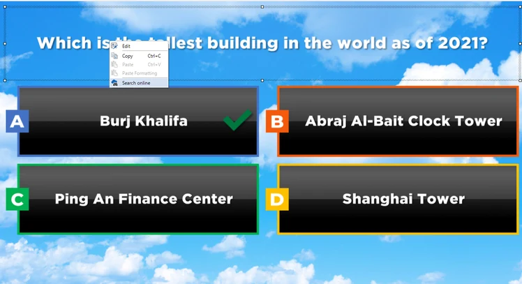{ width="374" loading=lazy }

## Credits

The AI functionality is accessible through a pay-per-use credits system. You can acquire credits (linked to your license key) for this feature through our online shop [here](https://www.quizxpress.com/product/quizxpress-credits/).

## AI roast

If you’re up for some fun you can now let AI roast a player publicly after having given a wrong answer during a quiz. This option is available from Director (desktop) on the ‘Players / Teams’ tab. Please refer to [The Teams view](../live/quizxpress-director/the-teams-view.md) for more information.

## General settings for AI

The AI completion functionality has some settings that you can find in HOME->Options:

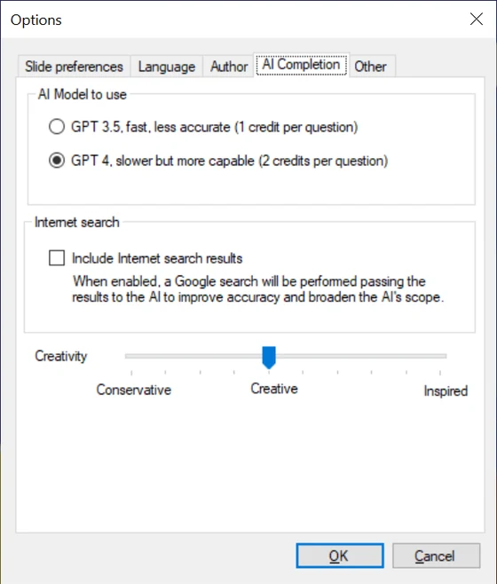{ width="280" loading=lazy }

As the current AI has a certain knowledge cutoff date, it has no knowledge of anything that happened recently. However, QuizXpress can perform an internet search on the given question and send the results to the AI to include in its reasoning. You can enable this functionality in the Options form.
