# Bingo round

This slide type starts a regular Number Bingo, Emoji Bingo, Music Bingo, or Trivia Bingo game. This type of game can currently only be played when the audience is using the Smart Buzzer app for mobile devices.

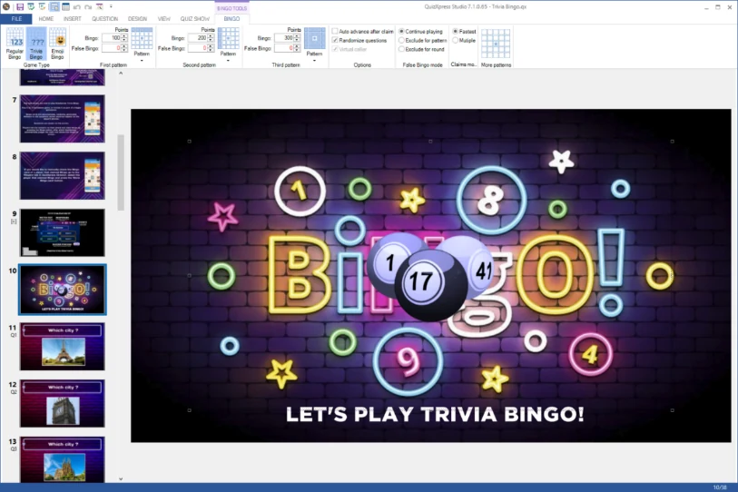{ width="518" loading=lazy }

By selecting the Bingo balls element on the slide, the Bingo contextual tab appears in the ribbon, and you can configure the various aspects of your new bingo game as described in section [Bingo properties](../user-interface-overview/advanced-properties-grid.md#bingo-properties).

QuizXpress supports the following Bingo games:

| 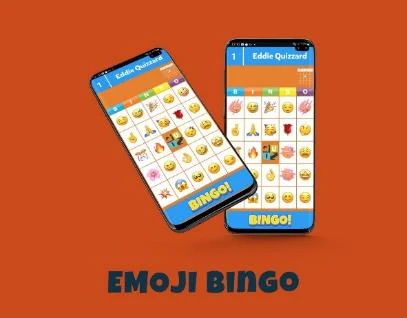{ width="257" loading=lazy } | 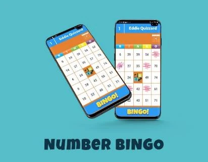{ width="259" loading=lazy } |
|------------------------------------------------------------------------------------------------------------------------------------------------------------------------|------------------------------------------------------------------------------------------------------------------------------------------------------------------------|
| 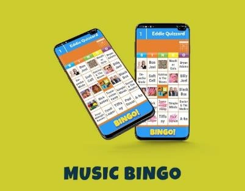{ width="257" loading=lazy }                                                                                       | 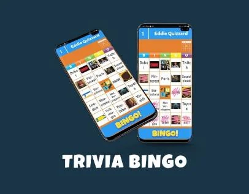{ width="259" loading=lazy }                                                                                       |

## Creating a Bingo game

You can create a new bingo round either by using the Quiz Wizard, or by manually inserting a bingo slide from the Quiz Slides picker on the INSERT tab of the ribbon.

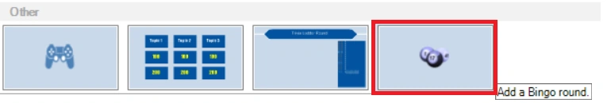{ width="604" loading=lazy }

For a traditional Number Bingo or Emoji Bingo game, you only need to create that single slide. Just click on the Bingo balls and then select ‘Regular Bingo’ or ‘Emoji Bingo’.

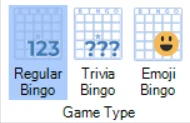{ width="190" loading=lazy }

For a Trivia Bingo round, however, you will also have to create the questions for which the answer (which can be a text or a picture) will appear on the bingo card cells. The questions need to be inserted after the Bingo slide, and you have to terminate the round with an *end-of-round* slide. As each card has 24 cells to fill, you need at least 24 questions. Creating more questions will result in more randomness in the cards. For example, if you only have 24 questions, each card will have ‘Coverall’ at the last question, and everyone will have Bingo. If you create more questions, as with regular Bingo, not all answers will be on the cards.

The types of questions supported in a Trivia Bingo round are number, text, letter, and open questions with a single picture (this will result in a picture bingo cell).

To create text cells on your bingo card, use the ‘open question’ slide template:

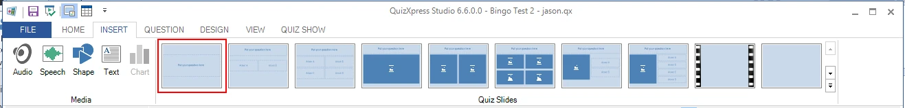{ width="624" loading=lazy }

And set the Input mode to Number, Letter or Text:

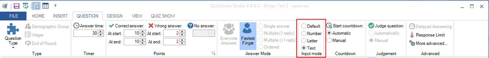{ width="624" loading=lazy }

This will result in a bingo cell with the correct answer as set for the question. Using ‘Number’ or ‘Text’ does not make much difference, but when using the type ‘Letter’, only the first letter will appear on the bingo card.

To create a *picture* bingo card cell, choose the following layout:

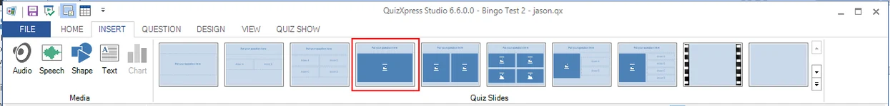{ width="623" loading=lazy }

Select the picture element and check the ‘Hidden’ flag in the ‘Adjust’ section of the ribbon.

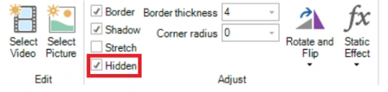{ width="298" loading=lazy }

This will make the picture hidden when presenting the quiz to the audience, and it will appear on the Bingo card as a picture cell (you can choose to also show the picture on the big screen during a quiz, but this will make the answer very easy to find on the Bingo card!).

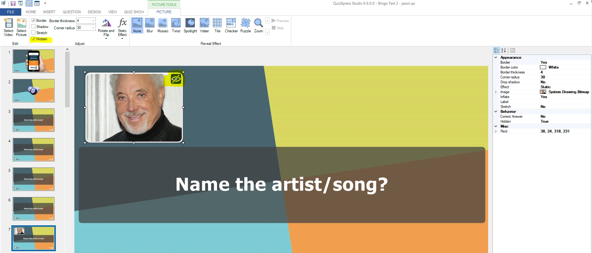{ width="624" loading=lazy }

The Quiz Wizard also helps in quickly creating a Trivia- or Music Bingo round. Just start the Quiz Wizard (HOME tab, Quiz Wizard button) and press ‘create a new round’ followed by ‘a Bingo round’. You can now choose from the four types of Bingo and indicate your preferences.

When you are done creating your questions, you can preview a (random) card by right-clicking the bingo slide and selecting Preview (or pressing F5).

Below you find an example of a Trivia Bingo card preview:

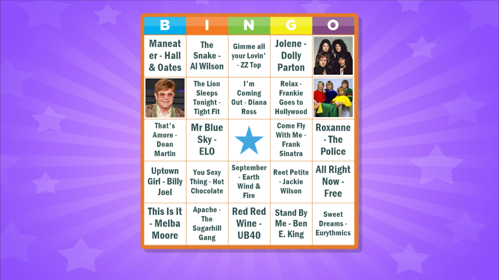{ width="544" loading=lazy }

When running your quiz, as soon as your Bingo slide is presented, the system creates a set of random cards and distributes them among your players automatically.

For Trivia Bingo there is an option (on the BINGO tab of the ribbon) to randomize the slides in the Bingo round so they appear in a different order every time you play the quiz:

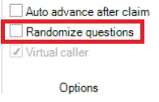{ width="158" loading=lazy }

It is possible to customize the picture that is shown in the center of the Bingo cards on the mobile app and use your own image. For this, select the Bingo element on the Bingo slide, open the advanced properties pane (VIEW tab, put a check before ‘Properties’), click the ‘Center image’ property and click the three dots property to select an image file:

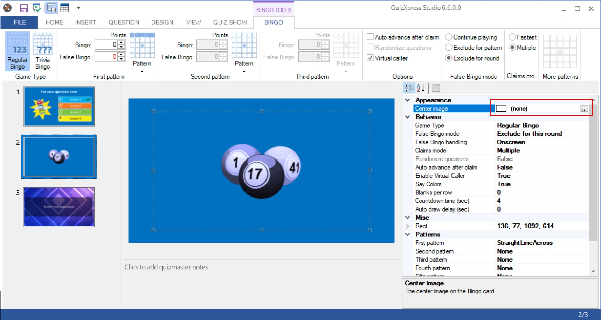{ width="522" loading=lazy }

Use your own center image to promote your brand with players!

### Supported Bingo patterns

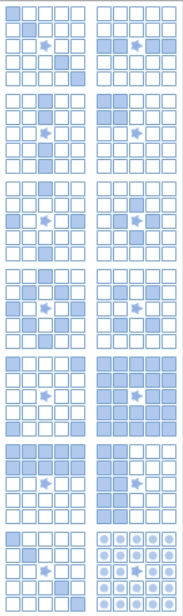{ width="146" loading=lazy }

You can define up to five subsequent patterns that will lead to Bingo. You can select three patterns by clicking the ‘Pattern’ buttons in the First pattern, Second pattern, and Third pattern section on the BINGO tab in the ribbon. If you want to define a fourth and fifth pattern, this can be done in the Properties pane.

A selection can be made from 13 predefined patterns. There is also the possibility to define custom patterns.

When opening the patterns, an animation is shown for patterns if applicable (for example, the horizontal line pattern is valid for each horizontal line).

When playing a Bingo game, in both the quiz player as well as the mobile phone an animation will be displayed showing the current pattern giving Bingo.

With version 7.1 comes the possibility to create your own bingo patterns. To do so, pick the custom pattern from the ribbon (last entry in the pattern picker), after which you will see the pattern editor:

| 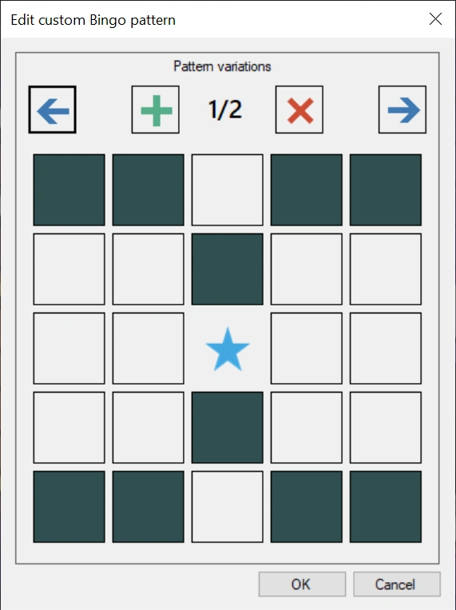{ width="203" loading=lazy } | 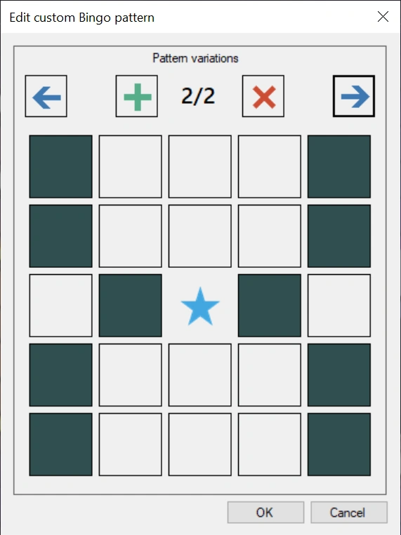{ width="205" loading=lazy } |
|---------------------------------------------------------------------------------|---------------------------------------------------------------------------------|
| Pattern variation 1                                                             | Pattern variation 2                                                             |

By clicking on the cells, you create the pattern. A pattern can have multiple variations that all make for a valid bingo (analogous to a horizontal line Bingo for example, where each horizontal line results in a Bingo). In the quiz player as well as on the mobile app the variations will be shown to the players in an animation.

### Blanks per row

To enable blanks, open the properties view in Studio (VIEW->Properties on the ribbon), select the Bingo slide, and look up the property named Blanks per row:

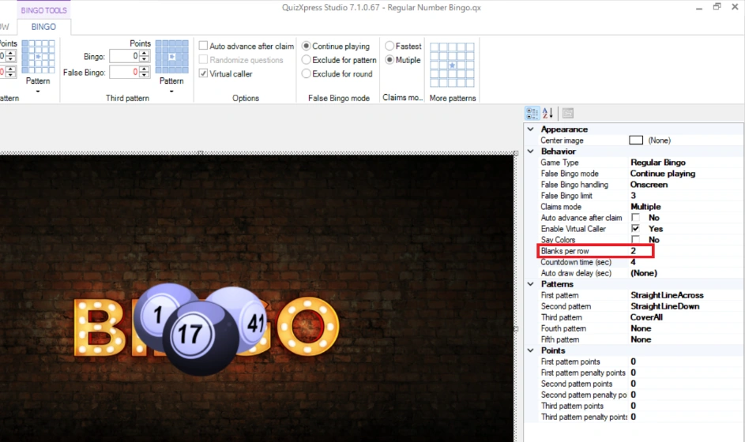{ width="605" loading=lazy }

This value indicates the number of blank cells per row on your card. It can be a value between 0 and 4. When specifying a value of 2, the Bingo card on the mobile device will look like:

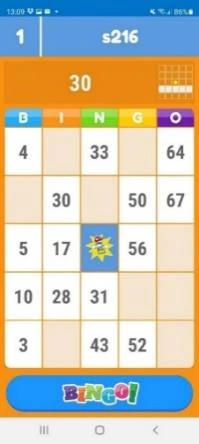{ width="128" loading=lazy }

The empty cells act as wildcards when evaluating a Bingo claim. So, in the example card on the left, by just marking 30, 50, and 67, the player could claim a Bingo for a horizontal line. When playing with blanks, one should consider what patterns to play for. For example, playing for a vertical line might not be such a good idea, as there could be columns with only one cell to mark. Also, more complex patterns, like a diamond shape, might never be achievable with certain cards.

### Advanced Options

*Auto advance after claim* – when this option is enabled, the game will move on automatically after a Bingo claim. When not enabled, the game waits for the host to advance.

*Virtual caller* – when enabled, the played numbers will be spoken by the computer (by the default Windows voice synthesizer).

**Using a custom Bingo caller voice**

When enabling the Virtual Caller option, by default the Windows voice synthesizer is used to speak the numbers. You can, however, create your own voice files, for example with the help of a local celebrity. To do so, create a subfolder in the QuizXpress application data folder (in Windows Explorer, enter *%appdata%\quizxpress* in the navigation bar) named ‘bingo’. In this folder, create the mp3 files for each number to speak (e.g., 1.mp3, 2.mp3, 3.mp3, etc.) and optionally a file named ‘welcome.mp3’ that will be played when the Bingo game starts. The system will play these files when a new ball is drawn.

### False Bingo mode

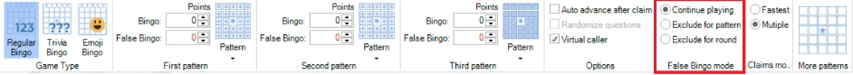{ width="604" loading=lazy }

You can indicate what needs to happen when a false Bingo claim is made. The options are:

- Continue playing – the player that made a false claim can claim another bingo for the same pattern.

- Exclude for patterns – the player that made a false claim can no longer claim bingo for the same pattern. The player must wait until someone else has a valid bingo and the system switches to the next pattern.

- Exclude for round – the player that made a false claim can no longer claim bingo for the remainder of the round (which can be a full game if there is only one Bingo round).

In the properties pane two additional settings for false Bingo claims are available:

False Bingo limit – set a limit to the number of false Bingo claims for a player. After the limit has been reached, the player is locked out of the game.

False Bingo handling – determines how false Bingo claims are handled, On-Screen or Silent. In silent mode, only Bingo claims that will result in a valid Bingo are shown in the quiz player.

### Claim handling

There are two options for handling a Bingo claim:

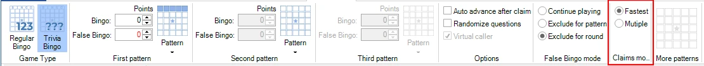{ width="605" loading=lazy }

Fastest: only the first player to claim a Bingo will be handled; other people pressing Bingo too will be blocked. When it is a valid Bingo, the next pattern will be played. All players are now playing for the new pattern.

Multiple: all the claims made in the few seconds after the first player claimed Bingo are handled. If there was one valid Bingo claim, the pattern switches to the next pattern after all claims are handled.

### Constraints when saving a quiz

There are some constraints when creating a Bingo round. For example, it is important that there are no duplicate cells on the card. The system has a built-in rules checker that checks the quiz before saving:

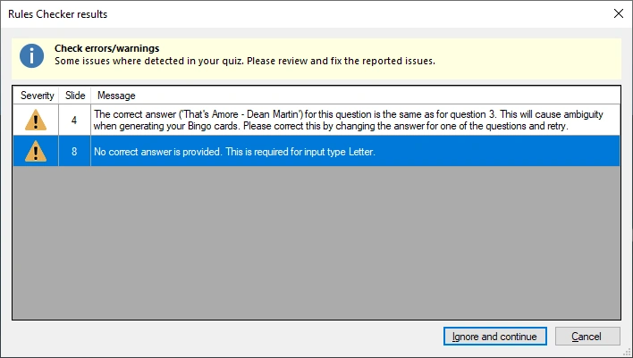{ width="475" loading=lazy }

It does this automatically for text questions. For picture cells you will have to do this yourself; make sure not to include two questions with the same picture.

## Playing a Bingo game

The quiz player takes care of registering the Bingo cards for all players and listens for Bingo claims coming from the players. Below you can find examples of the different Bingo games.

### Types of Bingo games

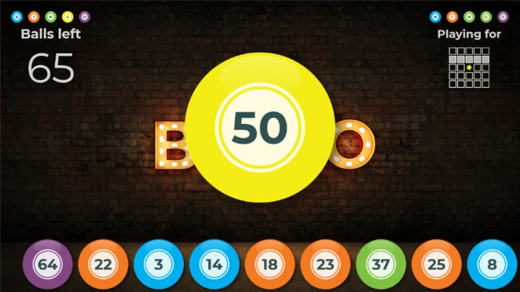{ width="424" loading=lazy }**Number Bingo**

The screen will show the last 9 balls that have been played along with their color (indicating the section on the Bingo card) as well as the latest ball that has been drawn. It shows how many balls are left to be drawn as well as the current pattern leading to a Bingo.

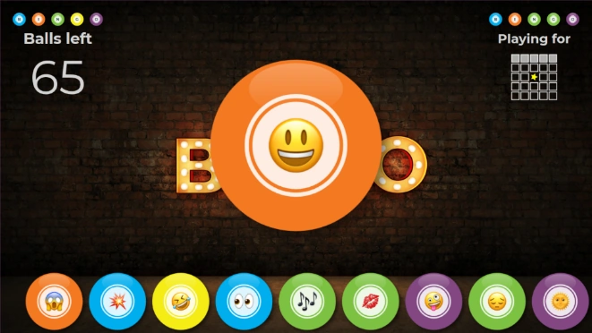{ width="423" loading=lazy }**Emoji Bingo**

Emoji Bingo is basically the same as Number Bingo, only instead of 75 numbers, the 75 most commonly used emojis are used.

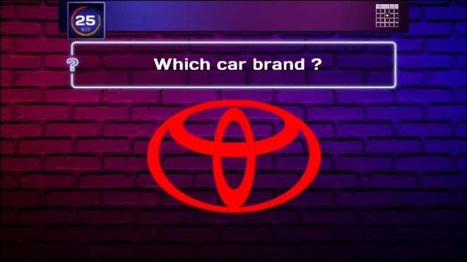{ width="422" loading=lazy }**Trivia Bingo**

When playing Trivia Bingo, the questions are shown on the big screen along with the current pattern and the countdown clock. The answer, being a text or a picture, has to be found on the card (if there are more questions than numbers on the card, it can be that the answer is \*not\* on a card).

**Music Bingo**

Music (or even video) Bingo is basically the same as Trivia Bingo. Questions with music fragments are shown on screen, and the answers (text or pictures) are on the Bingo card.

The quiz wizard contains specific support for Music Bingo. It allows you to select a folder with mp3 files, from which the Bingo round is automatically constructed.

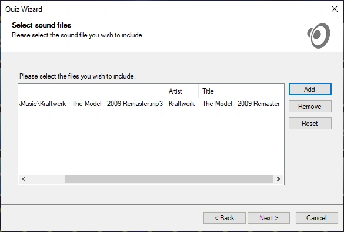{ width="585" loading=lazy }

### Claiming Bingo

When a player has marked enough cells to complete a pattern, he or she makes a claim by hitting the Bingo button on the mobile app. This results in the player’s name showing on screen and a 3-second countdown while the system validates the claim. There is no need for manual checking.

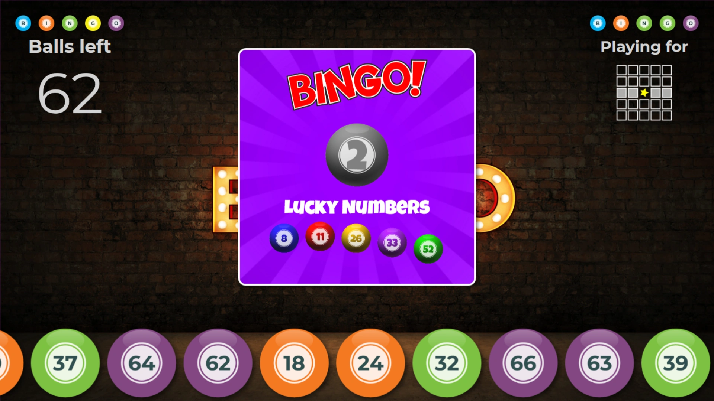{ width="605" loading=lazy }

After validation a thumbs-up or thumbs-down is shown on the big screen as well as on the mobile.

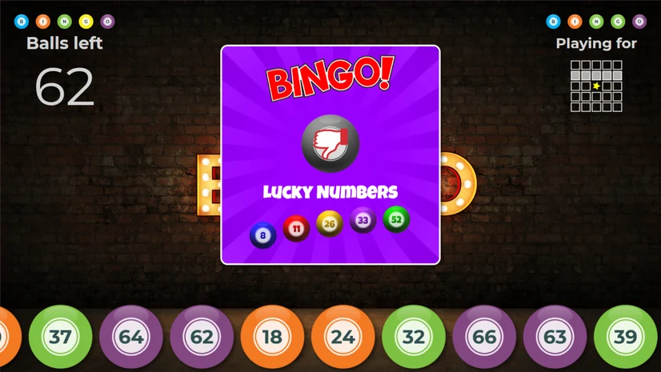{ width="413" loading=lazy } 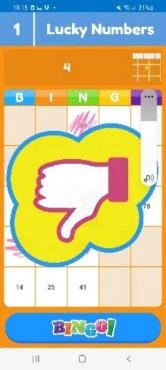{ width="103" loading=lazy }

On a valid Bingo, the player wins points (if configured) and the system switches to the next pattern.

When there is no next pattern to be played, the round ends and the quiz continues at the end-of-round slide (when there is only one round and no end of round slide, the quiz shows the final score screen).

Handling multiple claims looks like:

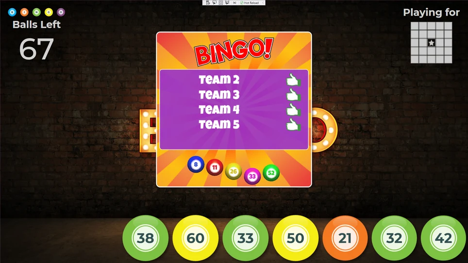{ width="482" loading=lazy }

When a player disconnects from your quiz or loses connection to the session, the Bingo card and marked cells are not lost. When joining the game again, the card will be presented like it was when disconnecting. Also, should the quiz player crash, you can restart the quiz, recover from the stored snapshot and continue the Bingo round.

### Live card view

In QuizXpress Director, on the ‘Teams’ tab, there is an option to view the current Bingo card of the selected player. The card also shows which cells have been played already, marked in green.

To show the card of a player, select the player and press the ‘Show bingo card’ button. So, in case of a dispute, you can always double-check.

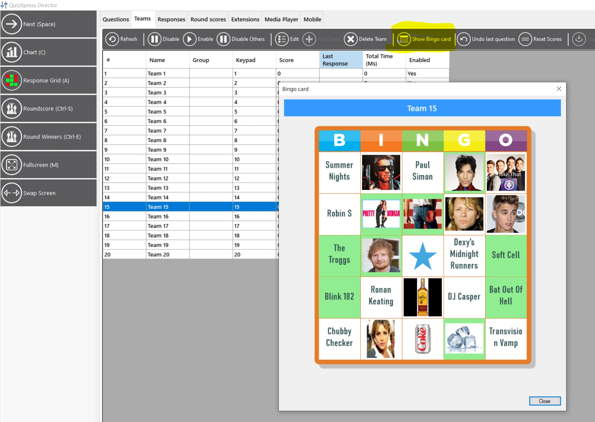{ width="624" loading=lazy }

### Change Bingo patterns during a Bingo session

In QuizXpress Director, it is now possible to change the patterns of a Bingo round along with some of the other Bingo settings during a quiz (before the round is started). To do so, double-click the Bingo slide on the Questions tab to open the settings for a Bingo round.

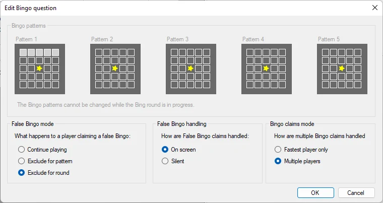{ width="605" loading=lazy }
