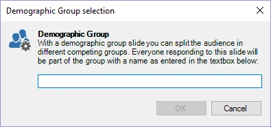

# Demographic groups

QuizXpress offers various ways to group players so they can compete with each other in teams (for example: boys versus girls). The ‘demographic groups’ slide type enables you to group players ‘on the fly’ when running a quiz.

When you choose this question type, a window pops up where you can enter the name of the group/team. When the slide is shown during a quiz, keypads that are pressed while the demographic slide is shown are registered to that specific group.

{ width="318" loading=lazy }

On the slide, we recommend showing a text asking the members of the specific group to press their buzzer or keypad (‘all boys, please press your keypad’).

You can also divide players in groups before a quiz in QuizXpress Setup. For this, please refer to the section [QuizXpress Setup: Grouping keypads](../../setup/setting-up-teams-the-teams-tab-page.md#grouping-keypads).

When playing with mobile phones (using the Smart Buzzer app or buzzerpad website), you can also play in groups. For this, please refer to sections [Playing in groups](../../setup/setting-up-mobile-keypad-support.md#playing-in-groups).
