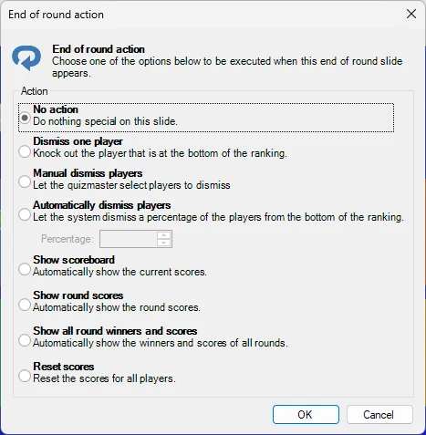
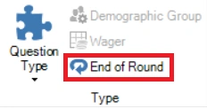

# End of round

Within QuizXpress you can indicate that a quiz slide marks the ‘end of a round’. You do this by setting a quiz slide’s ‘Type’ to ‘End of Round’ in QuizXpress Studio.

When an end-of-round slide is shown during a quiz show, no interaction with the participants takes place. For example, you can use it to show the text ‘End of Round 3’. Again, you can design the quiz slide any way you want, containing video, sound, and pictures.

Also, you can choose to show the intermediate or round score automatically. In this case, a slide with type ‘End of Round’ is in fact a ‘Billboard’ slide that also automatically shows the intermediate or round scores.

When selecting ‘End of Round’ for the question type, the ‘End of round action’ dialog box is shown with different options to execute when that slide appears:

{ width="303" loading=lazy }

Here you can set various automatic actions to occur when the end of round slide appears such as dismissing a subset of the players, showing the overall leaderboard or the winners for this round. You can always change these options later by clicking the ‘End of Round’ button next to the ‘Question Type’ button:

{ width="194" loading=lazy }

Please also refer to [End of Round](../../live/starting-a-quiz/the-quiz-screen-voting-everybody-answers.md#end-of-round) for more information about End of Round slides
