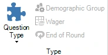

# Slide and game formats

The system supports different game formats. The formats are dictated by the ‘Question Type’ (which can be found on the QUESTION tab) that is chosen.

{ width="184" loading=lazy }

For each option, please also refer to [[The quiz screen: voting (everybody answers)](../../live/starting-a-quiz/the-quiz-screen-voting-everybody-answers.md)](../../live/starting-a-quiz/the-quiz-screen-voting-everybody-answers.md) and further which explains more about how each setting manifests itself in QuizXpress Live!, the quiz player.
