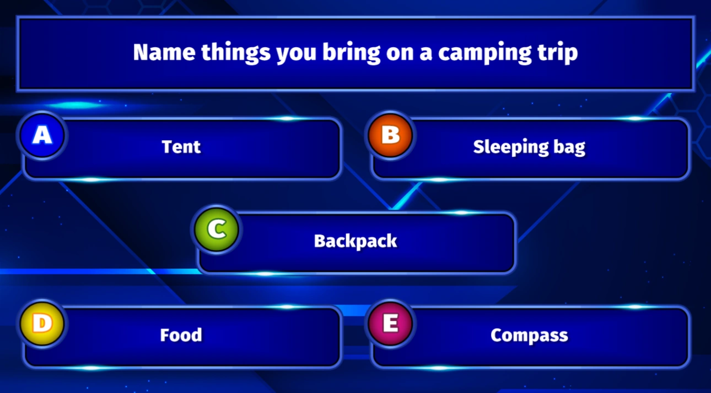

# Majority Rules

For this type of question, the correct answer depends on what the majority of the audience has chosen. So, only if a player has chosen the same answer as the majority of the audience, points are won. If multiple answers have the same number of votes, all the answers are considered correct. When the question is over, QuizXpress shows the correct (most chosen) answer(s) on the slide.

An example of a ‘majority rules’ question is:

{ width="381" loading=lazy }

If you choose what most of the audience chose, you will win the question’s points. Majority rules questions can be seen as a ‘live’ variant of ‘Family Feud’, where an instant audience poll takes place and you have to guess what the audience’s most popular answer is.
