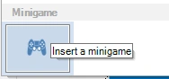
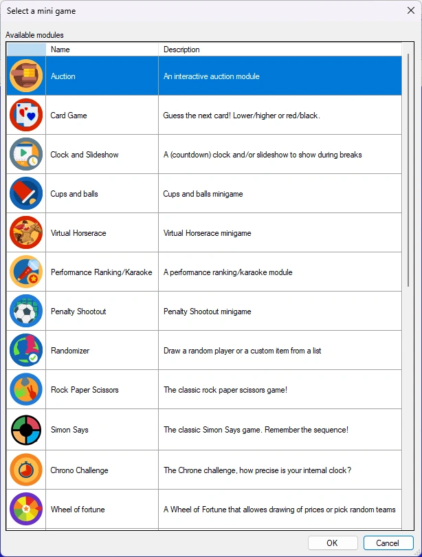
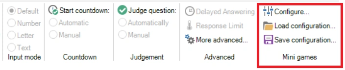
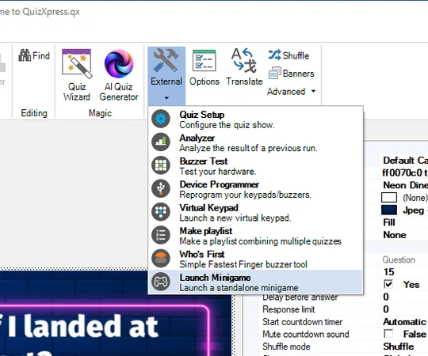
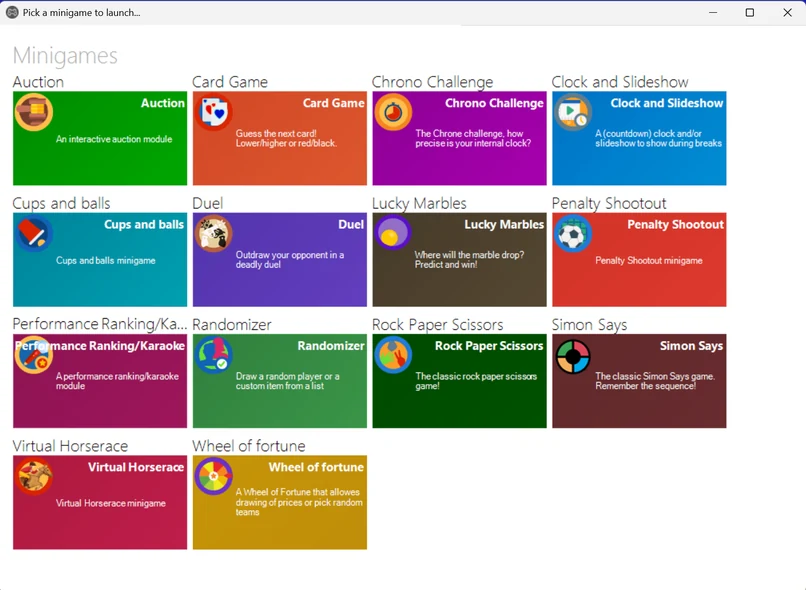

# Minigame

QuizXpress offers a variety of minigames. Minigames will spice up your game show or trivia night by offering something different from trivia. Points can be won or lost with the games.

Minigames can either be started manually (on demand) from within QuizXpress Director (the quizmaster control panel, more about that later), used by inserting a slide of type ‘Minigame’ in the quiz file, or run standalone from the minigame launcher.

{ width="109" loading=lazy }To insert a minigame in your quiz, select the ‘minigame’ slide layout from the layout gallery on the INSERT ribbon tab:

The next step is to pick the game from the list of available games:

{ width="260" loading=lazy }

A new slide is inserted that will launch the minigame in QuizXpress Live! when the quiz gets to that slide. Each minigame slide can have its own unique configuration and branding. To configure a minigame, right-click the slide and click ‘Configure…’ or click ‘Configure’ on the QUESTION ribbon:

{ width="605" loading=lazy }

This will bring up the configuration dialog for that minigame. You can also load and save minigame configurations to reuse them across quizzes. [Mini games](../mini-games/index.md) gives an overview of all mini games that are currently available and their game options.

To test your minigame, you can either run your full quiz or use the preview function in Studio by pressing F5 (or right-clicking the minigame and choosing ‘Preview’). This will launch the minigame in a separate window. Use the spacebar to navigate through the different screens.

Alternatively, you can launch mini games on the fly during a quiz from QuizXpress Director. Please refer to [The Round scores view](../../live/quizxpress-director/the-round-scores-view.md) for more information.

Finally, you can launch a minigame standalone (without running a quiz in the quiz player) from the minigame launcher. The minigame launcher can be started from the Windows start menu (section QuizXpress) or from Studio.

{ width="270" loading=lazy }

When started you are presented with an overview of all available minigames that can be started:

{ width="403" loading=lazy }

By right-clicking a tile you can configure the minigame and even make and store different configurations (which will appear as separate new tiles). When launching a game that requires player interaction on mobile keypads, a connect screen with a PIN code and QR code is presented for the mobile buzzers to connect. You can for example use the minigame launcher to run a quick game to give away a free drink.
