# Pairing question

In a Pairing Question, players match text labels to images (e.g., countries to flags or brands to logos). This looks as follows on the mobile buzzer:

| 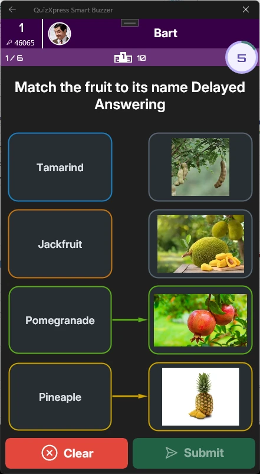{ width="159" loading=lazy } | 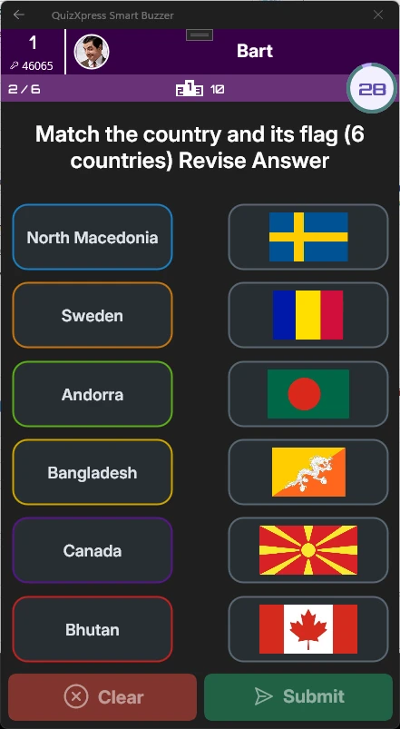{ width="161" loading=lazy } | 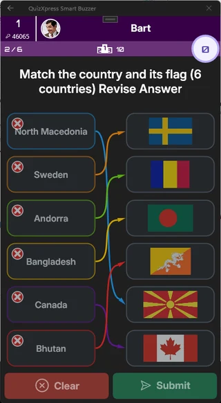{ width="160" loading=lazy } |
|--------------------------------------------------------------------------------|--------------------------------------------------------------------------------|--------------------------------------------------------------------------------|

To create this type of question, select a template with at least *three* image placeholders and set the question type to ‘Pairing Question’. Then assign the appropriate labels to each image:

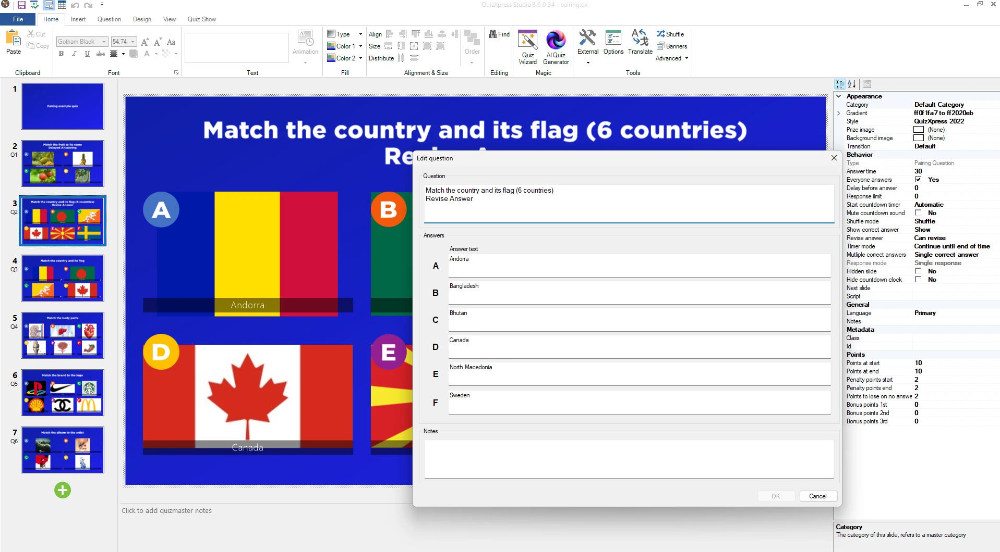{ width="602" loading=lazy }

Alternatively, you can use the Quiz Wizard.

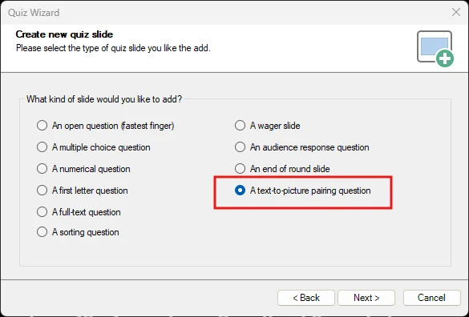{ width="390" loading=lazy }

Then fill in the labels and select the matching pictures:

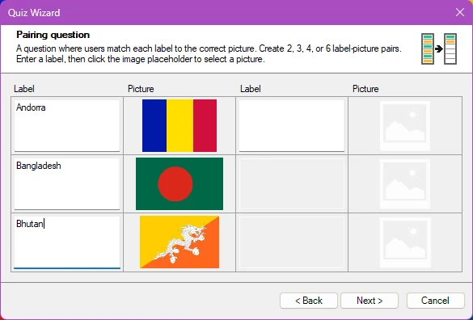{ width="390" loading=lazy }

Click **Next** and complete the Wizard to create the pairing question.

## Hotspot questions

With this type of question, the player must mark a spot (or multiple spots) on a picture, and the answer is correct when that spot (or spots) falls within the region marked as correct by the quiz designer.

For example, if we want the players to find France on a map, we pick a template with a single picture:

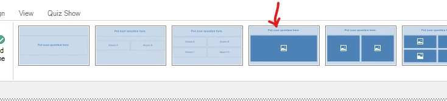{ width="602" loading=lazy }

Set the input type to ‘Hotspot’:

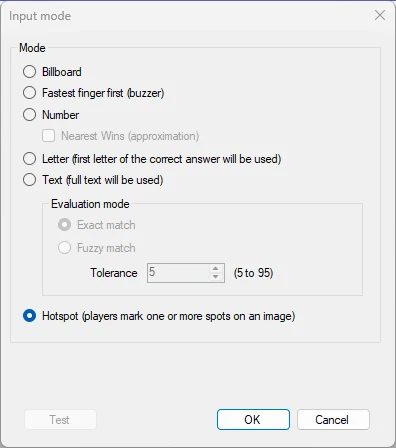{ width="251" loading=lazy }

Then, put an image of a map in the picture placeholder, and edit the hotspot region(s) with the **Hotspot Editor** (right click the picture and select **Edit Hotspots**):

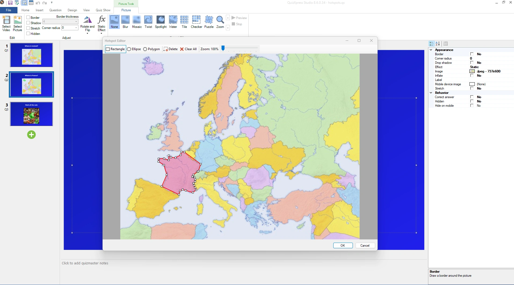{ width="602" loading=lazy }Now mark the area that makes the correct answer (here in red). Supported region shapes include rectangular, elliptical, and free-form areas.

Multiple correct regions can be defined: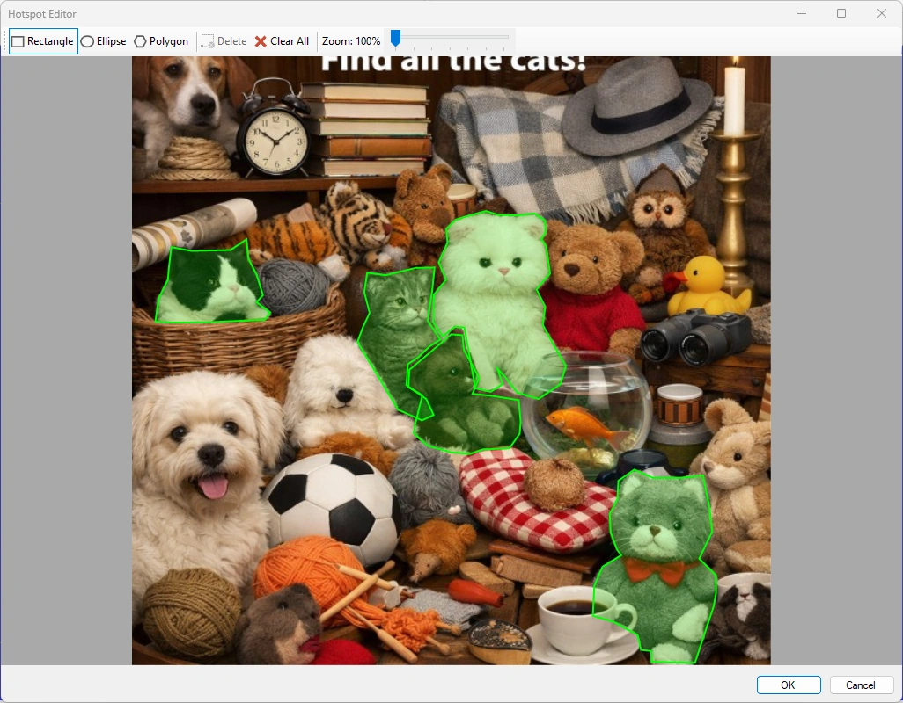{ width="602" loading=lazy }

For multiple regions it looks like this in the Smart Buzzer app:

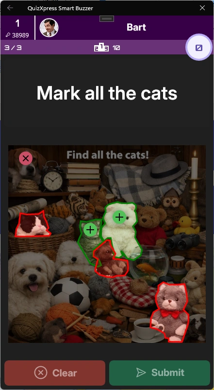{ width="185" loading=lazy }

On the quiz screen the picture will reveal the correct answer like:

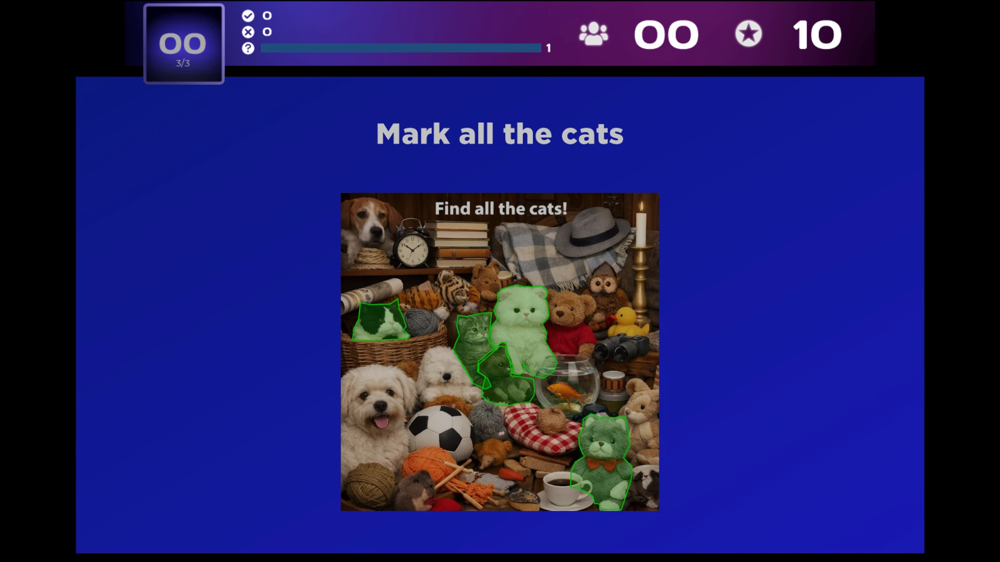{ width="602" loading=lazy }

!!! note

    when using multiple regions and the user marks more spots than there are correct regions, their score will go down (to prevent wild guessing with a lot of markers).
